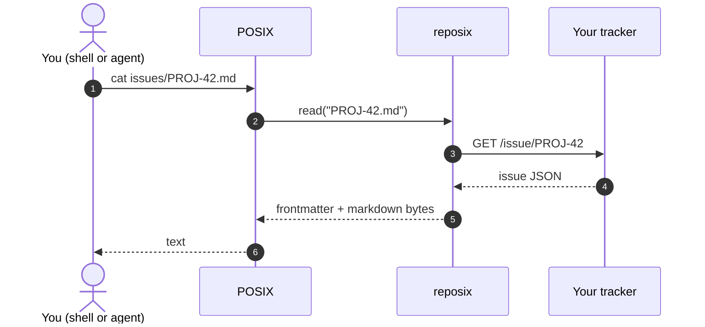
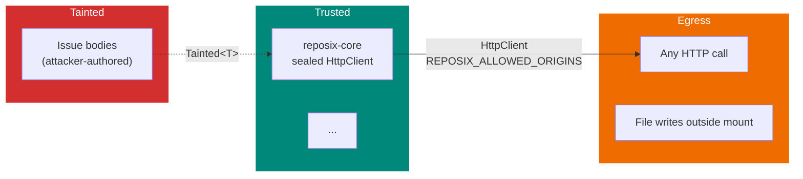

# Pattern Assignments — Docs narrative pages

← [back to index](./index.md)

## Pattern Assignments

### `docs/index.md` (narrative hero — REWRITE)

**Analog (source of truth for frontmatter/voice):** `docs/index.md` current state at `/home/reuben/workspace/reposix/docs/index.md` + `docs/why.md` for explanation voice.

**Analog for hero-admonition + grid-cards markdown pattern** (lines 11–12, 44–62 of current index.md):

```markdown
!!! success "v0.7 — six autonomous overnight sessions, 2026-04-13 → 2026-04-16"
    Every line of code in this repository was written by a coding agent across six overnight sessions. ...

<div class="grid cards" markdown>

-   :material-file-document: **[Five-crate workspace](reference/crates.md)**

    `-core`, `-sim`, `-fuse`, `-remote`, `-cli`. 317+ tests. All crates `#![forbid(unsafe_code)]`.

-   :material-shield-lock: **[Eight security guardrails](security.md)**

    SG-01 allowlist · SG-02 bulk-delete cap · ...

</div>
```

**Before/after hero pattern** (constructed from `.planning/notes/phase-30-narrative-vignettes.md` lines 114–181). Two fenced `bash` blocks stacked, with prose "Before" / "After" H3 framing, followed by a mandatory blockquote **complement line**:

```markdown
### Before — REST from an agent

\`\`\`bash
# ~30 lines of curl/jq ceremony — 5 round trips, 3 ID formats
\`\`\`

### After — the same change with reposix

\`\`\`bash
cd ~/work/acme-jira
sed -i -e 's/^status: .*/status: Done/' issues/PROJ-42.md
git commit -am "close PROJ-42" && git push
\`\`\`

> You still have full REST access for the operations that need it — JQL queries,
> bulk imports, admin config. reposix just means you don't have to reach for it
> for the hundred small edits you'd otherwise make every day.
```

**Divergence from analog:** The current `docs/index.md` leads with a thesis diagram (mermaid) and the phrase "FUSE filesystem." That opener **violates P2** (FUSE banned above Layer 3). The new `index.md` MUST drop "FUSE" from above-fold prose and replace the thesis-diagram hero with the V1 before/after code pair. Grid-cards pattern is preserved (it already matches the three-up value-prop brief). The `!!! success` admonition pattern can be reused verbatim for a post-fold v0.9.0 announcement line.

---

### `docs/mental-model.md` (three conceptual keys, 300–400 words)

**Analog for structure:** `docs/why.md` §"reposix turns the same workflow into two sentences of shell" (lines 30–38) — short H2 + one code block + one-paragraph explanation. Lift the cadence: equation → explanation → 3–5 line snippet.

**Voice excerpt from analog** (`docs/why.md` lines 32–38):

```markdown
```bash
sed -i 's/^status: open$/status: in_progress/' /mnt/reposix/issues/00000000001.md
git commit -am "claim issue 1" && git push
```

That's it. The agent issues two commands it has seen thousands of times in its pre-training...
```

**Locked key phrasings** (source-of-truth note, used verbatim as H2s):
- `## mount = git working tree`
- `## frontmatter = schema`
- `## \`git push\` = sync verb`

**Divergence from analog:** `why.md` has diagrams; mental-model has NONE (diagrams are the payoff of how-it-works, not the setup). `why.md` is long-form; mental-model is capped at ~400 words. Close each section with a terse "Now what" pointer to `/tutorial/` or `/how-it-works/`.

**NOTE:** The banned-word "mount" appears in the locked H2 phrasing. This file must be in the P2-scoped exception set in `.vale.ini` OR the rule must use `\bmount\b` with Vale's `action: remove` and `tokens` scoped so the literal H2 string is not flagged. Research §Example 1 uses `\bmount\b` as a regex boundary; the `[docs/mental-model.md]` section in `.vale.ini` must set `Reposix.ProgressiveDisclosure = NO` specifically for this page per the P2/P1 exception table.

---

### `docs/vs-mcp-sdks.md` (comparison, Explanation)

**Analog:** `docs/why.md` §"The bottleneck nobody talks about" + mermaid ladder diagram (lines 9–26). Same "before is expensive MCP dance" framing.

**Analog pattern (`docs/why.md` lines 9–26) — MCP ladder:**

```markdown
```mermaid
sequenceDiagram
  autonumber
  participant A as LLM Agent
  participant M as MCP Server
  participant J as Jira REST API
  Note over A,M: Turn 1 — tool discovery
  A->>M: list-tools
  M-->>A: 40+ tool definitions (~60 000 tokens)
  ...
```

Every turn costs context window. Every turn the agent learns the schema of a tool it will use once and discard.
```

**Table pattern from `docs/why.md`** (lines 55–58):

```markdown
| Scenario | Real tokens (`count_tokens`) |
|----------|-----------------:|
| MCP-mediated (tool catalog + schemas) | ~4,883 |
| **reposix** (shell session transcript) | **~531** |
```

**Divergence from analog:** `why.md` is a deep-dive with benchmark. `vs-mcp-sdks.md` is shorter, comparison-table-led. MUST include a paragraph articulating P1 explicitly ("reposix complements MCP/SDKs — you keep them for the operations they're good at"). MUST NOT use "replace" (P1 banned word). The copy subagent may lift the 92.3% figure from `docs/why.md` but link back for detail — don't duplicate the methodology section.

---

### `docs/tutorial.md` (5-minute first-run)

**Analog:** `docs/demo.md` lines 58–248 (steps 3–7). Already has the exact text the tutorial needs. Research §"Tutorial Pattern" (RESEARCH.md lines 766–780) prescribes a 4-step structure.

**Analog pattern (`docs/demo.md` lines 58–82) — numbered step with heading, prose, code block, expected output inline as `# => ...` comment:**

```markdown
### 3/9 — Start the simulator

\`\`\`bash
target/release/reposix-sim \
    --bind 127.0.0.1:7878 \
    --db /tmp/demo-sim.db \
    --seed-file crates/reposix-sim/fixtures/seed.json &
curl -sf http://127.0.0.1:7878/healthz   # waits for "ok"
curl -s http://127.0.0.1:7878/projects/demo/issues | jq 'length'
# => 6
\`\`\`

Six seeded issues. ...
```

**Prereqs list pattern (`docs/demo.md` lines 11–15):**

```markdown
Prereqs (Linux only for v0.1):

- Rust stable 1.82+ (we tested with 1.94.1).
- `fusermount3` (Ubuntu: `sudo apt install fuse3`).
- `jq`, `sqlite3`, `curl`, `git` (>= 2.20) on `$PATH`.
```

**FUSE-specific write-gotcha from `docs/demo.md` lines 125–136 (load-bearing — DO NOT rewrite with `sed -i`):**

```bash
NEW="$(sed 's/^status: open$/status: in_progress/' /tmp/demo-mnt/issues/00000000001.md)"
printf '%s\n' "$NEW" > /tmp/demo-mnt/issues/00000000001.md
```

Narrated note: "We do NOT use `sed -i`: the FUSE FS only accepts filenames matching `<padded-id>.md`, and `sed -i` creates a temp file like `sed.XYZ`, which gets `EINVAL`."

**Divergence from analog:** `demo.md` is 9 steps; tutorial collapses to 4 (prereqs, start simulator, mount+edit, git push+verify). `demo.md` opens with reference-style preamble ("one-liner: reposix mounts…"); tutorial opens with an action-oriented one-sentence promise ("In 5 minutes you'll edit a tracker ticket with `sed` and push the change through `git`"). The tutorial's "aha" must land in step 3 or 4 (server-side version bump via `curl | jq` per Stripe pattern G) — **do not save it for a recap**.

**Banned above Layer 3:** Despite being a tutorial that runs against the simulator, P2 applies. Do NOT use "FUSE" / "daemon" / "mount point" in prose. Use "reposix mount" as a command invocation only; never as a noun phrase in a sentence. Example from analog that WOULD need rephrasing: `docs/demo.md` line 86 ("The kernel sees a new VFS at `/tmp/demo-mnt`"). Tutorial equivalent: "reposix exposes the tracker at `/tmp/demo-mnt` as a directory."

---

### `docs/how-it-works/filesystem.md` (read/write path, Explanation)

**Analog:** `docs/architecture.md` §"Read path" (lines 82–110) + §"Write path" (lines 112–140) + §"The async bridge" (lines 194–223). Carve these three sections into one focused page with one mermaid diagram.

**Analog mermaid pattern (`docs/architecture.md` lines 84–103) — sequenceDiagram with autonumber and actor roles:**

```markdown
```mermaid
sequenceDiagram
  autonumber
  participant A as Agent (shell)
  participant K as Kernel VFS
  participant F as reposix-fuse
  participant S as reposix-sim
  participant D as SQLite WAL
  A->>K: read("/mnt/reposix/issues/00000000001.md")
  K->>F: FUSE_READ(ino)
  Note over F: validate_issue_filename("00000000001.md") — SG-04
  F->>F: IssueBackend::get_issue (SimBackend impl)<br/>5s timeout (SG-07)
  ...
```
```

**Prose pattern to adopt (`docs/architecture.md` lines 105–110) — bulleted "Key points" immediately after the diagram:**

```markdown
Key points:

- Filename validation happens at the FUSE boundary. `../../etc/passwd.md` is rejected with `EINVAL` before any HTTP call.
- The 5-second timeout means a dead backend cannot hang the kernel indefinitely; `ls` returns within 5s with `EIO`.
- The audit insert is an outermost axum middleware layer — every request is recorded, including rate-limited ones.
```

**Research-recommended mermaid spec for this page (RESEARCH.md §Example 6, lines 596–611):**

```markdown

```

**Divergence from analog:** This IS Layer 3, so the terms "FUSE" / "kernel" / "daemon" are PERMITTED in prose here. But research note for diagrams says keep actor/participant NAMES approachable (use "POSIX" + "reposix" instead of "Kernel VFS" + "reposix-fuse") so the page is still readable by a Layer 2 reader who clicks through. Architecture.md is 259 lines of dense content; this page carves ~one-third (~90 lines). Delete the crate-topology section (belongs elsewhere if at all).

---

### `docs/how-it-works/git.md` (remote helper + optimistic concurrency)

**Analog:** `docs/architecture.md` §"git push: the central value prop" (lines 142–167) + §"Optimistic concurrency as git merge" (lines 169–192).

**Analog sequence diagram (`docs/architecture.md` lines 144–167):**

```markdown
```mermaid
sequenceDiagram
  autonumber
  participant A as Agent
  participant G as git
  participant H as git-remote-reposix
  participant S as reposix-sim
  A->>G: git commit -am "..."
  A->>G: git push origin main
  G->>H: (spawn) + capabilities
  ...
  alt plan has ≤5 deletes OR [allow-bulk-delete] tag
    H->>S: POST / PATCH / DELETE per delta
    H-->>G: ok refs/heads/main
  else plan has >5 deletes, no override
    H-->>G: error refs/heads/main bulk-delete
  end
```
```

**Research-recommended simplified diagram (RESEARCH.md §Example 6 lines 618–624):**

```markdown

```

**Prose pattern for the concurrency argument (`docs/architecture.md` lines 171–192 + line 192 moneyline):**

> The agent resolving the conflict never has to parse a JSON `409` error. It never has to hold two versions of the issue in context and synthesize a merge. It uses `sed` on a text file with unambiguous markers — a flow it has seen in every merge-conflict-resolution corpus it was trained on.

**Divergence from analog:** architecture.md shows TWO mermaid diagrams in this section; the new page gets ONE (research constraint — one diagram per how-it-works page). The picked diagram is the simplified research-recommended flowchart (more scannable); the concurrency flow moves to prose + a brief code block showing the conflict-marker experience from supporting vignette 2 (`phase-30-narrative-vignettes.md` lines 197–210).

---

### `docs/how-it-works/trust-model.md` (taint + allowlist + audit)

**Analog:** `docs/security.md` (all 99 lines) + `docs/architecture.md` §"Security perimeter" (lines 225–254).

**Analog eight-guardrails table pattern (`docs/security.md` lines 21–30):**

```markdown
| ID | Mitigation | Evidence | Test | On camera |
|----|-----------|----------|------|-----------|
| SG-01 | Outbound HTTP allowlist (`REPOSIX_ALLOWED_ORIGINS`) | `crates/reposix-core/src/http.rs` sealed `HttpClient` newtype + per-request URL recheck | `crates/reposix-core/tests/http_allowlist.rs` (7 tests) | ✓ step 8a |
| SG-02 | Bulk-delete cap (>5 deletes refused; `[allow-bulk-delete]` overrides) | `crates/reposix-remote/src/diff.rs::plan` | `crates/reposix-remote/tests/bulk_delete_cap.rs` (3 tests) | ✓ step 8b |
```

**Analog security-perimeter diagram (`docs/architecture.md` lines 227–252):**

```markdown

```

**Research-recommended diagram for this page (RESEARCH.md §Example 6 lines 628–648):** Same shape as above but with actor-framing updates. Keep the three-color subgraph semantics: red = tainted, orange = egress, teal = trusted.

**Lethal-trifecta narrative opener (`docs/security.md` lines 5–11):**

```markdown
Every deployment of reposix is a textbook **lethal trifecta**[^1]:

1. **Private data.** The FUSE mount exposes issue bodies, custom fields, ...
2. **Untrusted input.** Every remote ticket / page is attacker-influenced text...
3. **Exfiltration channel.** `git push` can target any remote the agent chooses...

[^1]: [Simon Willison, "The lethal trifecta for AI agents"](https://simonwillison.net/2025/Jun/16/the-lethal-trifecta/), revised April 2026.
```

**Divergence from analog:** `security.md` is a shipped-items enumeration ("SG-01..08 + what's deferred"). The new page tells a STORY first — lethal trifecta → which leg reposix cuts at the architectural level (allowlist) → which it hardens (taint typing) → which it accepts as incurable (sanitize-on-egress). The SG-* table is carved wholesale (preserve exact rows per §"Security Domain" warning: don't oversell). Deferred-items list moves to the bottom or off-page. CLAUDE.md-OP-constraint: every trust-model claim cross-referenced against a shipped `SG-*` row with file:line evidence. NO new claims. See RESEARCH.md §"Security Domain" lines 1120–1130.

---

### `docs/how-it-works/index.md` (section landing page)

**Analog:** None in current docs — section-landing pages don't yet exist (current nav has `docs/decisions/` and `docs/development/` as sections with no `index.md`). Closest analog in shape: `docs/reference/crates.md` §intro (lines 1–3) — one sentence, then table of contents to the section.

**Voice pattern to replicate (`docs/reference/crates.md` lines 1–3):**

```markdown
# Crates overview

reposix is a Cargo workspace of eight crates. `reposix-core` is the seam: every other crate depends on it; it depends on nothing internal.
```

**Content pattern:** One paragraph that transitions from Layer 2 (the reader has just read the mental model and/or tutorial) to Layer 3 ("Under the hood, reposix is three pieces..." — lift this framing from `.planning/notes/phase-30-narrative-vignettes.md` lines 63–66). Followed by `grid cards` pointing to the three sub-pages. Reuse the index.md grid-cards pattern verbatim (syntax identical).

**Divergence from analog:** `crates.md` is a reference TOC; this page is narrative. The paragraph lead must be earned — the reader arrived here from the hero or mental model, not cold. "Under the hood" is explicitly allowed as a Layer 3 lead-in. Research verifies: mkdocs `--strict` mode may emit warnings for orphan pages. This page MUST be in `nav:` (see Pitfall 4).
