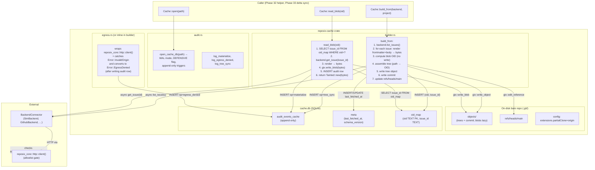

# Phase 31: `reposix-cache` crate — backing bare-repo cache from REST responses — Research

**Researched:** 2026-04-24
**Domain:** Rust git-object construction (gix) + SQLite append-only audit + tainted-bytes type discipline
**Confidence:** HIGH (gix/trybuild/SQLite all have direct precedent in this workspace; partial-clone consumer semantics fully verified)

## Summary

This phase creates `crates/reposix-cache/` — a pure Rust library that materializes REST API responses (via the existing `BackendConnector` trait) into a real on-disk bare git repository. The cache is the substrate every later v0.9.0 phase consumes: Phase 32's `stateless-connect` handler will tunnel protocol-v2 traffic to this bare repo, Phase 33's delta sync will mutate it incrementally, Phase 34's push handler will validate against it.

The crate has three orthogonal concerns: **git-object writing** (use `gix` 0.82 — pure Rust, no `pkg-config` / `libgit2`, all the primitives we need are stable: `init_bare`, `write_blob`, `write_object`, `edit_tree`, `commit_as`, `edit_reference`); **SQLite audit + meta** (lift the established `reposix_core::audit` schema fixture and pattern with a cache-specific `op` column extension); **trust-boundary discipline** (return `Tainted<Vec<u8>>` from blob reads, lock down by `clippy::disallowed_methods` against any `reqwest::Client` construction outside `reposix_core::http::client()`). All three are well-trodden ground in this workspace — there is precedent code to imitate or lift.

**Primary recommendation:** Use `gix` 0.82, treat `reposix_core::audit::open_audit_db` as the canonical pattern (extend with a separate `cache_events` table — do NOT reuse `audit_events` because the schema columns don't fit blob materialization), structure the crate as three modules (`builder`, `audit`, `egress`), and ship the trybuild compile-fail fixture in the same wave as the type that motivates it. A single synthesis-commit-per-sync model (per CONTEXT.md) keeps wave A's git-writing surface minimal — multi-commit history is a v0.10.0 concern.

## User Constraints (from CONTEXT.md)

### Locked Decisions

**Operating-principle hooks (non-negotiable — per project CLAUDE.md):**

- **Audit log non-optional (OP-3).** Every blob materialization writes one row to the `audit` table in `cache.db` (SQLite WAL, BEFORE UPDATE/DELETE RAISE trigger). Columns: `ts`, `op` (`materialize` | `egress_denied` | `tree_sync`), `backend`, `project`, `issue_id`, `oid`, `bytes`. Missing audit rows = feature is not done.
- **Tainted-by-default (OP-2).** Cache returns blob bytes wrapped in `reposix_core::Tainted<Vec<u8>>`. A compile-fail test asserts that calling any egress-side-effect function on `Tainted` without `sanitize()` is a type error. Mirrors the policy used by FUSE writes pre-v0.9.0 — the type system encodes the trust boundary so reviewers cannot accidentally introduce a trifecta.
- **Egress allowlist (security guardrail).** The cache constructs zero new `reqwest::Client` instances. All HTTP goes through `reposix_core::http::client()` which honours `REPOSIX_ALLOWED_ORIGINS`. A denied origin returns `Error::EgressDenied` AND writes an audit row with `op=egress_denied`. `clippy::disallowed_methods` in `clippy.toml` enforces this at lint time.
- **Simulator-first (OP-1).** Every test in this crate runs against `SimBackend`. No real-backend test in this phase (real backends land in Phase 35+).
- **No hidden state (OP-4).** The cache path is deterministic from `(backend, project)`. No session-local directories, no `/tmp` fallbacks.

**Cache construction strategy:**

- **Tree sync = full.** Cache calls `BackendConnector::list_issues()` once per sync, builds a tree object listing every `<bucket>/<id>.md` path, writes as a single commit. Tree metadata is cheap (≤500KB for 10k issues).
- **Blob materialization = lazy.** Blobs are NOT fetched during `list_issues`. They are fetched only on demand via `Cache::read_blob(oid)`, which looks up the OID → issue_id mapping, calls `BackendConnector::get_issue(issue_id)`, writes the blob to `.git/objects`, returns bytes.
- **Commit message format:** `sync(<backend>:<project>): <N> issues at <ISO8601>` — parseable, auditable.
- **Refspec namespace** (referenced here for Phase 32 consumer): cache publishes `refs/heads/main` internally, but the helper will map to `refs/reposix/*` per ARCH-05.

**Atomicity:**

- Preferred ordering for sync: bare-cache write first, then update cache DB's `last_fetched_at`. If REST fetch succeeds but cache write fails, `last_fetched_at` stays old and the next sync retries. If cache write succeeds but timestamp update fails, double-fetch but no data loss.
- For READ (blob materialization), atomicity is simpler: write blob → return bytes → write audit row. Audit row failure logs WARN but still returns bytes (audit failure must not poison the user flow, but should be visible).
- Full atomic reconciler deferred to Phase 33 (delta sync).

### Claude's Discretion

All other implementation details — specifically: exact crate module layout, choice of `gix` vs `git2` for git object writes (gix preferred per Rust-only build policy, but `git2` acceptable if gix coverage is insufficient), SQLite schema for the `meta` table beyond the `last_fetched_at` single-row requirement.

### Specific Ideas

- Cache path default is `$XDG_CACHE_HOME/reposix/<backend>-<project>.git`, overridable via `REPOSIX_CACHE_DIR`.
- The `meta` table schema: `key TEXT PRIMARY KEY, value TEXT, updated_at TEXT NOT NULL`. `last_fetched_at` is one row.
- A single synthesis commit per sync is acceptable for v0.9.0. Multi-commit histories deferred.
- Bare repo is initialised with `extensions.partialClone = origin` and the reposix-cache is the promisor.

### Deferred Ideas (OUT OF SCOPE)

- Multi-commit history (one commit per backend update timestamp) — v0.10.0 + observability.
- Cache eviction policy (LRU, TTL, quota).
- Full atomic rollback for REST-write + cache-update — deferred to Phase 33/34.
- `reposix gc` subcommand for manual eviction — v0.10.0.

## Phase Requirements

| ID | Description | Research Support |
|----|-------------|------------------|
| ARCH-01 | New crate `crates/reposix-cache/` constructs a bare git repo from REST responses via `BackendConnector`. Tree fully populated (filenames, blob OIDs); blobs lazy. | "What you need to know" §1 (gix 0.82 has all required primitives), §3 (tree construction), §4 (lazy materialization OID map) |
| ARCH-02 | One audit row per blob materialization. Cache returns `Tainted<Vec<u8>>`. Append-only schema (BEFORE UPDATE/DELETE RAISE). | "What you need to know" §5 (SQLite schema), §6 (Tainted compile-fail via trybuild) |
| ARCH-03 | Reuses `reposix_core::http::client()`. Zero new `reqwest::Client`. Denied origin → `Error::EgressDenied` + audit row `op=egress_denied`. clippy `disallowed_methods` enforces. | "What you need to know" §7 (existing factory + clippy.toml already configured) |

## Architectural Responsibility Map

| Capability | Primary Tier | Secondary Tier | Rationale |
|------------|-------------|----------------|-----------|
| REST → typed `Issue` | `reposix-core::backend::sim` (and other backends) | — | Already shipped; this phase consumes the trait |
| Issue → on-disk markdown bytes | `reposix-core::issue::frontmatter::render` | — | Already shipped; pure function with no I/O |
| `Vec<Issue>` → bare-repo tree+commit | `reposix-cache::builder` (NEW) | `gix` 0.82 (pure Rust git impl) | The new substrate; no existing component does this |
| OID → issue_id → REST → blob bytes | `reposix-cache::builder::read_blob` (NEW) | `gix::Repository::write_blob` | Lazy materialization is the cache's defining behaviour |
| Append-only audit | `reposix-cache::audit` (NEW, lifts `reposix_core::audit` pattern) | `rusqlite` 0.32 bundled, BEFORE UPDATE/DELETE triggers | Mirror existing simulator audit table; cache-specific schema |
| Trust boundary | `reposix_core::Tainted<Vec<u8>>` (existing) + new compile-fail fixture | `trybuild` 1.0.116 | The type already exists; this phase wires it to a new sink |
| Egress allowlist | `reposix_core::http::client()` (existing) | `clippy::disallowed_methods` (existing `clippy.toml`) | Single legal HTTP construction site, lint-enforced |
| OID ↔ issue_id mapping | `reposix-cache::builder` SQLite sidecar | `rusqlite` 0.32 | Required because git's blob OIDs are content-addressed and don't carry issue IDs |

## Standard Stack

### Core

| Library | Version | Purpose | Why Standard |
|---------|---------|---------|--------------|
| `gix` | 0.82.0 (latest, 2026-04-24) | Pure-Rust git object writing: `init_bare`, `write_blob`, `write_object`, `edit_tree`, `commit_as`, `edit_reference` | `[VERIFIED: crates.io API]` Pure Rust — no `libgit2`/`pkg-config` dep (matches workspace policy: `default-features = false` for `fuser` was chosen for the same reason). All required APIs are stable on `Repository`. Used by `cargo` itself (PR #14762 bumped cargo to gix 0.67) so production-tested. |
| `rusqlite` | 0.32 (already in workspace) | Audit + meta DB | `[VERIFIED: workspace Cargo.toml]` Already a workspace dependency with `bundled` feature → no system libsqlite3. The existing `reposix_core::audit` module wraps it; this crate follows the same pattern. |
| `chrono` | 0.4 (already in workspace) | `DateTime<Utc>` for audit `ts`, `last_fetched_at`, commit author timestamps | `[VERIFIED: workspace Cargo.toml]` Project convention is "Times are `chrono::DateTime<Utc>`. No `SystemTime` in serialized form." (CLAUDE.md). |
| `serde_yaml` | 0.9 (already in workspace) | Issue frontmatter rendering — already done by `reposix_core::issue::frontmatter::render` | `[VERIFIED: workspace Cargo.toml]` This crate calls into the existing renderer; doesn't pull serde_yaml as a direct dep. |
| `tokio` | 1 (already in workspace) | Async runtime — `BackendConnector` methods are `async` | `[VERIFIED: workspace Cargo.toml]` Workspace standard. |

### Supporting

| Library | Version | Purpose | When to Use |
|---------|---------|---------|-------------|
| `dirs` | 6.0.0 (latest) | Resolve `$XDG_CACHE_HOME` for default cache path | `[VERIFIED: crates.io API 2025-01-12]` Smaller than `etcetera`, sufficient for our use (single function call: `dirs::cache_dir()`). Use `etcetera` 0.11.0 only if we need testable injection of `BaseStrategy` — `dirs` returns `Option<PathBuf>` directly, simpler. |
| `thiserror` | 2 (already in workspace) | Typed `reposix_cache::Error` with variants `Egress(InvalidOrigin)`, `Backend(BackendError)`, `Sqlite(rusqlite::Error)`, `Git(gix::ObjectError)`, `Io(std::io::Error)` | Project convention: thiserror in libraries, anyhow at binary boundaries. |
| `async-trait` | 0.1 (already in workspace) | Implementing async methods if any new traits are introduced | Likely unneeded — `Cache` itself can have `async fn` directly since it's a concrete struct, not a trait. |
| `tempfile` | (test-dev only) | Test fixtures: ephemeral cache paths | Already used by `cache_db.rs` tests. |

### Dev-dependencies

| Library | Version | Purpose |
|---------|---------|---------|
| `trybuild` | 1.0.116 (latest, 2026-02-12) | Compile-fail fixture for `Tainted<Vec<u8>>` discipline. `[VERIFIED: crates.io API]` |
| `wiremock` | (current workspace version) | Mock REST backend for tests where SimBackend isn't enough. Likely unneeded if SimBackend covers all scenarios. |

### Alternatives Considered

| Instead of | Could Use | Tradeoff |
|------------|-----------|----------|
| `gix` 0.82 | `git2` 0.20.4 (libgit2 bindings) | git2 has more mature object-mutation surface but pulls `libgit2-sys` which links against system libgit2 (or vendored C). This violates the workspace's pure-Rust build-deps stance (the same reason `fuser` was held to `default-features = false` to avoid `libfuse-dev`). gix is sufficient — write_blob/write_object/edit_tree/commit_as/edit_reference all exist. **CITED:** [docs.rs/gix Repository methods](https://docs.rs/gix/latest/gix/struct.Repository.html) |
| `dirs` 6.0.0 | `etcetera` 0.11.0 (more flexible BaseStrategy) | etcetera lets you inject a strategy (good for tests) but `dirs` is simpler for one call site. The cache path is also overridable via `REPOSIX_CACHE_DIR` so test injection can use that env var instead. |
| Single SQLite file | Two files (audit.db + meta.db) | Not worth the complexity — one connection, two tables. Locking semantics for `cache.db` already exist in `crates/reposix-cli/src/cache_db.rs`. |
| Multi-commit history | Single synthesis commit per sync | LOCKED by CONTEXT.md to single-commit. Multi-commit would force commit-graph reasoning. v0.10.0 work. |

**Installation (proposed `crates/reposix-cache/Cargo.toml`):**

```toml
[package]
name = "reposix-cache"
version.workspace = true
edition.workspace = true

[dependencies]
reposix-core = { workspace = true }
tokio = { workspace = true }
async-trait = { workspace = true }
chrono = { workspace = true }
rusqlite = { workspace = true }
thiserror = { workspace = true }
tracing = { workspace = true }
gix = "0.82"
dirs = "6"

[dev-dependencies]
tempfile = "3"
trybuild = "1"
```

**Version verification:** `[VERIFIED: crates.io API 2026-04-24]`
- gix 0.82.0 published 2026-04-24
- git2 0.20.4 published 2026-02-02 (alternative, not selected)
- trybuild 1.0.116 published 2026-02-12
- dirs 6.0.0 published 2025-01-12
- etcetera 0.11.0 published 2025-10-28 (alternative, not selected)

## Architecture Patterns

### System Architecture Diagram



Data flow for `Cache::build_from(backend, "proj-1")`:
1. Caller invokes async `build_from`.
2. Builder calls `backend.list_issues("proj-1")` — REST hop guarded by allowlist via `reposix_core::http::client()`.
3. For each `Issue`, builder calls `frontmatter::render(&issue)` (pure function in `reposix-core`) to produce the canonical `<id>.md` bytes.
4. Builder computes the blob OID for each rendering by hashing — but does NOT write the blob to `.git/objects` yet (the lazy invariant).
5. Builder constructs a tree object via `gix::Repository::edit_tree` with entries `<bucket>/<id>.md` → blob OID. Writes tree object.
6. Builder writes a commit via `gix::Repository::commit_as` with message `sync(<backend>:<project>): <N> issues at <ISO8601>`.
7. Builder updates `refs/heads/main` to the commit OID via `edit_reference`.
8. Builder INSERTs one row per issue into `oid_map` (oid → issue_id).
9. Builder INSERTs one `op=tree_sync` row into the audit table.
10. Builder UPSERTs `last_fetched_at` into the meta table.

Data flow for `Cache::read_blob(oid)`:
1. Caller invokes async `read_blob(oid)`.
2. Builder SELECTs `issue_id` from `oid_map`. Miss → `Error::UnknownOid`.
3. Builder calls `backend.get_issue(issue_id)` — REST hop, allowlisted.
4. Builder calls `frontmatter::render(&issue)`.
5. Builder calls `gix::Repository::write_blob(bytes)`. This persists to `.git/objects` AND returns the OID. Builder asserts the returned OID == requested OID (consistency check; mismatch is a bug or backend race).
6. Builder INSERTs `op=materialize` audit row.
7. Builder returns `Tainted<Vec<u8>>`.

### Recommended Project Structure

```
crates/reposix-cache/
├── Cargo.toml
├── src/
│   ├── lib.rs            # crate root: pub use Cache, Error; #![forbid(unsafe_code)]; #![warn(clippy::pedantic)]
│   ├── cache.rs          # struct Cache { repo: gix::Repository, db: rusqlite::Connection, path: PathBuf, ... }
│   ├── builder.rs        # impl Cache: async fn build_from, async fn read_blob, helpers for tree assembly
│   ├── audit.rs          # open_cache_db, log_* helpers, schema fixture path
│   ├── meta.rs           # last_fetched_at + oid_map upsert/lookup
│   ├── error.rs          # thiserror enum: Egress, Backend, Sqlite, Git, Io
│   └── path.rs           # resolve_cache_path(backend, project) honoring REPOSIX_CACHE_DIR + dirs::cache_dir()
├── fixtures/
│   └── cache_schema.sql  # DDL: audit_events_cache + meta + oid_map + triggers
├── tests/
│   ├── tree_contains_all_issues.rs
│   ├── blobs_are_lazy.rs
│   ├── materialize_one.rs
│   ├── egress_denied_logs.rs
│   ├── audit_is_append_only.rs
│   ├── compile_fail.rs                           # trybuild driver
│   └── compile-fail/
│       ├── tainted_blob_into_egress.rs           # must fail to compile
│       └── tainted_blob_into_egress.stderr
```

### Pattern 1: gix bare repo construction

**What:** Initialize a bare repo, write an empty tree, write a commit, set HEAD.
**When to use:** `Cache::open` — first-time creation of the on-disk substrate.
**Example (verified API surface from gix 0.82 docs):**

```rust
// Source: https://docs.rs/gix/latest/gix/fn.init_bare.html (verified 2026-04-24)
//         https://docs.rs/gix/latest/gix/struct.Repository.html#method.write_blob
// Sketch — the actual signature for commit_as takes references and TreeRef.
use gix::ObjectId;

let repo: gix::Repository = gix::init_bare(&cache_path)?;

// Write tree from a list of (path, blob_oid) entries.
// edit_tree requires the `tree-editor` cargo feature (enabled by default in gix 0.82).
let mut editor = repo.edit_tree(ObjectId::empty_tree(repo.object_hash()))?;
for (path, blob_oid) in entries {
    editor.upsert(path, gix::object::tree::EntryKind::Blob, blob_oid)?;
}
let tree_oid = editor.write()?;

// Commit. The exact signature in gix 0.82 takes:
//   reference_name, message, tree_oid, parents (impl IntoIterator<Item=ObjectId>)
let commit_oid = repo.commit(
    "refs/heads/main",
    format!("sync({}:{}): {} issues at {}", backend, project, n, now),
    tree_oid,
    [] as [ObjectId; 0],
)?;
```

**Note for planner:** The exact method signatures for `commit_as` / `commit` may shift between gix versions. The plan should include a "verify-against-gix-0.82-API" task in Wave A that compiles a smoke test before the full builder is written. Do NOT trust this code sketch without running `cargo check` first; gix's API stability story is "iterating toward 1.0 (issue #470)".

### Pattern 2: lazy blob materialization

**What:** OID is a hash of bytes. Cache stores `(oid, issue_id)` mapping at tree-build time, then on `read_blob(oid)` looks up issue_id, fetches REST, writes blob.
**When to use:** Every `read_blob` call.
**Critical invariant:** `gix::Repository::write_blob(bytes)` returns the OID it computed. The cache MUST assert this equals the requested OID — a mismatch means the backend's `get_issue` returned different content than `list_issues` reported. This is a real failure mode (eventual consistency on backend) and should be a typed error: `Error::OidDrift { requested, actual, issue_id }`.

```rust
async fn read_blob(&self, oid: gix::ObjectId) -> Result<Tainted<Vec<u8>>> {
    let issue_id = self.oid_map_lookup(oid)?
        .ok_or(Error::UnknownOid(oid))?;
    let issue = self.backend.get_issue(&self.project, issue_id).await
        .map_err(|e| {
            // Convert egress-allowlist denial into our typed variant + audit
            if let Some(InvalidOrigin) = e.downcast_ref() {
                let _ = self.audit.log_egress_denied(&issue_id);
                Error::EgressDenied
            } else {
                Error::Backend(e)
            }
        })?;
    let bytes = frontmatter::render(&issue)?.into_bytes();
    let actual_oid = self.repo.write_blob(&bytes)?.into();
    if actual_oid != oid {
        return Err(Error::OidDrift { requested: oid, actual: actual_oid, issue_id });
    }
    let _ = self.audit.log_materialize(&issue_id, oid, bytes.len()); // best-effort
    Ok(Tainted::new(bytes))
}
```

### Pattern 3: extensions.partialClone on the cache

**What:** The cache's bare repo gets `extensions.partialClone = origin` set, even though the cache is itself the promisor.
**Why:** `[CITED: git-scm.com/docs/partial-clone]` — `extensions.partialClone` is a **consumer-side** setting that names which configured remote is the promisor. On the cache itself, this setting is *advisory*. Standard git tooling (`git fsck`, `git fetch <cache-path>`) treats the cache as a normal bare repo because the blobs are simply absent — git's "missing object" handler kicks in only when `extensions.partialClone` is set on the *fetcher's* repo, pointing at this cache as `origin`.
**Implication for this phase:** We do NOT need to configure the cache as a promisor of itself. We DO need to configure it correctly so `git fetch <cache-path>` from a partial-clone consumer (Phase 32 helper) works — and per the standard semantics, the cache simply needs valid trees + commits + missing blobs. Setting `extensions.partialClone = origin` on the cache is harmless and matches the CONTEXT.md "consistency with the partial-clone model" rationale.

### Anti-Patterns to Avoid

- **Don't write blobs in `build_from`.** The whole point of partial clone is lazy blob materialization. If `build_from` wrote blobs, every sync would refetch every issue body — exactly the FUSE problem v0.9.0 is solving. Writing blobs ONLY in `read_blob` is the contract.
- **Don't reuse `audit_events` schema from `reposix_core::audit::SCHEMA_SQL`.** The columns there are HTTP-shaped (`method`, `path`, `status`, `request_body`, `response_summary`). Cache events have different columns (`op`, `backend`, `project`, `issue_id`, `oid`, `bytes`). Define a separate `audit_events_cache` table in `crates/reposix-cache/fixtures/cache_schema.sql` with the same append-only triggers and DEFENSIVE flag pattern.
- **Don't construct `reqwest::Client` directly.** Lint-banned by workspace `clippy.toml` (`disallowed-methods` already lists `reqwest::Client::new`, `reqwest::Client::builder`, `reqwest::ClientBuilder::new`). The cache crate calls `BackendConnector` methods, which already use `reposix_core::http::client()` internally. The cache itself does NOT need to construct a client.
- **Don't expose `gix::Repository` in the public API.** Wrap it in `Cache`. If consumers (Phase 32 helper) need the repo path, expose `Cache::repo_path() -> &Path`. This keeps gix as an implementation detail — if we ever switch to git2 or a hand-rolled object writer, the public surface doesn't change.
- **Don't use `From<Tainted<Vec<u8>>> for Vec<u8>` or `Deref`.** Already locked: `reposix_core::taint` deliberately omits these (see `crates/reposix-core/src/taint.rs:11-16`). The cache must consume from `inner_ref()` / `into_inner()` only inside its own crate, never expose untainted-Bytes-from-Tainted as a free conversion.

## Don't Hand-Roll

| Problem | Don't Build | Use Instead | Why |
|---------|-------------|-------------|-----|
| Git object format (loose object headers, zlib, sha1/sha256 OID computation) | Custom `write_loose_object` | `gix::Repository::write_blob`, `write_object` | Header format edge cases (`blob <len>\0<bytes>`), zlib parameters, hash algorithm switching (sha1 vs sha256) — all handled by gix. Hand-rolling = guaranteed bugs. |
| Bare-repo init (`HEAD`, `config`, `description`, `objects/info/`) | Custom directory layout | `gix::init_bare` | Many subtle files; `git fsck` is unforgiving. |
| Tree object encoding (sorted entries, mode bits, null-terminated names) | Custom `write_tree` | `gix::Repository::edit_tree` (requires `tree-editor` feature, default in 0.82) | Tree entry sort order is critical (entries with trailing `/` sort differently). gix gets this right. |
| Append-only audit log (BEFORE UPDATE/DELETE triggers, DEFENSIVE flag) | New schema in this crate from scratch | Pattern from `reposix_core::audit` (lift the open-with-DEFENSIVE pattern + write our own DDL with the same trigger structure) | The hardening (M-04, H-02) is already understood in the workspace — `BEGIN…COMMIT` wrapper, `DROP TRIGGER IF EXISTS` for idempotency, `SQLITE_DBCONFIG_DEFENSIVE` to block `writable_schema` attacks. Don't re-discover. |
| HTTP egress allowlist | Custom URL parser + check | `reposix_core::http::client()` returns `HttpClient` which gates every send | Already shipped, already tested (`http_allowlist.rs`), already lint-locked. The cache **must not** even hold a `reqwest::Client`. |
| Tainted/Untainted boundary | New newtype | `reposix_core::Tainted<T>` | Already defined; the discipline (no `Deref`, no `From`) is established. Just use it. |
| XDG cache dir | `std::env::var("XDG_CACHE_HOME")` then fallback to `$HOME/.cache` | `dirs::cache_dir()` | Handles XDG spec, macOS `~/Library/Caches`, Windows `%LOCALAPPDATA%`, falls back to `$HOME/.cache` per spec. (Even though we only target Linux, the right thing is the right thing.) |
| Commit message timestamp formatting | `format!("{}", chrono::Utc::now())` | `chrono::Utc::now().to_rfc3339()` or `.format("%+")` | RFC 3339 / ISO 8601 — what the CONTEXT.md commit-message spec asks for. |

**Key insight:** Every part of this crate has precedent in the workspace OR in stable, well-known external crates. The novel work is the **composition** — gluing `BackendConnector` → render → gix → audit → Tainted return — not any single primitive.

## Runtime State Inventory

This phase introduces NEW on-disk state. There is no rename/refactor migration. But the planner needs to know what state lives where:

| Category | Items Found | Action Required |
|----------|-------------|------------------|
| Stored data | New: `$XDG_CACHE_HOME/reposix/<backend>-<project>.git/` (bare repo objects + refs + config). New: `<that-path>/cache.db` (SQLite — meta, oid_map, audit_events_cache). | New crate writes both; `.gitignore` for `runtime/` already covers test artifacts in this repo. |
| Live service config | None — this crate adds no service. | None. |
| OS-registered state | None. The cache is just files. | None. |
| Secrets/env vars | New env var consumed: `REPOSIX_CACHE_DIR` (override of default cache path). Existing env vars consumed: `REPOSIX_ALLOWED_ORIGINS` (via `reposix_core::http::client()`). | Document both in CHANGELOG `[v0.9.0]` Added section and in `crates/reposix-cache/src/lib.rs` module docs. |
| Build artifacts / installed packages | None. New crate is workspace-internal; not published to crates.io in v0.9.0. | None. |

**Verified by:** `grep -rn "XDG_CACHE_HOME\|dirs::cache_dir" .` (no existing refs in repo) and CONTEXT.md `<specifics>` section (cache path scheme).

## Common Pitfalls

### Pitfall 1: Computing blob OID without writing, then writing in a different order
**What goes wrong:** Tree references blob OID `X`; later `read_blob` writes the bytes and gets OID `Y` because frontmatter rendering was non-deterministic (e.g., `BTreeMap` iteration order changes, or a timestamp leaked in).
**Why it happens:** `frontmatter::render` is supposed to be pure but `Issue.extensions: BTreeMap` is the only field whose iteration order affects YAML output, and BTreeMap is deterministic by key — so this is unlikely. But `chrono::Utc::now()` MUST NOT appear inside `render()`.
**How to avoid:** Add a unit test in this phase asserting `frontmatter::render(&issue) == frontmatter::render(&issue.clone())` — bytewise. (Not a regression test on `reposix-core`; a contract assertion the cache crate relies on.)
**Warning signs:** `Error::OidDrift` firing in production. If it ever fires, look at non-determinism in `render` first.

### Pitfall 2: Audit row write fails after blob write
**What goes wrong:** Blob is in `.git/objects/`, but `audit_events_cache` row never wrote. Subsequent compliance audits show fewer rows than blobs, looking like a security event.
**Why it happens:** SQLite `BUSY` from a concurrent reader; disk full; transient FS error.
**How to avoid:** CONTEXT.md decision: "audit failure logs WARN but still returns bytes — audit failure must not poison the user flow, but should be visible." Use `tracing::warn!` with target `reposix_cache::audit_failure`, include the issue_id and OID, and add a metric counter `audit_failures_total`. Document this trade-off in module docs so reviewers don't think it's an oversight.
**Warning signs:** WARN log lines with target `reposix_cache::audit_failure` in production logs. Operators should treat persistent occurrence as a P1.

### Pitfall 3: Tainted bytes leak via panic / unwrap
**What goes wrong:** `Cache::read_blob` returns `Tainted<Vec<u8>>`. Caller does `cache.read_blob(oid).await?.into_inner()` and the bytes flow into `git push` to a non-allowlisted remote.
**Why it happens:** Tainted is enforced by the type system, but `into_inner()` is `pub` and unconditional. The compile-fail fixture in this phase only catches the *type* contract, not the *flow* contract.
**How to avoid:** This phase ships the type-level guard (the compile-fail fixture ensures `egress::send(tainted)` doesn't compile). Flow-level guard is Phase 34's job (sanitize-on-push frontmatter allowlist). Document the boundary explicitly: "this phase makes Tainted impossible to misuse *implicitly*; phase 34 makes Tainted impossible to misuse *explicitly* without a documented sanitize step."
**Warning signs:** Code reviews finding `into_inner()` calls in non-cache crates. The crate's own consumers (Phase 32 helper) should call `inner_ref()` and pipe bytes directly to git's stdout, never `into_inner()` followed by an HTTP send.

### Pitfall 4: gix API stability across versions
**What goes wrong:** `gix` is pre-1.0 (issue #470 explicitly tracks 1.0 readiness). Method signatures for `commit_as` / `edit_tree` / `edit_reference` shift between minor versions.
**Why it happens:** Maintainers' explicit policy until 1.0.
**How to avoid:** Pin `gix = "=0.82.0"` (with `=`) in this crate's Cargo.toml until v0.10.0 stabilizes the broader cache API. Wave A's first task should be a smoke test that compiles `gix::init_bare` + `write_blob` + `commit` against the actually-resolved version before the rest of the builder is written.
**Warning signs:** `cargo update` output mentions `gix v0.82 → v0.83` and immediately something stops compiling.

### Pitfall 5: Misconfiguring the bare-repo's HEAD
**What goes wrong:** `gix::init_bare` may default HEAD to `refs/heads/master` or `refs/heads/main` depending on the user's `init.defaultBranch` git config. The Phase 32 helper expects `refs/heads/main`.
**Why it happens:** gix respects local git config when present.
**How to avoid:** Explicitly set HEAD to `refs/heads/main` after init via `repo.edit_reference` (or write `HEAD` file directly if gix doesn't expose this — fallback). Add a test: `assert_eq!(cache.repo.head_ref()?.name(), "refs/heads/main")`.
**Warning signs:** Phase 32 integration tests fail with "ref does not exist" on a freshly-built cache.

### Pitfall 6: Concurrent build_from and read_blob
**What goes wrong:** Two callers race: caller A is in the middle of `build_from` (rewriting the tree), caller B calls `read_blob(some_oid)` against an OID that's about to be evicted from the new tree.
**Why it happens:** v0.9.0 has no global lock around the cache.
**How to avoid:** v0.9.0 scope (CONTEXT.md): single-writer, no concurrent build_from. Document this constraint. Phase 33 (delta sync) will introduce a serialization story (likely SQLite EXCLUSIVE WAL lock per the existing `cache_db.rs` pattern).
**Warning signs:** This is a deferred concern; not worth defending in v0.9.0.

## Code Examples

### Example 1: Audit table DDL (lifts the `reposix_core::audit` pattern)

```sql
-- Source: pattern from crates/reposix-core/fixtures/audit.sql (verified)
-- This file: crates/reposix-cache/fixtures/cache_schema.sql

BEGIN;

CREATE TABLE IF NOT EXISTS audit_events_cache (
    id            INTEGER PRIMARY KEY AUTOINCREMENT,
    ts            TEXT    NOT NULL,                                -- ISO 8601 UTC
    op            TEXT    NOT NULL CHECK (op IN ('materialize','egress_denied','tree_sync')),
    backend       TEXT    NOT NULL,
    project       TEXT    NOT NULL,
    issue_id      TEXT,                                            -- nullable for tree_sync
    oid           TEXT,                                            -- nullable for tree_sync (or hex blob OID)
    bytes         INTEGER,                                         -- blob size (materialize) or item count (tree_sync)
    reason        TEXT                                             -- nullable; populated for egress_denied
);

CREATE TABLE IF NOT EXISTS meta (
    key         TEXT PRIMARY KEY,
    value       TEXT NOT NULL,
    updated_at  TEXT NOT NULL
);

CREATE TABLE IF NOT EXISTS oid_map (
    oid       TEXT PRIMARY KEY,
    issue_id  TEXT NOT NULL,
    backend   TEXT NOT NULL,
    project   TEXT NOT NULL
);
CREATE INDEX IF NOT EXISTS idx_oid_map_issue
    ON oid_map(backend, project, issue_id);

DROP TRIGGER IF EXISTS audit_cache_no_update;
CREATE TRIGGER audit_cache_no_update BEFORE UPDATE ON audit_events_cache
    BEGIN
        SELECT RAISE(ABORT, 'audit_events_cache is append-only');
    END;

DROP TRIGGER IF EXISTS audit_cache_no_delete;
CREATE TRIGGER audit_cache_no_delete BEFORE DELETE ON audit_events_cache
    BEGIN
        SELECT RAISE(ABORT, 'audit_events_cache is append-only');
    END;

COMMIT;
```

### Example 2: trybuild compile-fail fixture for Tainted discipline

```rust
// File: crates/reposix-cache/tests/compile-fail/tainted_blob_into_egress.rs
//
// This file MUST fail to compile. The .stderr sibling captures the expected
// error so trybuild's UI test framework asserts the diagnostic shape.

use reposix_core::Tainted;

// A fake "egress" sink that demands an Untainted<Vec<u8>>.
// The real Phase 34 push path will look like this.
fn egress_send(_bytes: reposix_core::Untainted<Vec<u8>>) {}

fn main() {
    let tainted: Tainted<Vec<u8>> = Tainted::new(vec![1, 2, 3]);
    // The next line MUST NOT compile: there is no From<Tainted<Vec<u8>>>
    // for Untainted<Vec<u8>>, and Untainted::new is pub(crate).
    egress_send(tainted);
}
```

```rust
// File: crates/reposix-cache/tests/compile_fail.rs

#[test]
fn tainted_blob_cannot_flow_to_egress() {
    let t = trybuild::TestCases::new();
    t.compile_fail("tests/compile-fail/tainted_blob_into_egress.rs");
}
```

### Example 3: Cache::open + build_from skeleton (informational — not a copy-paste contract)

```rust
// crates/reposix-cache/src/cache.rs

use std::path::PathBuf;
use std::sync::Arc;

use reposix_core::{BackendConnector, Tainted};

pub struct Cache {
    pub(crate) backend: Arc<dyn BackendConnector>,
    pub(crate) project: String,
    pub(crate) path: PathBuf,
    pub(crate) repo: gix::Repository,
    pub(crate) db: rusqlite::Connection,
}

impl Cache {
    /// Open or create a cache at the deterministic path for (backend, project).
    ///
    /// # Errors
    /// - I/O failure during directory creation
    /// - gix::init_bare failure
    /// - SQLite open failure
    pub fn open(
        backend: Arc<dyn BackendConnector>,
        project: impl Into<String>,
    ) -> Result<Self> { /* ... */ }

    /// Sync the tree from the backend. Writes a synthesis commit to refs/heads/main.
    /// Does NOT materialize blobs.
    ///
    /// # Errors
    /// Any backend / git / sqlite error. See `Error`.
    pub async fn build_from(&self) -> Result<gix::ObjectId> { /* ... */ }

    /// Materialize a single blob by OID. Tainted because the bytes came from
    /// the backend.
    ///
    /// # Errors
    /// - Unknown OID
    /// - Backend egress denied (audit row written first)
    /// - OID drift between requested and actual
    pub async fn read_blob(&self, oid: gix::ObjectId) -> Result<Tainted<Vec<u8>>> { /* ... */ }
}
```

## State of the Art

| Old Approach | Current Approach | When Changed | Impact |
|--------------|------------------|--------------|--------|
| FUSE virtual FS, every read = REST hop | Bare-repo cache + git partial clone | v0.9.0 (this milestone) | This phase ships the substrate; full pivot completes in Phase 36 |
| `git2` (libgit2 bindings) for Rust git ops | `gix` pure-Rust (since gix matured to 0.7+ in 2023, now 0.82 in 2026) | gix issue #470 tracks 1.0 readiness; current state "production-ready for object writing, iterating on higher-level porcelain" | Avoids `pkg-config` / `libgit2-sys` build dep — matches workspace's "no system C deps" stance |
| Hand-rolled SQLite append-only enforcement | `BEFORE UPDATE/DELETE RAISE(ABORT)` triggers + `SQLITE_DBCONFIG_DEFENSIVE` flag | Established in `reposix-core` Phase 1 audit fixture (M-04, H-02) | Lift the pattern; no novel work |

**Deprecated/outdated:**
- The pre-v0.9.0 `crates/reposix-cli/src/cache_db.rs` `refresh_meta` table will be superseded once `reposix-cache` ships its own `meta` table. CONTEXT.md specifies "possibly lifts the code into reposix-cache" — Wave A should decide: either (a) dual-source `last_fetched_at` (CLI writes to its own, cache writes to its own — a Phase 33 / 35 reconciliation issue) or (b) move the CLI module into the new crate now. Recommend (b) — fewer reconciliation foot-guns. But this is out of CONTEXT.md's locked scope; flag it as an open question for the planner to either time-box into Wave A or kick to Phase 33.

## Assumptions Log

| # | Claim | Section | Risk if Wrong |
|---|-------|---------|---------------|
| A1 | gix 0.82's `commit_as` / `commit` method takes `(reference_name, message, tree_oid, parents)` in that order | Pattern 1 code sketch | LOW — Wave A smoke test will catch any signature mismatch before the rest of the builder is written. Mitigated by including a "verify gix API surface" task. |
| A2 | `gix::init_bare` defaults HEAD to `refs/heads/main` when no `init.defaultBranch` is configured globally | Pitfall 5 | MEDIUM — depends on user's `~/.gitconfig`. The mitigation (explicitly setting HEAD post-init) makes this assumption irrelevant. |
| A3 | `frontmatter::render` is fully deterministic given an Issue (no time, no random) | Pitfall 1 | LOW — the function is in `reposix-core` and the existing test `frontmatter_roundtrips` implicitly covers determinism, but adding an explicit "render twice, compare bytes" test is cheap insurance. |
| A4 | `gix::Repository::write_blob` returns the OID it computed (allowing OID-drift detection) | Pattern 2 | LOW — this is the standard contract for any git object writer. Verifiable in 30 seconds via `cargo doc`. |
| A5 | `reposix_core::http::client()` already returns `Error::InvalidOrigin` for non-allowlisted backends, and that error type is `downcast`-able from `BackendConnector` errors | Pattern 2 read_blob sketch | MEDIUM — needs verification. The `BackendConnector` trait error contract is `Error::Other` for many cases. Wave B may need a small refactor to surface `Error::InvalidOrigin` distinctly from `Error::Other`, OR the cache can match on the error message string. Flag for planner. |
| A6 | The single-row `meta` table from `cache_db.rs` is conceptually replaced by this crate's `meta` table — pre-existing CLI callers either move with it or get refactored in Phase 35 | State of the Art | MEDIUM — coordination with Phase 35 (CLI pivot). Flag for planner: either lift now or document the divergence. |
| A7 | `gix` 0.82 has the `tree-editor` cargo feature enabled by default | Pattern 1 | LOW — verified via docs.rs feature listing. If wrong, add `features = ["tree-editor"]` to Cargo.toml dep. |

## Open Questions for the Planner

1. **Lift `cache_db.rs` from `reposix-cli` into `reposix-cache` now, or in Phase 35?**
   - What we know: Both crates have a `meta` table conceptually. CONTEXT.md says "possibly lifts the code".
   - What's unclear: Whether dual-sourcing through v0.9.0 is OK or causes Phase 33 friction.
   - Recommendation: Lift in Wave B of this phase. The CLI's existing `refresh` subcommand is being deleted in Phase 35 anyway (replaced by `reposix init`), so leaving `cache_db.rs` orphaned in `reposix-cli` for one phase risks divergence.

2. **Should `Cache::read_blob` return `Tainted<Vec<u8>>` or `Tainted<Bytes>` (i.e., `bytes::Bytes`)?**
   - What we know: `Vec<u8>` is the simplest return type. `Bytes` enables zero-copy when piping to git's stdout (Phase 32).
   - What's unclear: Whether the protocol-v2 send path in Phase 32 will be a serious bytes-copy hot spot.
   - Recommendation: Start with `Vec<u8>`. Convert to `Bytes` only if Phase 32 perf benchmarks show it matters. Premature optimization risk is real and `Bytes` adds a workspace dep.

3. **Is the `Error::EgressDenied` variant new, or does it reuse `reposix_core::Error::InvalidOrigin`?**
   - What we know: `reposix_core::Error::InvalidOrigin` already exists and is what `reposix_core::http::client` returns.
   - What's unclear: Whether the cache should re-export that variant, define its own that wraps it, or just propagate it.
   - Recommendation: Define `reposix_cache::Error::Egress(reposix_core::Error)` and pattern-match on `InvalidOrigin` in `read_blob` to fire the `op=egress_denied` audit row. This keeps the cache's error space tight (one `Egress` variant) while preserving the underlying detail.

4. **What does the cache's `Cache::open` do if the bare-repo dir already exists with content from a different `(backend, project)` combo?**
   - What we know: The cache path is deterministic from `(backend, project)`, so this can only happen if a user manually moves files or `REPOSIX_CACHE_DIR` is shared across projects.
   - What's unclear: Whether to error, refuse, or silently overwrite.
   - Recommendation: Read the `meta` table's `backend` and `project` keys at open. If present and mismatching, return `Error::CacheCollision { expected, found }`. Defensive, cheap.

5. **Does the planner want a Wave 0 for test-infra, separate from Wave A's crate scaffold?**
   - What we know: Per CONTEXT.md, "trivial small" gates apply — and CONTEXT.md token-budget note suggests "2–3 plans max: (A) crate scaffold + types + bare-repo builder, (B) audit log + tainted + egress + SQLite, (C) tests including compile-fail."
   - What's unclear: Whether the `trybuild` fixture must land BEFORE the type it constrains (Wave 0) or alongside (Wave C).
   - Recommendation: Land alongside (Wave C). The type itself is `reposix_core::Tainted<Vec<u8>>` and already exists — no Wave 0 needed for that. The compile-fail fixture is a *test* of the type's existing behavior, not a precondition.

## Environment Availability

| Dependency | Required By | Available | Version | Fallback |
|------------|------------|-----------|---------|----------|
| `cargo` (Rust toolchain ≥ 1.82) | All crates | ✓ | per `rust-toolchain.toml` | — |
| Git (`git` binary) | Optional smoke-test of cache against `git fsck` | ✓ (assumed) | 2.34+ per CLAUDE.md transition section | If absent, skip the fsck smoke test (degrade to Rust-only verification) |
| `gix` 0.82 | `reposix-cache` git ops | ✓ on crates.io | 0.82.0 (2026-04-24) | git2 0.20.4 (NOT recommended; pulls libgit2-sys) |
| SQLite (bundled via rusqlite) | Audit + meta DB | ✓ | rusqlite 0.32 `bundled` feature already in workspace | None needed — bundled |
| `trybuild` | Compile-fail fixture | ✓ on crates.io | 1.0.116 (2026-02-12) | Hand-rolled `cargo build --release 2>&1 | grep "expected"` (DO NOT — trybuild is already proven in `reposix-core`) |

**Missing dependencies with no fallback:** None — every dep is workspace-available or one `cargo add` away.

**Missing dependencies with fallback:** None.

## Validation Architecture

### Test Framework

| Property | Value |
|----------|-------|
| Framework | `cargo test` (Rust standard) + `trybuild` 1.0.116 for compile-fail |
| Config file | `crates/reposix-cache/Cargo.toml` (no separate config — Rust convention) |
| Quick run command | `cargo test -p reposix-cache` |
| Full suite command | `cargo test --workspace` (includes regression check on all other crates) |

### Phase Requirements → Test Map

| Req ID | Behavior | Test Type | Automated Command | File Exists? |
|--------|----------|-----------|-------------------|-------------|
| ARCH-01 | `Cache::build_from(backend)` produces a valid bare repo with a tree containing all N issue paths | integration | `cargo test -p reposix-cache --test tree_contains_all_issues` | ❌ Wave A |
| ARCH-01 | After `build_from`, `.git/objects/` contains tree + commit but NO blob objects | integration | `cargo test -p reposix-cache --test blobs_are_lazy` | ❌ Wave A |
| ARCH-01 | `Cache::read_blob(oid)` materializes exactly one blob and returns the expected bytes | integration | `cargo test -p reposix-cache --test materialize_one` | ❌ Wave A or B |
| ARCH-02 | Each `read_blob` call writes one `op="materialize"` audit row; N reads → N rows | integration | `cargo test -p reposix-cache --test materialize_one -- --include-ignored audit_count` | ❌ Wave B |
| ARCH-02 | `Cache::read_blob` returns `Tainted<Vec<u8>>` | unit | `cargo test -p reposix-cache --test materialize_one -- type_signature` | ❌ Wave A |
| ARCH-02 | `egress::send(cache.read_blob(oid).unwrap())` does NOT compile | compile-fail | `cargo test -p reposix-cache --test compile_fail` | ❌ Wave C |
| ARCH-02 | `UPDATE audit_events_cache SET ts=0` and `DELETE FROM audit_events_cache` both fail with SQLITE_CONSTRAINT | integration | `cargo test -p reposix-cache --test audit_is_append_only` | ❌ Wave B |
| ARCH-03 | Pointing the cache at an origin not in `REPOSIX_ALLOWED_ORIGINS` returns `Error::Egress(InvalidOrigin)` | integration | `cargo test -p reposix-cache --test egress_denied_logs` | ❌ Wave B |
| ARCH-03 | A denied egress writes an `op="egress_denied"` audit row | integration | (same test as above, asserts row count) | ❌ Wave B |
| ARCH-03 | No `reqwest::Client::new` / `ClientBuilder::new` call in `crates/reposix-cache/src/`. Workspace clippy lint already configured. | clippy | `cargo clippy -p reposix-cache --all-targets -- -D warnings` | ✅ existing `clippy.toml` |
| ARCH-03 | Cache uses `reposix_core::http::client()` exclusively (verifiable by absence of any `reqwest::` import) | grep / clippy | `! grep -rn "reqwest::Client" crates/reposix-cache/src/` | ❌ add to verify-work checklist |

### Sampling Rate

- **Per task commit:** `cargo check -p reposix-cache && cargo clippy -p reposix-cache --all-targets -- -D warnings` (≤ 30 s typically)
- **Per wave merge:** `cargo test -p reposix-cache` (all integration + compile-fail tests)
- **Phase gate:** `cargo test --workspace && cargo clippy --workspace --all-targets -- -D warnings` (no regression in 318+ existing tests)

### Wave 0 Gaps

- [ ] `crates/reposix-cache/Cargo.toml` — new crate manifest (Wave A)
- [ ] `crates/reposix-cache/src/lib.rs` + module skeleton — Wave A
- [ ] `crates/reposix-cache/fixtures/cache_schema.sql` — Wave B
- [ ] `crates/reposix-cache/tests/compile_fail.rs` + `tests/compile-fail/tainted_blob_into_egress.{rs,stderr}` — Wave C
- [ ] Workspace `Cargo.toml` `members` array gains `crates/reposix-cache` — Wave A
- [ ] Workspace `Cargo.toml` `[workspace.dependencies]` gains `gix = "=0.82.0"` and `dirs = "6"` — Wave A

(The framework itself — `cargo test`, `trybuild` — is already in use across the workspace; no install step needed.)

## Threat Model Delta

This phase adds an on-disk cache populated from REST responses. The cache is NOT a new exfiltration surface — and the planner needs to be able to articulate why.

### Why the cache is not a new exfiltration surface

| Threat | Pre-cache | With cache | Net change |
|--------|-----------|------------|------------|
| Tainted bytes flow into outbound HTTP | FUSE callback returns issue body bytes; nothing prevents another component from re-POSTing them. Mitigated by frontmatter sanitize + allowlist. | `Cache::read_blob` returns `Tainted<Vec<u8>>`. The trybuild compile-fail fixture in this phase mechanically blocks `egress::send(tainted)` at the type level. | **Reduced.** The cache narrows where tainted bytes can be born (only `read_blob`), and the type discipline catches misuse at compile time. |
| Cache file readable by other local users | N/A (no cache pre-v0.9.0) | Cache lives at `$XDG_CACHE_HOME/reposix/...`. Default umask gives 0700 on the directory; SQLite file inherits default 0644 unless we mode-set. | **NEW THREAT.** Mitigation: open `cache.db` with `mode=0o600` (lifted pattern from `cache_db.rs:71`). Verify in test. |
| Cache poisoning by a malicious backend | Pre-cache: malicious backend response renders to FUSE bytes returned to agent. | With cache: same malicious bytes get committed into the bare repo. `git diff` would surface them — auditable. | **No worse.** The cache is just a stable place for bytes that were already attacker-influenced. The git history makes them MORE auditable, not less. |
| Egress to non-allowlisted origin | `reposix_core::http::client()` rejects with `Error::InvalidOrigin`. | Same — cache calls through the same factory. PLUS: the rejection is now audited (`op=egress_denied` row), which is a NEW capability. | **Improved.** Was silent-rejected error → now audited. |
| Audit-log tampering | `audit_events` in simulator's DB has BEFORE UPDATE/DELETE triggers + DEFENSIVE flag. | `audit_events_cache` in this crate's DB will have the SAME hardening (lifted pattern). | **No change.** Same hardening, two tables. |
| Cache file as a covert channel | N/A | An attacker who can write to the cache directory can plant arbitrary commits. But: same attacker can plant anything in any directory they control. The cache is no different from `~/.cache/anything-else`. | **No new attack.** OS-level file permissions are the only defence, and they're sufficient (0700 dir). |

### CLAUDE.md Threat-Model Table — what changes after this phase

The current CLAUDE.md threat-model table says:

> | Exfiltration | `git push` can target arbitrary remotes; the FUSE daemon makes outbound HTTP. |

After this phase: outbound HTTP is no longer FUSE's job. It's the cache's. The CLAUDE.md table needs an update in Phase 36 (per ARCH-14) — but this phase introduces the change. Recommendation: include a CHANGELOG `[Unreleased]` entry noting "outbound HTTP surface migrated from FUSE daemon to `reposix-cache`; allowlist enforcement unchanged."

### What this phase does NOT cover (explicit deferrals)

- **Push path.** This phase is read-only against the backend (no `create_issue` / `update_issue` / `delete_or_close`). Phase 34 covers push — the place where Tainted-vs-Untainted matters operationally.
- **Threat-model document update.** `research/threat-model-and-critique.md` revision is in architecture-pivot-summary §7 open question 3 and is deferred per CONTEXT.md.
- **Concurrent writers.** Single-writer per cache is the v0.9.0 contract. Phase 33 will introduce the lock.

### Single mandatory hardening checklist for this phase

- [ ] `cache.db` opens with `mode=0o600`
- [ ] `audit_events_cache` has `BEFORE UPDATE` and `BEFORE DELETE` triggers raising ABORT
- [ ] Cache's SQLite handle has `SQLITE_DBCONFIG_DEFENSIVE` set (mirror `reposix_core::audit::open_audit_db`)
- [ ] Egress denial writes `op=egress_denied` audit row BEFORE returning the typed error
- [ ] `Tainted<Vec<u8>>` is the public return type of `read_blob` (asserted by trybuild compile-fail)
- [ ] Zero `reqwest::Client::*` constructors in the new crate (asserted by clippy `disallowed_methods`)

## Project Constraints (from CLAUDE.md)

- **`#![forbid(unsafe_code)]`** at every crate root — `reposix-cache/src/lib.rs` MUST include this.
- **`#![warn(clippy::pedantic)]`** at every crate root — same as above.
- **`thiserror`** for typed errors in libraries; **`anyhow`** only at binary boundaries — this crate is a library, so it's pure `thiserror`.
- **All `Result`-returning functions have a `# Errors` doc section** — `Cache::open`, `Cache::build_from`, `Cache::read_blob` each need this.
- **Tests live next to the code** (`#[cfg(test)] mod tests`) for unit tests; integration tests in `tests/`.
- **YAML frontmatter via `serde_yaml` 0.9** — handled by `reposix_core::issue::frontmatter::render`; the cache calls into it, never re-implements.
- **Times are `chrono::DateTime<Utc>`** — for audit `ts` and meta `updated_at` (serialize as RFC 3339).
- **Workspace `clippy.toml` `disallowed_methods`** already lists `reqwest::Client::new`, `reqwest::Client::builder`, `reqwest::ClientBuilder::new` — DO NOT modify; the cache must NOT add to this list either (it has zero reqwest call sites).
- **Subagent delegation rules** — `gsd-planner` writes the plan; `gsd-executor` writes the code; `gsd-code-reviewer` reviews. Per CLAUDE.md, "use `gsd-phase-researcher` for any 'how do I build a bare git repo from raw blobs in Rust' question — non-trivial, easy to over-research in the orchestrator." This research file is the answer.
- **GSD entry rule:** Never edit code outside a GSD-tracked phase. This phase is GSD-tracked (Phase 31).

## Sources

### Primary (HIGH confidence)
- **In-repo source code (load-bearing):**
  - `crates/reposix-core/src/backend.rs` — `BackendConnector` trait (verified Phase 27 rename in place)
  - `crates/reposix-core/src/http.rs` — `HttpClient` + `client()` factory + allowlist (verified Phase 1 Hardening)
  - `crates/reposix-core/src/taint.rs` — `Tainted<T>` / `Untainted<T>` + `sanitize` (verified, no `From` / `Deref`)
  - `crates/reposix-core/src/audit.rs` + `crates/reposix-core/fixtures/audit.sql` — append-only schema pattern
  - `crates/reposix-cli/src/cache_db.rs` — single-row `refresh_meta` table + WAL+EXCLUSIVE pattern
  - `clippy.toml` — workspace `disallowed-methods` config
  - `Cargo.toml` (workspace) — verified workspace deps and dep versions
- **External authoritative docs:**
  - [docs.rs/gix Repository methods](https://docs.rs/gix/latest/gix/struct.Repository.html) — `write_blob`, `write_object`, `edit_tree`, `commit`, `commit_as`, `edit_reference` confirmed
  - [docs.rs/gix init_bare](https://docs.rs/gix/latest/gix/fn.init_bare.html) — `pub fn init_bare(directory) -> Result<Repository, Error>` confirmed
  - [git-scm.com/docs/partial-clone](https://git-scm.com/docs/partial-clone) — promisor remote semantics, `extensions.partialClone` set on consumer not promisor
- **crates.io API (version verification, 2026-04-24):**
  - gix 0.82.0 — published 2026-04-24
  - git2 0.20.4 — published 2026-02-02 (alternative)
  - trybuild 1.0.116 — published 2026-02-12
  - dirs 6.0.0 — published 2025-01-12
  - etcetera 0.11.0 — published 2025-10-28 (alternative)

### Secondary (MEDIUM confidence)
- [GitoxideLabs/gitoxide crate-status.md](https://github.com/GitoxideLabs/gitoxide/blob/main/crate-status.md) — high-level capability status (no per-method stability labels)
- [gix issue #470 toward 1.0](https://github.com/GitoxideLabs/gitoxide/issues/470) — gix is pre-1.0; minor-version churn possible (mitigation: pin `=0.82.0`)
- [GitLab partial clone overview](https://about.gitlab.com/blog/partial-clone-for-massive-repositories/) — confirms 50% faster / 70% less data pattern
- [git fast-import / fast-export docs (gitprotocol-v2)](https://git-scm.com/docs/gitprotocol-v2) — relevant to Phase 32 consumer, not directly this phase

### Tertiary (LOW confidence)
- WebSearch results referencing 2025 dates around gix object-mutation examples — verbose summaries, no concrete code snippets confirming method signatures. **Not used as authoritative source**; the docs.rs link above is the authoritative reference and Wave A's first task is a direct API smoke test.

## Metadata

**Confidence breakdown:**
- Standard stack: HIGH — gix 0.82, trybuild 1.0.116, dirs 6.0.0 all verified via crates.io API; rusqlite/chrono/thiserror already in workspace
- Architecture: HIGH — substantially traced from existing `reposix_core::audit`, `reposix_core::taint`, `reposix_core::http` patterns; no novel infra
- Pitfalls: MEDIUM — pitfalls 1-6 are based on familiar git/SQLite/Rust failure modes; pitfall 4 (gix API stability) mitigated by version pin; the rest are operational diligence
- Threat model: HIGH — extends existing well-understood threat model; no new attack surface that isn't already mitigated by the existing allowlist + Tainted discipline

**Research date:** 2026-04-24
**Valid until:** 2026-05-24 (30 days — gix is fast-moving, pin recommended)

## RESEARCH COMPLETE
