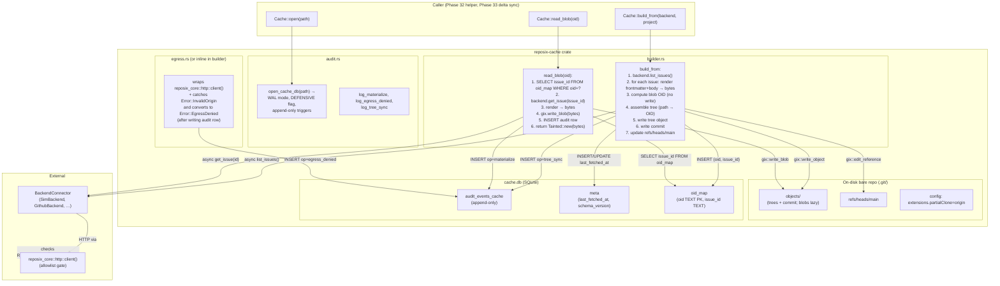

← [back to index](./index.md)

# Architecture Patterns

## Architecture Patterns

### System Architecture Diagram



Data flow for `Cache::build_from(backend, "proj-1")`:
1. Caller invokes async `build_from`.
2. Builder calls `backend.list_issues("proj-1")` — REST hop guarded by allowlist via `reposix_core::http::client()`.
3. For each `Issue`, builder calls `frontmatter::render(&issue)` (pure function in `reposix-core`) to produce the canonical `<id>.md` bytes.
4. Builder computes the blob OID for each rendering by hashing — but does NOT write the blob to `.git/objects` yet (the lazy invariant).
5. Builder constructs a tree object via `gix::Repository::edit_tree` with entries `<bucket>/<id>.md` → blob OID. Writes tree object.
6. Builder writes a commit via `gix::Repository::commit_as` with message `sync(<backend>:<project>): <N> issues at <ISO8601>`.
7. Builder updates `refs/heads/main` to the commit OID via `edit_reference`.
8. Builder INSERTs one row per issue into `oid_map` (oid → issue_id).
9. Builder INSERTs one `op=tree_sync` row into the audit table.
10. Builder UPSERTs `last_fetched_at` into the meta table.

Data flow for `Cache::read_blob(oid)`:
1. Caller invokes async `read_blob(oid)`.
2. Builder SELECTs `issue_id` from `oid_map`. Miss → `Error::UnknownOid`.
3. Builder calls `backend.get_issue(issue_id)` — REST hop, allowlisted.
4. Builder calls `frontmatter::render(&issue)`.
5. Builder calls `gix::Repository::write_blob(bytes)`. This persists to `.git/objects` AND returns the OID. Builder asserts the returned OID == requested OID (consistency check; mismatch is a bug or backend race).
6. Builder INSERTs `op=materialize` audit row.
7. Builder returns `Tainted<Vec<u8>>`.

### Recommended Project Structure

```
crates/reposix-cache/
├── Cargo.toml
├── src/
│   ├── lib.rs            # crate root: pub use Cache, Error; #![forbid(unsafe_code)]; #![warn(clippy::pedantic)]
│   ├── cache.rs          # struct Cache { repo: gix::Repository, db: rusqlite::Connection, path: PathBuf, ... }
│   ├── builder.rs        # impl Cache: async fn build_from, async fn read_blob, helpers for tree assembly
│   ├── audit.rs          # open_cache_db, log_* helpers, schema fixture path
│   ├── meta.rs           # last_fetched_at + oid_map upsert/lookup
│   ├── error.rs          # thiserror enum: Egress, Backend, Sqlite, Git, Io
│   └── path.rs           # resolve_cache_path(backend, project) honoring REPOSIX_CACHE_DIR + dirs::cache_dir()
├── fixtures/
│   └── cache_schema.sql  # DDL: audit_events_cache + meta + oid_map + triggers
├── tests/
│   ├── tree_contains_all_issues.rs
│   ├── blobs_are_lazy.rs
│   ├── materialize_one.rs
│   ├── egress_denied_logs.rs
│   ├── audit_is_append_only.rs
│   ├── compile_fail.rs                           # trybuild driver
│   └── compile-fail/
│       ├── tainted_blob_into_egress.rs           # must fail to compile
│       └── tainted_blob_into_egress.stderr
```

### Pattern 1: gix bare repo construction

**What:** Initialize a bare repo, write an empty tree, write a commit, set HEAD.
**When to use:** `Cache::open` — first-time creation of the on-disk substrate.
**Example (verified API surface from gix 0.82 docs):**

```rust
// Source: https://docs.rs/gix/latest/gix/fn.init_bare.html (verified 2026-04-24)
//         https://docs.rs/gix/latest/gix/struct.Repository.html#method.write_blob
// Sketch — the actual signature for commit_as takes references and TreeRef.
use gix::ObjectId;

let repo: gix::Repository = gix::init_bare(&cache_path)?;

// Write tree from a list of (path, blob_oid) entries.
// edit_tree requires the `tree-editor` cargo feature (enabled by default in gix 0.82).
let mut editor = repo.edit_tree(ObjectId::empty_tree(repo.object_hash()))?;
for (path, blob_oid) in entries {
    editor.upsert(path, gix::object::tree::EntryKind::Blob, blob_oid)?;
}
let tree_oid = editor.write()?;

// Commit. The exact signature in gix 0.82 takes:
//   reference_name, message, tree_oid, parents (impl IntoIterator<Item=ObjectId>)
let commit_oid = repo.commit(
    "refs/heads/main",
    format!("sync({}:{}): {} issues at {}", backend, project, n, now),
    tree_oid,
    [] as [ObjectId; 0],
)?;
```

**Note for planner:** The exact method signatures for `commit_as` / `commit` may shift between gix versions. The plan should include a "verify-against-gix-0.82-API" task in Wave A that compiles a smoke test before the full builder is written. Do NOT trust this code sketch without running `cargo check` first; gix's API stability story is "iterating toward 1.0 (issue #470)".

### Pattern 2: lazy blob materialization

**What:** OID is a hash of bytes. Cache stores `(oid, issue_id)` mapping at tree-build time, then on `read_blob(oid)` looks up issue_id, fetches REST, writes blob.
**When to use:** Every `read_blob` call.
**Critical invariant:** `gix::Repository::write_blob(bytes)` returns the OID it computed. The cache MUST assert this equals the requested OID — a mismatch means the backend's `get_issue` returned different content than `list_issues` reported. This is a real failure mode (eventual consistency on backend) and should be a typed error: `Error::OidDrift { requested, actual, issue_id }`.

```rust
async fn read_blob(&self, oid: gix::ObjectId) -> Result<Tainted<Vec<u8>>> {
    let issue_id = self.oid_map_lookup(oid)?
        .ok_or(Error::UnknownOid(oid))?;
    let issue = self.backend.get_issue(&self.project, issue_id).await
        .map_err(|e| {
            // Convert egress-allowlist denial into our typed variant + audit
            if let Some(InvalidOrigin) = e.downcast_ref() {
                let _ = self.audit.log_egress_denied(&issue_id);
                Error::EgressDenied
            } else {
                Error::Backend(e)
            }
        })?;
    let bytes = frontmatter::render(&issue)?.into_bytes();
    let actual_oid = self.repo.write_blob(&bytes)?.into();
    if actual_oid != oid {
        return Err(Error::OidDrift { requested: oid, actual: actual_oid, issue_id });
    }
    let _ = self.audit.log_materialize(&issue_id, oid, bytes.len()); // best-effort
    Ok(Tainted::new(bytes))
}
```

### Pattern 3: extensions.partialClone on the cache

**What:** The cache's bare repo gets `extensions.partialClone = origin` set, even though the cache is itself the promisor.
**Why:** `[CITED: git-scm.com/docs/partial-clone]` — `extensions.partialClone` is a **consumer-side** setting that names which configured remote is the promisor. On the cache itself, this setting is *advisory*. Standard git tooling (`git fsck`, `git fetch <cache-path>`) treats the cache as a normal bare repo because the blobs are simply absent — git's "missing object" handler kicks in only when `extensions.partialClone` is set on the *fetcher's* repo, pointing at this cache as `origin`.
**Implication for this phase:** We do NOT need to configure the cache as a promisor of itself. We DO need to configure it correctly so `git fetch <cache-path>` from a partial-clone consumer (Phase 32 helper) works — and per the standard semantics, the cache simply needs valid trees + commits + missing blobs. Setting `extensions.partialClone = origin` on the cache is harmless and matches the CONTEXT.md "consistency with the partial-clone model" rationale.

### Anti-Patterns to Avoid

- **Don't write blobs in `build_from`.** The whole point of partial clone is lazy blob materialization. If `build_from` wrote blobs, every sync would refetch every issue body — exactly the FUSE problem v0.9.0 is solving. Writing blobs ONLY in `read_blob` is the contract.
- **Don't reuse `audit_events` schema from `reposix_core::audit::SCHEMA_SQL`.** The columns there are HTTP-shaped (`method`, `path`, `status`, `request_body`, `response_summary`). Cache events have different columns (`op`, `backend`, `project`, `issue_id`, `oid`, `bytes`). Define a separate `audit_events_cache` table in `crates/reposix-cache/fixtures/cache_schema.sql` with the same append-only triggers and DEFENSIVE flag pattern.
- **Don't construct `reqwest::Client` directly.** Lint-banned by workspace `clippy.toml` (`disallowed-methods` already lists `reqwest::Client::new`, `reqwest::Client::builder`, `reqwest::ClientBuilder::new`). The cache crate calls `BackendConnector` methods, which already use `reposix_core::http::client()` internally. The cache itself does NOT need to construct a client.
- **Don't expose `gix::Repository` in the public API.** Wrap it in `Cache`. If consumers (Phase 32 helper) need the repo path, expose `Cache::repo_path() -> &Path`. This keeps gix as an implementation detail — if we ever switch to git2 or a hand-rolled object writer, the public surface doesn't change.
- **Don't use `From<Tainted<Vec<u8>>> for Vec<u8>` or `Deref`.** Already locked: `reposix_core::taint` deliberately omits these (see `crates/reposix-core/src/taint.rs:11-16`). The cache must consume from `inner_ref()` / `into_inner()` only inside its own crate, never expose untainted-Bytes-from-Tainted as a free conversion.
