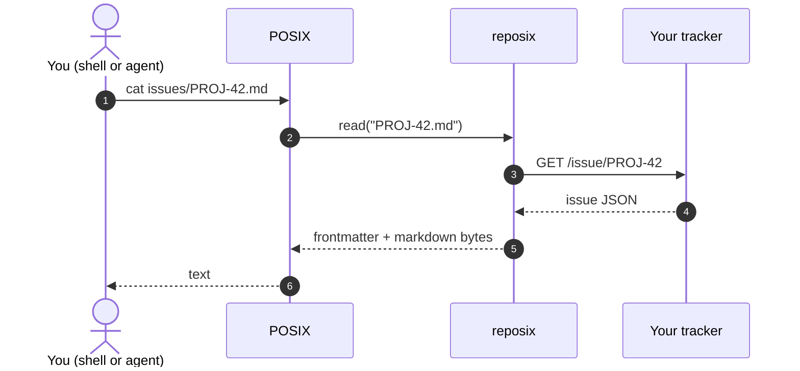
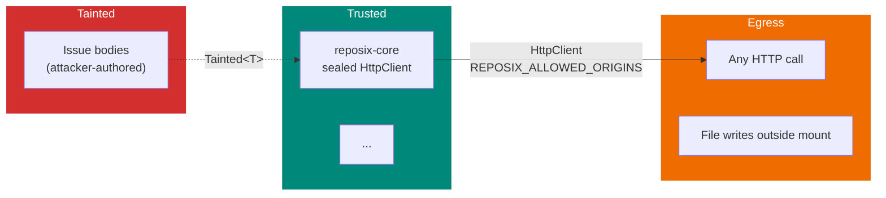

# Phase 30: Docs IA and narrative overhaul — Pattern Map

**Mapped:** 2026-04-17
**Files analyzed:** 26 new + modified + deleted targets (docs pages, mkdocs config, Vale config, scripts, CI)
**Analogs found:** 23 / 26 (3 greenfield with no project analog — see § "No Analog Found")

## File Classification

| New/Modified File | Role | Data Flow | Closest Analog | Match Quality |
|-------------------|------|-----------|----------------|---------------|
| `docs/index.md` | docs page (narrative hero) | carved-from-existing + rewrite | `docs/index.md` (current) + `docs/why.md` (voice) | role-match (rewrite over existing) |
| `docs/mental-model.md` | docs page (Explanation, short) | new-from-scratch | `docs/why.md` §"The one-sentence thesis" | role-match |
| `docs/vs-mcp-sdks.md` | docs page (Explanation, comparison) | new-from-scratch | `docs/why.md` + `docs/index.md` (current thesis diagram) | role-match |
| `docs/tutorial.md` | docs page (Tutorial) | carved-from-existing | `docs/demo.md` (steps 3–7) | exact |
| `docs/how-it-works/filesystem.md` | docs page (Explanation) | carved-from-existing | `docs/architecture.md` §"Read path" + §"Write path" + §"The async bridge" | exact |
| `docs/how-it-works/git.md` | docs page (Explanation) | carved-from-existing | `docs/architecture.md` §"git push" + §"Optimistic concurrency as git merge" | exact |
| `docs/how-it-works/trust-model.md` | docs page (Explanation) | carved-from-existing | `docs/security.md` + `docs/architecture.md` §"Security perimeter" | exact |
| `docs/how-it-works/index.md` | section landing | new-from-scratch | None direct — see note | partial |
| `docs/guides/write-your-own-connector.md` | docs page (How-to) | move-unchanged | `docs/connectors/guide.md` (465 lines, preserve verbatim) | exact (file move) |
| `docs/guides/integrate-with-your-agent.md` | docs page (How-to) | new-from-scratch | `docs/connectors/guide.md` (prose voice), `docs/why.md` (agent framing) | role-match (greenfield) |
| `docs/guides/troubleshooting.md` | docs page (How-to stub) | new-from-scratch | `docs/demo.md` §"Limitations / honest scope" (failure patterns) | partial |
| `docs/guides/connect-github.md` | docs page (How-to stub) | new-from-scratch | `docs/reference/confluence.md` + `docs/demos/index.md` | partial |
| `docs/guides/connect-jira.md` | docs page (How-to stub) | new-from-scratch | same as above | partial |
| `docs/guides/connect-confluence.md` | docs page (How-to stub) | new-from-scratch | `docs/reference/confluence.md` | partial |
| `docs/reference/simulator.md` | docs page (Reference) | new-from-scratch + carve | `docs/reference/cli.md` (reference voice) + `docs/reference/http-api.md` (sim REST shape) | exact |
| `docs/architecture.md` | existing — **DELETE** after carve | (carved out) | — | — |
| `docs/security.md` | existing — **DELETE** after carve | (carved out) | — | — |
| `docs/demo.md` | existing — **DELETE / REDIRECT** | (carved out) | — | — |
| `docs/connectors/guide.md` | existing — **DELETE** (moved) | (relocated) | — | — |
| `docs/why.md` | existing — keep (Explanation tier, linked from home) | keep | — | — |
| `mkdocs.yml` | config | modify-in-place | `mkdocs.yml` (current, lines 8–103) | exact (baseline) |
| `.vale.ini` | linter config | new-from-scratch | None in repo — research §Example 1 | no-analog (use research template) |
| `.vale-styles/Reposix/ProgressiveDisclosure.yml` | Vale rule | new-from-scratch | None in repo — research §Example 1 | no-analog |
| `.vale-styles/Reposix/NoReplace.yml` | Vale rule | new-from-scratch | None in repo — research §Example 1 | no-analog |
| `scripts/hooks/pre-commit-docs` | git hook | new-from-scratch | `scripts/hooks/pre-push` (mirror pattern HARD-00) | exact |
| `scripts/hooks/test-pre-commit-docs.sh` | shell test | new-from-scratch | `scripts/hooks/test-pre-push.sh` | exact |
| `scripts/check_phase_30_structure.py` | validation script | new-from-scratch | `scripts/check_fixtures.py` | exact |
| `scripts/test_phase_30_tutorial.sh` | shell test | new-from-scratch | `scripts/hooks/test-pre-push.sh` (bash test pattern) | role-match |
| `scripts/install-hooks.sh` | install script | modify-in-place | `scripts/install-hooks.sh` (current — symlink pattern already scales) | exact (no change needed — loop auto-picks up new hook) |
| `.github/workflows/docs.yml` | CI workflow | modify-in-place | `.github/workflows/docs.yml` (current) + `.github/workflows/ci.yml` (hook test pattern) | exact |
| `README.md` (root) | modify-in-place | modify-in-place | existing | (only link audit) |
| `docs/screenshots/phase-30/*.png` | binary assets | new-from-scratch | `docs/screenshots/*.png` (naming pattern) | exact |

## Pattern Assignments

### `docs/index.md` (narrative hero — REWRITE)

**Analog (source of truth for frontmatter/voice):** `docs/index.md` current state at `/home/reuben/workspace/reposix/docs/index.md` + `docs/why.md` for explanation voice.

**Analog for hero-admonition + grid-cards markdown pattern** (lines 11–12, 44–62 of current index.md):

```markdown
!!! success "v0.7 — six autonomous overnight sessions, 2026-04-13 → 2026-04-16"
    Every line of code in this repository was written by a coding agent across six overnight sessions. ...

<div class="grid cards" markdown>

-   :material-file-document: **[Five-crate workspace](reference/crates.md)**

    `-core`, `-sim`, `-fuse`, `-remote`, `-cli`. 317+ tests. All crates `#![forbid(unsafe_code)]`.

-   :material-shield-lock: **[Eight security guardrails](security.md)**

    SG-01 allowlist · SG-02 bulk-delete cap · ...

</div>
```

**Before/after hero pattern** (constructed from `.planning/notes/phase-30-narrative-vignettes.md` lines 114–181). Two fenced `bash` blocks stacked, with prose "Before" / "After" H3 framing, followed by a mandatory blockquote **complement line**:

```markdown
### Before — REST from an agent

\`\`\`bash
# ~30 lines of curl/jq ceremony — 5 round trips, 3 ID formats
\`\`\`

### After — the same change with reposix

\`\`\`bash
cd ~/work/acme-jira
sed -i -e 's/^status: .*/status: Done/' issues/PROJ-42.md
git commit -am "close PROJ-42" && git push
\`\`\`

> You still have full REST access for the operations that need it — JQL queries,
> bulk imports, admin config. reposix just means you don't have to reach for it
> for the hundred small edits you'd otherwise make every day.
```

**Divergence from analog:** The current `docs/index.md` leads with a thesis diagram (mermaid) and the phrase "FUSE filesystem." That opener **violates P2** (FUSE banned above Layer 3). The new `index.md` MUST drop "FUSE" from above-fold prose and replace the thesis-diagram hero with the V1 before/after code pair. Grid-cards pattern is preserved (it already matches the three-up value-prop brief). The `!!! success` admonition pattern can be reused verbatim for a post-fold v0.9.0 announcement line.

---

### `docs/mental-model.md` (three conceptual keys, 300–400 words)

**Analog for structure:** `docs/why.md` §"reposix turns the same workflow into two sentences of shell" (lines 30–38) — short H2 + one code block + one-paragraph explanation. Lift the cadence: equation → explanation → 3–5 line snippet.

**Voice excerpt from analog** (`docs/why.md` lines 32–38):

```markdown
```bash
sed -i 's/^status: open$/status: in_progress/' /mnt/reposix/issues/00000000001.md
git commit -am "claim issue 1" && git push
```

That's it. The agent issues two commands it has seen thousands of times in its pre-training...
```

**Locked key phrasings** (source-of-truth note, used verbatim as H2s):
- `## mount = git working tree`
- `## frontmatter = schema`
- `## \`git push\` = sync verb`

**Divergence from analog:** `why.md` has diagrams; mental-model has NONE (diagrams are the payoff of how-it-works, not the setup). `why.md` is long-form; mental-model is capped at ~400 words. Close each section with a terse "Now what" pointer to `/tutorial/` or `/how-it-works/`.

**NOTE:** The banned-word "mount" appears in the locked H2 phrasing. This file must be in the P2-scoped exception set in `.vale.ini` OR the rule must use `\bmount\b` with Vale's `action: remove` and `tokens` scoped so the literal H2 string is not flagged. Research §Example 1 uses `\bmount\b` as a regex boundary; the `[docs/mental-model.md]` section in `.vale.ini` must set `Reposix.ProgressiveDisclosure = NO` specifically for this page per the P2/P1 exception table.

---

### `docs/vs-mcp-sdks.md` (comparison, Explanation)

**Analog:** `docs/why.md` §"The bottleneck nobody talks about" + mermaid ladder diagram (lines 9–26). Same "before is expensive MCP dance" framing.

**Analog pattern (`docs/why.md` lines 9–26) — MCP ladder:**

```markdown
```mermaid
sequenceDiagram
  autonumber
  participant A as LLM Agent
  participant M as MCP Server
  participant J as Jira REST API
  Note over A,M: Turn 1 — tool discovery
  A->>M: list-tools
  M-->>A: 40+ tool definitions (~60 000 tokens)
  ...
```

Every turn costs context window. Every turn the agent learns the schema of a tool it will use once and discard.
```

**Table pattern from `docs/why.md`** (lines 55–58):

```markdown
| Scenario | Real tokens (`count_tokens`) |
|----------|-----------------:|
| MCP-mediated (tool catalog + schemas) | ~4,883 |
| **reposix** (shell session transcript) | **~531** |
```

**Divergence from analog:** `why.md` is a deep-dive with benchmark. `vs-mcp-sdks.md` is shorter, comparison-table-led. MUST include a paragraph articulating P1 explicitly ("reposix complements MCP/SDKs — you keep them for the operations they're good at"). MUST NOT use "replace" (P1 banned word). The copy subagent may lift the 92.3% figure from `docs/why.md` but link back for detail — don't duplicate the methodology section.

---

### `docs/tutorial.md` (5-minute first-run)

**Analog:** `docs/demo.md` lines 58–248 (steps 3–7). Already has the exact text the tutorial needs. Research §"Tutorial Pattern" (RESEARCH.md lines 766–780) prescribes a 4-step structure.

**Analog pattern (`docs/demo.md` lines 58–82) — numbered step with heading, prose, code block, expected output inline as `# => ...` comment:**

```markdown
### 3/9 — Start the simulator

\`\`\`bash
target/release/reposix-sim \
    --bind 127.0.0.1:7878 \
    --db /tmp/demo-sim.db \
    --seed-file crates/reposix-sim/fixtures/seed.json &
curl -sf http://127.0.0.1:7878/healthz   # waits for "ok"
curl -s http://127.0.0.1:7878/projects/demo/issues | jq 'length'
# => 6
\`\`\`

Six seeded issues. ...
```

**Prereqs list pattern (`docs/demo.md` lines 11–15):**

```markdown
Prereqs (Linux only for v0.1):

- Rust stable 1.82+ (we tested with 1.94.1).
- `fusermount3` (Ubuntu: `sudo apt install fuse3`).
- `jq`, `sqlite3`, `curl`, `git` (>= 2.20) on `$PATH`.
```

**FUSE-specific write-gotcha from `docs/demo.md` lines 125–136 (load-bearing — DO NOT rewrite with `sed -i`):**

```bash
NEW="$(sed 's/^status: open$/status: in_progress/' /tmp/demo-mnt/issues/00000000001.md)"
printf '%s\n' "$NEW" > /tmp/demo-mnt/issues/00000000001.md
```

Narrated note: "We do NOT use `sed -i`: the FUSE FS only accepts filenames matching `<padded-id>.md`, and `sed -i` creates a temp file like `sed.XYZ`, which gets `EINVAL`."

**Divergence from analog:** `demo.md` is 9 steps; tutorial collapses to 4 (prereqs, start simulator, mount+edit, git push+verify). `demo.md` opens with reference-style preamble ("one-liner: reposix mounts…"); tutorial opens with an action-oriented one-sentence promise ("In 5 minutes you'll edit a tracker ticket with `sed` and push the change through `git`"). The tutorial's "aha" must land in step 3 or 4 (server-side version bump via `curl | jq` per Stripe pattern G) — **do not save it for a recap**.

**Banned above Layer 3:** Despite being a tutorial that runs against the simulator, P2 applies. Do NOT use "FUSE" / "daemon" / "mount point" in prose. Use "reposix mount" as a command invocation only; never as a noun phrase in a sentence. Example from analog that WOULD need rephrasing: `docs/demo.md` line 86 ("The kernel sees a new VFS at `/tmp/demo-mnt`"). Tutorial equivalent: "reposix exposes the tracker at `/tmp/demo-mnt` as a directory."

---

### `docs/how-it-works/filesystem.md` (read/write path, Explanation)

**Analog:** `docs/architecture.md` §"Read path" (lines 82–110) + §"Write path" (lines 112–140) + §"The async bridge" (lines 194–223). Carve these three sections into one focused page with one mermaid diagram.

**Analog mermaid pattern (`docs/architecture.md` lines 84–103) — sequenceDiagram with autonumber and actor roles:**

```markdown
```mermaid
sequenceDiagram
  autonumber
  participant A as Agent (shell)
  participant K as Kernel VFS
  participant F as reposix-fuse
  participant S as reposix-sim
  participant D as SQLite WAL
  A->>K: read("/mnt/reposix/issues/00000000001.md")
  K->>F: FUSE_READ(ino)
  Note over F: validate_issue_filename("00000000001.md") — SG-04
  F->>F: IssueBackend::get_issue (SimBackend impl)<br/>5s timeout (SG-07)
  ...
```
```

**Prose pattern to adopt (`docs/architecture.md` lines 105–110) — bulleted "Key points" immediately after the diagram:**

```markdown
Key points:

- Filename validation happens at the FUSE boundary. `../../etc/passwd.md` is rejected with `EINVAL` before any HTTP call.
- The 5-second timeout means a dead backend cannot hang the kernel indefinitely; `ls` returns within 5s with `EIO`.
- The audit insert is an outermost axum middleware layer — every request is recorded, including rate-limited ones.
```

**Research-recommended mermaid spec for this page (RESEARCH.md §Example 6, lines 596–611):**

```markdown

```

**Divergence from analog:** This IS Layer 3, so the terms "FUSE" / "kernel" / "daemon" are PERMITTED in prose here. But research note for diagrams says keep actor/participant NAMES approachable (use "POSIX" + "reposix" instead of "Kernel VFS" + "reposix-fuse") so the page is still readable by a Layer 2 reader who clicks through. Architecture.md is 259 lines of dense content; this page carves ~one-third (~90 lines). Delete the crate-topology section (belongs elsewhere if at all).

---

### `docs/how-it-works/git.md` (remote helper + optimistic concurrency)

**Analog:** `docs/architecture.md` §"git push: the central value prop" (lines 142–167) + §"Optimistic concurrency as git merge" (lines 169–192).

**Analog sequence diagram (`docs/architecture.md` lines 144–167):**

```markdown
```mermaid
sequenceDiagram
  autonumber
  participant A as Agent
  participant G as git
  participant H as git-remote-reposix
  participant S as reposix-sim
  A->>G: git commit -am "..."
  A->>G: git push origin main
  G->>H: (spawn) + capabilities
  ...
  alt plan has ≤5 deletes OR [allow-bulk-delete] tag
    H->>S: POST / PATCH / DELETE per delta
    H-->>G: ok refs/heads/main
  else plan has >5 deletes, no override
    H-->>G: error refs/heads/main bulk-delete
  end
```
```

**Research-recommended simplified diagram (RESEARCH.md §Example 6 lines 618–624):**

```markdown

```

**Prose pattern for the concurrency argument (`docs/architecture.md` lines 171–192 + line 192 moneyline):**

> The agent resolving the conflict never has to parse a JSON `409` error. It never has to hold two versions of the issue in context and synthesize a merge. It uses `sed` on a text file with unambiguous markers — a flow it has seen in every merge-conflict-resolution corpus it was trained on.

**Divergence from analog:** architecture.md shows TWO mermaid diagrams in this section; the new page gets ONE (research constraint — one diagram per how-it-works page). The picked diagram is the simplified research-recommended flowchart (more scannable); the concurrency flow moves to prose + a brief code block showing the conflict-marker experience from supporting vignette 2 (`phase-30-narrative-vignettes.md` lines 197–210).

---

### `docs/how-it-works/trust-model.md` (taint + allowlist + audit)

**Analog:** `docs/security.md` (all 99 lines) + `docs/architecture.md` §"Security perimeter" (lines 225–254).

**Analog eight-guardrails table pattern (`docs/security.md` lines 21–30):**

```markdown
| ID | Mitigation | Evidence | Test | On camera |
|----|-----------|----------|------|-----------|
| SG-01 | Outbound HTTP allowlist (`REPOSIX_ALLOWED_ORIGINS`) | `crates/reposix-core/src/http.rs` sealed `HttpClient` newtype + per-request URL recheck | `crates/reposix-core/tests/http_allowlist.rs` (7 tests) | ✓ step 8a |
| SG-02 | Bulk-delete cap (>5 deletes refused; `[allow-bulk-delete]` overrides) | `crates/reposix-remote/src/diff.rs::plan` | `crates/reposix-remote/tests/bulk_delete_cap.rs` (3 tests) | ✓ step 8b |
```

**Analog security-perimeter diagram (`docs/architecture.md` lines 227–252):**

```markdown

```

**Research-recommended diagram for this page (RESEARCH.md §Example 6 lines 628–648):** Same shape as above but with actor-framing updates. Keep the three-color subgraph semantics: red = tainted, orange = egress, teal = trusted.

**Lethal-trifecta narrative opener (`docs/security.md` lines 5–11):**

```markdown
Every deployment of reposix is a textbook **lethal trifecta**[^1]:

1. **Private data.** The FUSE mount exposes issue bodies, custom fields, ...
2. **Untrusted input.** Every remote ticket / page is attacker-influenced text...
3. **Exfiltration channel.** `git push` can target any remote the agent chooses...

[^1]: [Simon Willison, "The lethal trifecta for AI agents"](https://simonwillison.net/2025/Jun/16/the-lethal-trifecta/), revised April 2026.
```

**Divergence from analog:** `security.md` is a shipped-items enumeration ("SG-01..08 + what's deferred"). The new page tells a STORY first — lethal trifecta → which leg reposix cuts at the architectural level (allowlist) → which it hardens (taint typing) → which it accepts as incurable (sanitize-on-egress). The SG-* table is carved wholesale (preserve exact rows per §"Security Domain" warning: don't oversell). Deferred-items list moves to the bottom or off-page. CLAUDE.md-OP-constraint: every trust-model claim cross-referenced against a shipped `SG-*` row with file:line evidence. NO new claims. See RESEARCH.md §"Security Domain" lines 1120–1130.

---

### `docs/how-it-works/index.md` (section landing page)

**Analog:** None in current docs — section-landing pages don't yet exist (current nav has `docs/decisions/` and `docs/development/` as sections with no `index.md`). Closest analog in shape: `docs/reference/crates.md` §intro (lines 1–3) — one sentence, then table of contents to the section.

**Voice pattern to replicate (`docs/reference/crates.md` lines 1–3):**

```markdown
# Crates overview

reposix is a Cargo workspace of eight crates. `reposix-core` is the seam: every other crate depends on it; it depends on nothing internal.
```

**Content pattern:** One paragraph that transitions from Layer 2 (the reader has just read the mental model and/or tutorial) to Layer 3 ("Under the hood, reposix is three pieces..." — lift this framing from `.planning/notes/phase-30-narrative-vignettes.md` lines 63–66). Followed by `grid cards` pointing to the three sub-pages. Reuse the index.md grid-cards pattern verbatim (syntax identical).

**Divergence from analog:** `crates.md` is a reference TOC; this page is narrative. The paragraph lead must be earned — the reader arrived here from the hero or mental model, not cold. "Under the hood" is explicitly allowed as a Layer 3 lead-in. Research verifies: mkdocs `--strict` mode may emit warnings for orphan pages. This page MUST be in `nav:` (see Pitfall 4).

---

### `docs/guides/write-your-own-connector.md` (MOVE from `docs/connectors/guide.md`)

**Analog:** `docs/connectors/guide.md` (465 lines) — **preserve verbatim**. This is a file move, not a rewrite.

**Source-of-truth clause (lines 64–65 of `docs/connectors/guide.md` — must be preserved intact):**

```markdown
Do NOT read the above and copy it into your adapter's docs — link to
`crates/reposix-core/src/backend.rs` as the single source of truth.
```

**Internal-link pattern used throughout (`docs/connectors/guide.md` line 451 onward):**

```markdown
- [`crates/reposix-core/src/backend.rs`](https://github.com/reubenjohn/reposix/blob/main/crates/reposix-core/src/backend.rs)
  — `IssueBackend` trait, `BackendFeature`, `DeleteReason`.
- [ADR-001 GitHub state mapping](../decisions/001-github-state-mapping.md)
```

**Divergence from analog:** Two relative-link updates are required:
1. Path `../decisions/...` still works from `docs/guides/` (same depth as `docs/connectors/`). No change needed.
2. Path `../reference/confluence.md` still works (same depth).
3. External repo links (using `https://github.com/reubenjohn/reposix/blob/main/...`) are unaffected by the move.

**Nav entry** moves from `Connectors > Building your own` to `Guides > Write your own connector`. Phase 11 and Phase 12 ROADMAP pointers at lines 8–14 and 363–399 stay intact.

---

### `docs/guides/integrate-with-your-agent.md` (NEW — greenfield)

**Analog (prose voice):** `docs/connectors/guide.md` step-by-step pattern (lines 74–165) + `docs/why.md` voice for the agent-framing context.

**Analog step pattern (`docs/connectors/guide.md` lines 74–100) — `### Step N. Name` H3 + prose + fenced code + terse trailing explanation:**

```markdown
### Step 1. Cargo skeleton

\`\`\`bash
cargo new --lib reposix-adapter-foo
cd reposix-adapter-foo
\`\`\`

Copy the dependency list from [`reposix-confluence/Cargo.toml`](...) as a starting point. The minimum set is:

\`\`\`toml
[dependencies]
reposix-core = "..."               # match the version of reposix you're targeting
...
\`\`\`
```

**Voice excerpt to echo (`docs/why.md` lines 89–98):**

```markdown
Every modern foundation model has been trained on:

- The Linux man pages (`man 1 grep`, `man 7 regex`, `man 2 open` — all there).
- Hundreds of thousands of open-source shell scripts.
- Countless Stack Overflow answers that use `sed`, `awk`, `jq`, `find`.
- Every commit message in every public Git repo of any size.
```

**Divergence from analog:** No existing source for this page. Planner + subagent author from scratch. Suggested structure (research-aligned):
1. `## With Claude Code` — prompt pattern showing a system prompt that mentions the mount path; include expected token savings (~75×, link to `why.md`).
2. `## With Cursor` — `.cursorrules` pattern.
3. `## With a custom SDK` — 20 lines of Python / TypeScript doing `subprocess.run(["git", "push"])` against a reposix mount.
4. `## Gotchas` — taint boundary, allowlist setup, REPOSIX_ALLOWED_ORIGINS walkthrough.

Above-Layer-3 banned words: FUSE, daemon, mount (noun), kernel. Vale rule enforces.

---

### `docs/guides/troubleshooting.md` (NEW — stub that grows post-launch)

**Analog (prose + failure-case voice):** `docs/demo.md` §"Limitations / honest scope" (lines 272–298) — shows honest-accounting tone.

**Analog pattern (`docs/demo.md` lines 274–293):**

```markdown
## Limitations / honest scope

This demo page was captured at v0.1 alpha (2026-04-13) and shows the simulator-only narrative...

- **The demo script itself still targets the simulator** — it's the fastest, cred-free path to demonstrate ...
- **No man page, .deb, or brew formula.** Clone-and-`cargo build`.
- **Linux only.** FUSE3/FUSE2. macOS-via-macFUSE is a follow-up.
```

**Divergence from analog:** Troubleshooting is work-mode (How-to), not honest-scope (Explanation). Each entry is a Symptom/Cause/Fix triad, not a limitation bullet. Three initial stub entries per RESEARCH.md line 943:
1. FUSE mount fails — likely `fuse3` not installed; run `sudo apt install fuse3`.
2. `git push` rejected with `bulk-delete` — SG-02 fired; either reduce scope or append `[allow-bulk-delete]` to commit message.
3. Audit log query — `sqlite3 /tmp/demo-sim.db 'SELECT ...'` — pattern from `docs/demo.md` lines 234–241.

Page is explicitly a stub; CHANGELOG notes "grows post-launch." Don't pad.

---

### `docs/guides/connect-{github,jira,confluence}.md` (NEW — stubs)

**Analog:** `docs/reference/confluence.md` (full backend reference) — lift credential-env-var section. `docs/demos/index.md` for the tier-5 real-backend scripts.

**Voice excerpt pattern (`docs/why.md` lines 73–79):**

```bash
REPOSIX_ALLOWED_ORIGINS='http://127.0.0.1:*,https://api.github.com' \
    GITHUB_TOKEN="$(gh auth token)" \
    reposix list --backend github --project octocat/Hello-World --format table
```

**Divergence from analog:** Each of these is a stub that links to (a) the existing `docs/reference/{confluence,jira}.md` reference page, (b) the `scripts/demos/05-mount-real-github.sh` tier-5 script, and (c) the `REPOSIX_ALLOWED_ORIGINS` + credential env-var requirement. Do NOT duplicate `reference/` content — single source of truth.

---

### `docs/reference/simulator.md` (NEW — carved from architecture + reference/http-api)

**Analog:** `docs/reference/cli.md` (lines 1–76, the flag-table-by-subcommand reference voice) + `docs/reference/http-api.md` (lines 1–60, the endpoint-by-endpoint reference voice) + `docs/architecture.md` §"System view" simulator-row.

**Analog flag-table pattern (`docs/reference/cli.md` lines 47–58):**

```markdown
## `reposix sim`

Spawn the REST simulator as a subprocess.

| Flag | Default | Purpose |
|------|---------|---------|
| `--bind` | `127.0.0.1:7878` | Listen address. |
| `--db` | `runtime/sim.db` | SQLite file. |
| `--seed-file` | — | Path to JSON seed (e.g. `crates/reposix-sim/fixtures/seed.json`). |
| `--no-seed` | off | Don't seed even if `--seed-file` is given. |
| `--ephemeral` | off | Use in-memory SQLite instead of `--db`. |
| `--rate-limit` | `100` | Per-agent requests/sec. |
```

**Analog endpoint-table pattern (`docs/reference/http-api.md` lines 7–59):** reference-voice endpoint listings with purpose-and-example pairs.

**Divergence from analog:** This page frames the simulator as **dev tooling** (research-agreed), not core architecture. Opening sentence should be "The simulator is the default testing backend for reposix. …" Lift the sim route table from `reference/http-api.md` (already correct). Lift the CLI flag table from `reference/cli.md` `reposix sim` subcommand. Add a new "Seeding + fixtures" section describing `crates/reposix-sim/fixtures/seed.json` (not yet documented anywhere user-facing).

---

### `mkdocs.yml` (MODIFY — nav + theme + plugins)

**Analog (baseline):** `mkdocs.yml` current state at `/home/reuben/workspace/reposix/mkdocs.yml` (103 lines).

**Current theme block (lines 8–36, keep palette; modify features):**

```yaml
theme:
  name: material
  palette:
    - scheme: default
      primary: deep purple
      accent: amber
      toggle:
        icon: material/brightness-7
        name: Switch to dark mode
    - scheme: slate
      primary: deep purple
      accent: amber
      toggle:
        icon: material/brightness-4
        name: Switch to light mode
  features:
    - navigation.instant
    - navigation.tracking
    - navigation.sections
    - navigation.expand       # REMOVE per research — conflicts with sections
    - navigation.top
    - search.suggest
    - search.highlight
    - content.code.copy
    - content.code.annotate
    - content.tabs.link
  icon:
    repo: fontawesome/brands/github
```

**Target features (research §"mkdocs-material Theme Tuning" lines 833–862):** add `navigation.footer`, `navigation.tabs`, `content.action.edit`, `content.action.view`; optional `announce.dismiss`; REMOVE `navigation.expand`.

**Current plugins (lines 40–43):**

```yaml
plugins:
  - search
  - minify:
      minify_html: true
```

**Target plugins (add social):**

```yaml
plugins:
  - search
  - social   # ADD — generates per-page social cards (CairoSVG + pillow already present)
  - minify:
      minify_html: true
```

**Current markdown extensions (lines 45–70, keep AS-IS — already has mermaid fence wiring):**

```yaml
markdown_extensions:
  - pymdownx.highlight:
      anchor_linenums: true
      line_spans: __span
      pygments_lang_class: true
  - pymdownx.superfences:
      custom_fences:
        - name: mermaid
          class: mermaid
          format: !!python/name:pymdownx.superfences.fence_code_format
  ...
```

**Current nav (lines 77–103):**

```yaml
nav:
  - Home: index.md
  - Why reposix: why.md
  - Architecture: architecture.md
  - Demos:
      - Overview: demos/index.md
      - Tier 2 walkthrough: demo.md
  - Security: security.md
  - Decisions:
      - ADR-001 GitHub state mapping: decisions/001-github-state-mapping.md
      ...
  - Reference:
      - Crates overview: reference/crates.md
      - CLI: reference/cli.md
      - HTTP API (simulator): reference/http-api.md
      - git remote helper: reference/git-remote.md
      - Confluence backend: reference/confluence.md
  - Connectors:
      - Building your own: connectors/guide.md
  - Development:
      - Contributing: development/contributing.md
      - Roadmap (v0.2+): development/roadmap.md
```

**Target nav (source-of-truth §"Proposed nav", matches RESEARCH.md §"Recommended docs/ tree structure"):**

```yaml
nav:
  - Home: index.md
  - Why reposix: why.md
  - Mental model: mental-model.md
  - reposix vs MCP / SDKs: vs-mcp-sdks.md
  - Try it in 5 minutes: tutorial.md
  - How it works:
      - Overview: how-it-works/index.md
      - The filesystem layer: how-it-works/filesystem.md
      - The git layer: how-it-works/git.md
      - The trust model: how-it-works/trust-model.md
  - Guides:
      - Connect to GitHub: guides/connect-github.md
      - Connect to Jira: guides/connect-jira.md
      - Connect to Confluence: guides/connect-confluence.md
      - Write your own connector: guides/write-your-own-connector.md
      - Integrate with your agent: guides/integrate-with-your-agent.md
      - Troubleshooting: guides/troubleshooting.md
  - Reference:
      - Crates overview: reference/crates.md
      - CLI: reference/cli.md
      - HTTP API (simulator): reference/http-api.md
      - Simulator: reference/simulator.md
      - git remote helper: reference/git-remote.md
      - Confluence backend: reference/confluence.md
  - Decisions:
      - ADR-001 GitHub state mapping: decisions/001-github-state-mapping.md
      ...
  - Research:
      - Architectural argument: research/initial-report.md
      - Agentic engineering reference: research/agentic-engineering-reference.md
  - Development:
      - Contributing: development/contributing.md
      - Roadmap (v0.2+): development/roadmap.md
```

**Divergence from analog:** Research §"mkdocs-material Theme Tuning" is the authority on theme features. Research §"Recommended docs/ tree structure" (RESEARCH.md lines 211–262) is the authority on nav structure. The current `Architecture` / `Security` / `Demos` entries are REMOVED (content carved and source files deleted). The current `Connectors` section is REMOVED (folded into `Guides`). Edit carefully per Pitfall 7 — every removed page must have no dangling links when `mkdocs build --strict` runs.

---

### `.vale.ini` (NEW — Vale linter config)

**Analog:** None in the repo. Use research §Example 1 (RESEARCH.md lines 433–464) verbatim.

**Template pattern:**

```ini
# .vale.ini
StylesPath = .vale-styles
MinAlertLevel = warning

Vocab = Reposix

# Exclude code from prose linting (critical — avoids flagging bash snippets)
IgnoredScopes = code, code_block

# By default, apply the banned-word rule to all markdown
[*.md]
BasedOnStyles = Reposix

# ESCAPE HATCH: how-it-works/, reference/, decisions/, research/ are Layer 3+
# and MAY use the banned terms. Opt-out per-glob.
[docs/how-it-works/**]
Reposix.ProgressiveDisclosure = NO
[docs/reference/**]
Reposix.ProgressiveDisclosure = NO
[docs/decisions/**]
Reposix.ProgressiveDisclosure = NO
[docs/research/**]
Reposix.ProgressiveDisclosure = NO
[docs/development/**]
Reposix.ProgressiveDisclosure = NO

# The hero-ban on "replace" is a different rule, applied EVERYWHERE on the landing
[docs/index.md]
BasedOnStyles = Reposix
Reposix.NoReplace = YES
```

**Divergence from analog:** No repo analog for `.ini` format. The above is verbatim-citable. Planner may need to add a `[docs/mental-model.md]` exception specifically for the locked "mount = git working tree" H2 (see `docs/mental-model.md` divergence note above).

---

### `.vale-styles/Reposix/ProgressiveDisclosure.yml` (NEW — P2 rule)

**Analog:** None in the repo. Use research §Example 1 (RESEARCH.md lines 468–482) verbatim.

```yaml
extends: existence
message: "P2 violation: '%s' is a Layer 3 term — banned on Layer 1/2 pages (index, mental-model, vs-mcp-sdks, tutorial, guides, home-adjacent). Move it into docs/how-it-works/ or rephrase in user-experience language."
level: error
scope: text
ignorecase: true
tokens:
  - FUSE
  - inode
  - daemon
  - \bhelper\b       # boundaries — "Jupyter helper" generic is fine, but flag bare
  - kernel
  - \bmount\b        # noun/verb — flag any bare occurrence; authors rephrase
  - syscall
```

**Divergence:** none — template is canonical.

---

### `.vale-styles/Reposix/NoReplace.yml` (NEW — P1 rule)

**Analog:** None in the repo. Use research §Example 1 (RESEARCH.md lines 486–497) verbatim.

```yaml
extends: existence
message: "P1 violation: 'replace' is banned in hero/value-prop copy. Use 'complement, absorb, subsume, lift, erase the ceremony' instead."
level: error
scope: text
ignorecase: true
tokens:
  - replace
  - replaces
  - replacing
  - replacement
```

**Divergence:** none — template is canonical.

---

### `scripts/hooks/pre-commit-docs` (NEW — doc-lint git hook)

**Analog:** `scripts/hooks/pre-push` (155 lines) — mirror bash-hook structure, colored logging, set flags, and `REPOSIX_HOOKS_QUIET` gating.

**Analog header + logging pattern (`scripts/hooks/pre-push` lines 1–33):**

```bash
#!/usr/bin/env bash
#
# Credential-hygiene pre-push hook (OP-7 from HANDOFF.md).
#
# Rejects a push if any committed file on the outgoing range contains
# a literal Atlassian API token (prefix `ATATT3`) or GitHub PAT (prefix
# `ghp_` or `github_pat_`). ...
#
# To install:
#   bash scripts/install-hooks.sh
#
# Environment:
#   REPOSIX_HOOKS_QUIET=1   suppress informational output; still rejects on hit.

set -euo pipefail

readonly RED='\033[0;31m'
readonly GREEN='\033[0;32m'
readonly YELLOW='\033[1;33m'
readonly NC='\033[0m'

quiet="${REPOSIX_HOOKS_QUIET:-0}"

log() {
  if [[ "$quiet" != "1" ]]; then
    printf '%b\n' "$*" >&2
  fi
}
```

**Analog exit-discipline pattern (`scripts/hooks/pre-push` lines 124–135):**

```bash
if [[ "$hit" -gt 0 ]]; then
  printf '%b\n' "${RED}✖ pre-push rejected:${NC} ${hit} credential-prefix hit(s) above." >&2
  printf '%b\n' "${YELLOW}→${NC} If this is a false positive ..." >&2
  exit 1
fi

log "${GREEN}✓${NC} no credential prefixes detected."
```

**Target sketch (RESEARCH.md §Example 2 lines 505–524):**

```bash
#!/usr/bin/env bash
# Doc-lint gate — runs Vale on docs/**.md.
# Mirrors scripts/hooks/pre-push pattern (HARD-00).

set -euo pipefail

CHANGED=$(git diff --cached --name-only --diff-filter=ACM | grep -E '^docs/.*\.md$' || true)

if [ -z "$CHANGED" ]; then
    exit 0
fi

if ! command -v vale >/dev/null 2>&1; then
    echo "error: vale not installed. See .planning/phases/30-.../RESEARCH.md §Standard Stack." >&2
    exit 1
fi

echo "==> Vale lint on $CHANGED"
echo "$CHANGED" | xargs vale --config=.vale.ini
```

**Divergence from analog:** `pre-push` operates on ref ranges + git-diff between shas (push-time); `pre-commit-docs` operates on `--cached` staged files (commit-time). Scope is narrower (only `docs/**.md`). Full color/log/quiet pattern should be adopted for consistency — the research example is minimal; the planner should extend it with the `readonly RED/GREEN/YELLOW/NC` + `log()` helper per `pre-push` analog.

**Install path:** `scripts/install-hooks.sh` (lines 28–42) already loops `scripts/hooks/*` and symlinks every executable file. **NO change** needed to `install-hooks.sh` — new hook auto-registers on re-run. Confirmed by reading `install-hooks.sh`.

---

### `scripts/hooks/test-pre-commit-docs.sh` (NEW — hook test)

**Analog:** `scripts/hooks/test-pre-push.sh` (146 lines) — same detached-HEAD, stage-fixture, assert-exit-code pattern.

**Analog setup+cleanup pattern (`scripts/hooks/test-pre-push.sh` lines 36–52):**

```bash
readonly orig_head="$(git rev-parse HEAD)"
readonly orig_branch="$(git symbolic-ref --short -q HEAD || echo '')"
readonly tmp_branch="test-pre-push-$$-$RANDOM"

cleanup() {
  git reset -q --hard "$orig_head" 2>/dev/null || true
  if [[ -n "$orig_branch" ]]; then
    git checkout -q "$orig_branch" 2>/dev/null || true
  else
    git checkout -q "$orig_head" 2>/dev/null || true
  fi
  git branch -D "$tmp_branch" 2>/dev/null || true
  rm -f "${repo_root}/.test-pre-push-fixture.txt"
}
trap cleanup EXIT
```

**Analog test-harness pattern (`scripts/hooks/test-pre-push.sh` lines 54–70):**

```bash
run_and_check() {
  local label="$1"
  local expected="$2"
  local actual=0
  echo "refs/heads/test HEAD HEAD^{commit}~1 $(git rev-parse HEAD^)" \
    | bash "$hook" > /tmp/test-pre-push.out 2>&1 || actual=$?
  if [[ "$actual" == "$expected" ]]; then
    printf '%b\n' "${GREEN}✓${NC} ${label} (exit=${actual})"
    return 0
  else
    printf '%b\n' "${RED}✖ ${label}: expected exit=${expected}, got ${actual}${NC}" >&2
    sed 's/^/    /' /tmp/test-pre-push.out >&2
    return 1
  fi
}
```

**Analog specific-test pattern (`scripts/hooks/test-pre-push.sh` lines 84–91) — fixture injection + staging + assertion:**

```bash
git checkout -q --detach HEAD
echo 'ATATT3xFfWELr_FakeTokenForHookTest' > .test-pre-push-fixture.txt
git add .test-pre-push-fixture.txt
git -c user.email=test@test -c user.name=test commit -q -m "test: inject fake ATATT3 token"
if ! run_and_check "ATATT3 token rejected" 1; then
  fails=$((fails + 1))
fi
git reset -q --hard HEAD^  # pop the fake commit
```

**Divergence from analog:** The pre-commit-docs hook reads from `git diff --cached` (staged), not push-refs. Test harness needs to `git add` a fixture `.md` file with a banned word (e.g. `docs/_test_banned.md` containing "replace" on a home-path file), then spawn the hook with the staged-file context. Cleanup must unstage + remove fixture. Suggested tests per RESEARCH.md §Wave 0 Gaps (line 1097):
1. Clean docs commit passes.
2. `docs/index.md` with "replace" is rejected.
3. `docs/how-it-works/filesystem.md` with "FUSE" passes (scope exemption).
4. `docs/tutorial.md` with "mount" (bare) is rejected.
5. Code-block-only "FUSE" (fenced) is NOT flagged (Vale `IgnoredScopes` check).

---

### `scripts/check_phase_30_structure.py` (NEW — validation script)

**Analog:** `scripts/check_fixtures.py` — Python validation script with module-level docstring, stdlib-only imports, `check_*` functions, and exit-with-nonzero-on-failure pattern.

**Analog header pattern (`scripts/check_fixtures.py` lines 1–11):**

```python
#!/usr/bin/env python3
"""Validate benchmark fixture files for shape, size, and content safety.

Checks:
  - github_issues.json: JSON array, >=3 issues, required keys, 4-12 KB, no secrets.
  ...

Run from the repository root:
    python3 scripts/check_fixtures.py
"""

from __future__ import annotations

import json
import pathlib
import re
import sys
```

**Analog check-function pattern (`scripts/check_fixtures.py` lines 39–40):**

```python
def check_github() -> list[str]:
    """Check benchmarks/fixtures/github_issues.json.
```

**Divergence from analog:** Same script shape — stdlib-only, one check function per requirement group, returning `list[str]` of error messages. Targets per RESEARCH.md §"Phase Requirements → Test Map" (lines 1063–1077):
- `test -f docs/how-it-works/{filesystem,git,trust-model}.md`
- `grep -c '```mermaid' docs/how-it-works/*.md` ≥ 1 each
- `grep -c '^## ' docs/mental-model.md` == 3
- `grep -iE 'complement|absorb|subsume' docs/vs-mcp-sdks.md` ≥ 1
- `grep -iE '\breplace\b' docs/index.md` == 0
- `grep -c 'social' mkdocs.yml` ≥ 1
- `grep -c 'navigation.footer' mkdocs.yml` ≥ 1

Use `pathlib.Path.read_text()` + string search (not shelling to `grep`), consistent with `check_fixtures.py`.

---

### `scripts/test_phase_30_tutorial.sh` (NEW — end-to-end tutorial check)

**Analog:** `scripts/hooks/test-pre-push.sh` (overall shell-test structure) + `scripts/demo.sh` → `scripts/demos/full.sh` (actual tutorial command sequence).

**Analog shim pattern (`scripts/demo.sh` entire file):**

```bash
#!/usr/bin/env bash
# scripts/demo.sh — backwards-compatible shim. The demo lives at
# scripts/demos/full.sh as of Phase 8-A; this file exists so existing
# "bash scripts/demo.sh" references in docs, README, and user muscle
# memory keep working.
exec bash "$(dirname "$0")/demos/full.sh" "$@"
```

**Divergence from analog:** `test_phase_30_tutorial.sh` must actually RUN the tutorial end-to-end against the simulator (per RESEARCH.md line 1099 — "Promote the ad-hoc bash per OP #4"). It spawns `reposix-sim`, mounts, executes each tutorial command, asserts `$?` per command, and tears down. Pattern = `test-pre-push.sh` cleanup-trap discipline. Source for actual command sequence: `docs/demo.md` lines 60–175 (the simulator-facing subset of the 9-step demo).

---

### `.github/workflows/docs.yml` (MODIFY — add Vale step)

**Analog (baseline):** `.github/workflows/docs.yml` current state at `/home/reuben/workspace/reposix/.github/workflows/docs.yml` (45 lines).

**Current install step (lines 31–34):**

```yaml
      - name: Install MkDocs + Material
        run: |
          python -m pip install --upgrade pip
          python -m pip install mkdocs-material mkdocs-minify-plugin
```

**Analog hook-test pattern (`.github/workflows/ci.yml` lines 54–55):**

```yaml
      - name: Test pre-push credential hook
        run: bash scripts/hooks/test-pre-push.sh
```

**Target additions (RESEARCH.md §Example 3 lines 533–545):**

```yaml
      - name: Install Vale
        run: |
          VALE_VERSION=3.10.0  # pin; bump deliberately
          curl -L "https://github.com/errata-ai/vale/releases/download/v${VALE_VERSION}/vale_${VALE_VERSION}_Linux_64-bit.tar.gz" \
              | tar xz -C /usr/local/bin vale
          vale --version

      - name: Lint docs with Vale (banned-word + progressive-disclosure rules)
        run: vale --config=.vale.ini docs/

      - name: Build strict (fail on broken links)
        run: mkdocs build --strict
```

**Divergence from analog:** Current workflow installs bare `mkdocs-material`. Research recommends upgrading to `mkdocs-material[imaging]` for social cards. Also: the current workflow has paths-filter on `docs/**` + `mkdocs.yml` — add `.vale.ini` + `.vale-styles/**` to the filter so doc-relevant config changes also trigger the build. Verify via `gh run view` post-push per OP #1.

---

### `docs/screenshots/phase-30/*.png` (NEW — Playwright outputs)

**Analog:** `docs/screenshots/` current contents — naming convention `site-<page>.png` and `gh-pages-<page>.png`.

**Analog naming pattern (current dir listing):**

```
docs/screenshots/gh-pages-home-v0.2.png
docs/screenshots/gh-pages-home.png
docs/screenshots/site-architecture.png
docs/screenshots/site-home.png
docs/screenshots/site-security.png
```

**Target names per RESEARCH.md §Example 5 (lines 582–590):**

```
docs/screenshots/phase-30/home-desktop.png
docs/screenshots/phase-30/home-mobile.png
docs/screenshots/phase-30/how-it-works-filesystem-desktop.png
docs/screenshots/phase-30/how-it-works-filesystem-mobile.png
docs/screenshots/phase-30/how-it-works-git-desktop.png
docs/screenshots/phase-30/how-it-works-git-mobile.png
docs/screenshots/phase-30/how-it-works-trust-model-desktop.png
docs/screenshots/phase-30/how-it-works-trust-model-mobile.png
docs/screenshots/phase-30/tutorial-desktop.png
docs/screenshots/phase-30/tutorial-mobile.png
```

**Divergence from analog:** Existing screenshots are flat in `docs/screenshots/`. Phase 30 organizes under a `phase-30/` subdirectory (scales better for future phases; matches `.planning/phases/` directory-per-milestone convention). Resolution/sizing per research: desktop 1280×800, mobile 375×667 via Playwright MCP.

---

### `README.md` (MODIFY — link audit only)

**Analog:** existing `README.md` at repo root.

**Divergence from analog:** This is a minimal mechanical change. The README likely contains links to `docs/architecture.md` and/or `docs/security.md` — both being deleted. Per RESEARCH.md §"Runtime State Inventory" lines 377–378, README.md MUST be grep-audited for dangling links and updated. Use the find-and-replace pattern from research (RESEARCH.md Pitfall 7, lines 421–425) — don't delete the source pages until the audit is clean.

---

## Shared Patterns

### Mermaid diagrams (render + review)
**Source:** `docs/architecture.md` (multiple) + `docs/why.md` lines 104–115 + `docs/index.md` lines 16–26.
**Apply to:** All three `docs/how-it-works/*.md` pages (one diagram each).

Pattern conventions already set by the codebase:
- Use `flowchart LR` for left-to-right dataflows; `flowchart TB` for subgraph-heavy security perimeter; `sequenceDiagram` with `autonumber` for read/write paths.
- Label nodes in quoted strings if they contain HTML (`<br/>`): `A["LLM agent<br/>(Claude Code / shell)"]`.
- Color palette is uniform across diagrams: purple (`#6a1b9a`) = agent/attacker-origin; teal (`#00897b`) = reposix core; orange (`#ef6c00`) = egress/danger-of-data-loss; red (`#d32f2f`) = tainted/hostile.
- Style lines ALWAYS at bottom of the block: `style A fill:#... ,stroke:#fff,color:#fff`.

**Rendering verification:** `mkdocs-material` auto-themes flowchart/sequence/class/state/ER diagrams; client-side JS renders at page load. Screenshot verification via Playwright MCP per RESEARCH.md §Example 5. Dark-mode check is mandatory (Pitfall 3).

### Frontmatter on markdown pages
**Source:** no docs page in the repo currently uses YAML frontmatter (confirmed — `docs/index.md`, `docs/why.md`, etc. all start with `# Title`). mkdocs-material uses `hide:` / `template:` only for custom templates.
**Apply to:** All new pages — NO frontmatter unless the page needs `template: home.html` (research recommends against that path).

### Internal-link conventions
**Source:** `docs/connectors/guide.md` lines 64–65, 451–464; `docs/architecture.md` line 254.
**Apply to:** All new pages.

Pattern:
- Internal markdown links use relative paths from the current file: `[text](../decisions/...)`, `[text](reference/cli.md)`, `[text](why.md#anchor)`.
- Cross-repository-root references (to `crates/`, `.planning/`) use full GitHub URLs: `[path](https://github.com/reubenjohn/reposix/blob/main/crates/reposix-core/src/backend.rs)`.
- `mkdocs --strict` gate catches dangling internal links — verify before merge.

### Admonition voice
**Source:** `docs/index.md` line 11 (`!!! success`) + `docs/why.md` line 41 (`!!! success "Measured, not claimed"`) + `docs/development/contributing.md` line 3 (`!!! note`).
**Apply to:** Announcement banners, measured-claim callouts, non-obvious-caveat notes.

Pattern: `!!! <type> "<title>"` with 4-space indented body. Types used: `success`, `note`. Avoid decorative use.

### Footnote-for-cited-source
**Source:** `docs/security.md` lines 5, 11 (`[^1]: Simon Willison ...`).
**Apply to:** `docs/vs-mcp-sdks.md`, `docs/how-it-works/trust-model.md`.

Pattern:

```markdown
Every deployment of reposix is a textbook **lethal trifecta**[^1]:
...
[^1]: [Simon Willison, "The lethal trifecta for AI agents"](https://simonwillison.net/...), revised April 2026.
```

### Bash hook structure
**Source:** `scripts/hooks/pre-push` + `scripts/hooks/test-pre-push.sh`.
**Apply to:** `scripts/hooks/pre-commit-docs` + `scripts/hooks/test-pre-commit-docs.sh`.

Pattern: shebang + long-form comment header (purpose, install, bypass, env); `set -euo pipefail`; `readonly` color codes + NC; `log()` helper gated on `REPOSIX_HOOKS_QUIET`; return 0 on no-match, non-zero on hit with helpful stderr message ending in a suggested next action ("rotate the token," "rephrase the sentence"); cleanup trap for tests.

### Python validation script
**Source:** `scripts/check_fixtures.py`.
**Apply to:** `scripts/check_phase_30_structure.py`.

Pattern: `#!/usr/bin/env python3` shebang; module docstring explaining checks + usage; `from __future__ import annotations`; stdlib-only imports; `check_*() -> list[str]` functions each returning error messages; `main()` aggregates and exits non-zero if any check failed.

### GitHub Actions tool-install step
**Source:** `.github/workflows/docs.yml` lines 27–34 + `.github/workflows/ci.yml` line 39 (`Swatinem/rust-cache@v2` pattern for Rust; `sudo apt-get install` for system binaries).
**Apply to:** New Vale-install step in `docs.yml`.

Pattern: explicit `- name:` per step; pin versions where possible; use `curl -L | tar -xz` for binary releases (per research §Standard Stack); verify with `--version` call immediately after install.

---

## No Analog Found

Files with no close existing match in the reposix codebase. Planner should use RESEARCH.md-provided templates directly.

| File | Role | Data Flow | Reason |
|------|------|-----------|--------|
| `.vale.ini` | linter config | new-from-scratch | Vale has never been used in this repo; format is `.ini`, which exists nowhere else. Use RESEARCH.md §Example 1 verbatim. |
| `.vale-styles/Reposix/ProgressiveDisclosure.yml` | Vale rule | new-from-scratch | No Vale rules yet. Use RESEARCH.md §Example 1 verbatim. |
| `.vale-styles/Reposix/NoReplace.yml` | Vale rule | new-from-scratch | Same as above. |
| `docs/how-it-works/index.md` | section landing | new-from-scratch | No existing section-landing page in `docs/` (decisions/, development/ have no index.md). The `docs/reference/crates.md` file is the closest shape-wise, but it's a page-in-nav, not a section-landing. Pattern is "1-paragraph bridge + grid-cards TOC." |

---

## Metadata

**Analog search scope:**
- `docs/` (all files read or surveyed) — 25 files
- `docs/reference/`, `docs/decisions/`, `docs/development/`, `docs/research/`, `docs/connectors/` — 100% coverage
- `mkdocs.yml` — read in full
- `scripts/hooks/` — `pre-push`, `test-pre-push.sh`, `install-hooks.sh` all read
- `scripts/` — `check_fixtures.py`, `demo.sh` sampled as Python/shell analogs
- `.github/workflows/` — `ci.yml`, `docs.yml`, `release.yml` listed; `docs.yml` + `ci.yml` read in full

**Files scanned:** 15 existing files read directly; 25+ files surveyed via directory listings.

**Pattern extraction date:** 2026-04-17

**Verified tools / already-present dependencies (from RESEARCH.md §Environment Availability, lines 1024–1041):** mkdocs 1.6.1, mkdocs-material 9.7.1, pymdownx.superfences with mermaid fence already wired (line 50–54 of mkdocs.yml), CairoSVG + pillow (social-cards-ready), mmdc 11.12.0, Playwright Chromium cached. Vale is the only net-new install.

## PATTERN MAPPING COMPLETE
