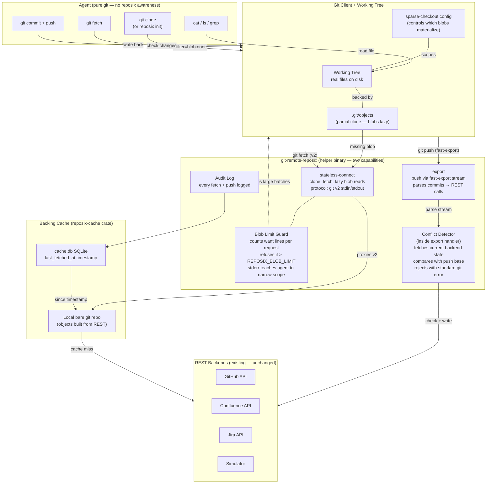

# Architecture Pivot Summary: FUSE to Git-Native Partial Clone

**Date:** 2026-04-24
**Status:** Design confirmed via two independent POCs; ready for implementation planning.
**Supersedes:** FUSE-based architecture (`crates/reposix-fuse`).

This document is the canonical record of the design decision to replace reposix's FUSE virtual filesystem with git's built-in partial clone mechanism. It captures every conclusion from two research sessions (read-path and push-path), the confirmed protocol findings, and the sync/conflict model designed in conversation. Future sessions planning this work should start here.

---

## 1. Problem Statement

### FUSE is slow by design

The current architecture mounts a FUSE filesystem where every `cat` or `ls` triggers a live REST API call to the backing service (GitHub, Confluence, Jira). There is no caching layer between the agent and the network. This means:

- **Latency on every read.** `cat issues/2444.md` blocks on an HTTP round-trip. Agents that read dozens of files serially accumulate seconds of wall-clock delay.
- **Fan-out on directory listing.** `ls issues/` on a project with 10,000 Confluence pages means 10,000 API calls (or a single paginated call that returns 10,000 items and blocks until complete). Neither is acceptable for an autonomous agent loop.
- **No offline story.** If the network drops, the mount is dead. FUSE returns EIO on every read.

### FUSE has operational pain

Beyond performance, FUSE imposes environmental requirements that hurt portability:

- **`fusermount3` / `/dev/fuse` permissions.** The dev host lacks `pkg-config` and `libfuse-dev`, and we have no passwordless sudo to install them. WSL2 environments require additional kernel module configuration.
- **Build dependency on `fuser`.** The `fuser` crate with default features requires `libfuse-dev` headers at compile time. We already use `default-features = false` to avoid this, but it constrains what FUSE features we can use.
- **Mount lifecycle complexity.** Mount/unmount, stale mounts after crashes, `/etc/mtab` cleanup, and the `fuse-mount-tests` feature gate (which must be excluded from `cargo test --workspace` because FUSE tests are unsafe in WSL2) all add operational surface area.
- **Integration test fragility.** FUSE integration tests require `/dev/fuse`, `--release` builds, and `--test-threads=1`. They cannot run in standard CI without `fuse3` packages installed.

### The fundamental mismatch

The project's core thesis is: "the mount point IS a git working tree; `git diff` is the change set." But with FUSE, the mount is a virtual filesystem that *pretends* to be a git repo. Writes go through FUSE callbacks, not `git commit`. The change-tracking story is incomplete because the working tree is synthetic.

---

## 2. Key Design Decision: Delete FUSE, Use Git's Partial Clone

The replacement architecture uses git's own partial clone mechanism (`--filter=blob:none`) to achieve lazy blob loading natively, with `git-remote-reposix` serving as the promisor remote.

### How it works

1. **`git clone --filter=blob:none reposix://github/org/repo`** downloads the full tree structure (directory names, filenames, blob OIDs) but zero file contents. This is a single list-API call to the backend, regardless of repo size.

2. **Blobs are lazy-fetched on demand.** When git needs a blob (during `checkout`, `cat-file`, `show`, etc.), it invokes the remote helper to fetch just that blob. The helper translates the OID into a REST API call (e.g., `GET /issues/2444`), returns the content as a packfile, and git caches it locally in `.git/objects`.

3. **`git-remote-reposix` is the promisor remote.** It advertises the `stateless-connect` capability, proxying protocol-v2 traffic to a local bare-repo cache that reposix builds from REST responses. Git treats it identically to an HTTP or SSH remote.

4. **The agent uses ONLY standard git commands.** `cat`, `grep`, `git diff`, `git push` -- no reposix-specific CLI, no MCP tools, no in-context learning. The mount point is a real git working tree with a real `.git` directory.

5. **Sparse-checkout controls scope.** An agent working on a subset of issues uses `git sparse-checkout set issues/PROJ-24*` to materialize only matching files. The helper sees a single batched fetch request for exactly those blobs.

### Why this is better

| Dimension | FUSE | Partial clone |
|---|---|---|
| Read latency | Every `cat` = 1 API call | First read = 1 API call; subsequent reads = local |
| Directory listing | N API calls for N items | Free (tree already local) |
| Offline support | None (EIO) | Full (all fetched blobs cached) |
| Build dependencies | `fuser`, `libfuse-dev`, `pkg-config` | None beyond git >= 2.27 |
| Platform support | Linux only (FUSE), WSL2 fragile | Everywhere git runs |
| Working tree | Virtual (FUSE callbacks) | Real git checkout |
| Change tracking | Custom diff logic | `git diff` natively |
| Agent UX | Must learn reposix CLI | Already knows git |

---

## 3. Confirmed Technical Findings

Two research sessions produced detailed findings documents with working POCs. This section summarises the key results.

### Q1: Can a remote helper act as a promisor remote?

**YES**, via the `stateless-connect` capability.

When git has a partial clone and encounters a missing blob, it runs `git fetch <remote> --filter=blob:none --stdin` with the missing OIDs piped on stdin. This fetch goes through the standard transport-selection path in `transport-helper.c::fetch_refs`:

1. If the helper advertises `stateless-connect` (or `connect`), git routes through the protocol-v2 tunnel.
2. If the helper advertises `fetch`, git uses the simple fetch capability.
3. If the helper advertises `import`, git uses fast-import.

Only branch (1) supports the `filter` argument required for partial clone. The `fetch` capability requires a ref name (not bare OIDs), and `import` has no filter semantics. **`stateless-connect` is the only viable path.**

The POC confirmed this empirically: three distinct helper invocations during a partial clone + two lazy blob fetches, with missing-blob count dropping 6 -> 5 -> 4 across invocations.

**Source:** `promisor-remote.c::fetch_objects`, `transport-helper.c::fetch_refs`.

### Transport routing: `stateless-connect` for fetch, `export` for push (hybrid)

The hybrid approach is confirmed working. A single helper advertises both `stateless-connect` and `export`. Git dispatches:

- **Fetch direction:** `stateless-connect` handles `git-upload-pack` (protocol v2 tunnel).
- **Push direction:** `stateless-connect` is gated by service name and explicitly excludes `git-receive-pack`. Git falls through to `export`, which receives a fast-import stream that the helper parses for per-file changes.

This is not a hack -- it is the intended dispatch logic in `transport-helper.c`. The capabilities are independent bits; there is no either/or enforcement.

**POC confirmation:** `poc-push-trace.log` shows 2 `stateless-connect` invocations (clone + lazy fetch) and 2 `export` invocations (accept + reject), all from the same helper binary.

### Helper can count `want` lines and refuse

The helper sees the full pkt-line stream of each `command=fetch` request before dispatching. A multi-blob fetch (e.g., from sparse-checkout) packs all OIDs into a single RPC turn with multiple `want <oid>` lines. The helper can:

- Count `want` lines and refuse if the count exceeds a threshold.
- Inspect or omit the `filter` argument.
- Log every fetch for audit purposes.
- Return errors via stderr (git surfaces helper stderr to the user).

### Sparse-checkout batches blob requests

Setting sparse-checkout alone does not trigger blob fetches. Only `git checkout` (or any blob-materializing operation) fetches. When checkout does fetch, it batches all missing blobs into a single `command=fetch` RPC with multiple `want` lines.

This is materially different from `git cat-file -p <oid>`, which always sends one want at a time (one helper process per blob).

**Architectural implication:** the recommended agent UX is to configure sparse-checkout *before* checkout, so the helper sees one batched request for exactly the blobs the agent needs.

### Three protocol gotchas (from POC)

These are not documented in `gitremote-helpers.adoc` and required iterative testing to discover:

| Gotcha | Symptom if wrong | Fix |
|---|---|---|
| Initial advertisement does NOT end with response-end (`0002`), only flush (`0000`). | `fatal: expected flush after ref listing` | Send advertisement as-is from `upload-pack --advertise-refs --stateless-rpc`; do not append `0002`. |
| Subsequent RPC responses DO need trailing response-end (`0002`). | Helper hangs or git misframes the next request. | After each response-pack, write bytes from `upload-pack --stateless-rpc` followed by `0002`. |
| Mixing text and binary stdin reads corrupts the stream. | Helper hangs after handshake. | Read the entire helper protocol in binary mode. (In Rust: read from `BufReader<Stdin>` consistently.) |

### Push rejection format

The helper emits `error <refname> <message>` after processing the export stream. If `<message>` is a free-form string (not matching one of git's canned status strings), git renders it verbatim:

```
! [remote rejected] main -> main (reposix: issue was modified on backend since last fetch)
```

If the helper emits `error <ref> fetch first`, git renders the standard "perhaps a `git pull` would help" hint. The recommended approach is to emit the canned `fetch first` status for standard UX, plus a detailed diagnostic on stderr via the existing `diag()` function.

### Conflict detection happens inside `handle_export`

The interception point for push-time conflict detection is between receiving the fast-import stream and emitting the status response. Flow:

1. Parse the fast-import stream in memory.
2. For each changed file path, fetch current backend state (`GET /issues/<id>`).
3. Compare base version to backend's current version.
4. On mismatch: emit `error refs/heads/main <message>`; do not touch the backing cache.
5. On success: apply REST writes, update backing cache, emit `ok refs/heads/main`.

The reject path drains the incoming stream and never touches the bare repo, ensuring no partial state.

### Refspec namespace is non-optional

The helper must advertise a private ref namespace (e.g., `refs/heads/*:refs/reposix/*`). Using `refs/heads/*:refs/heads/*` causes fast-export to emit an empty delta because the private OID matches the local HEAD, making the exclude equal the include. The current `crates/reposix-remote` already uses the correct namespace; this must not regress.

---

## 4. Sync and Conflict Model

This section captures design decisions made in the exploration session that are not recorded in either findings document. This is new content.

### Push-time conflict detection

The agent works against a local git checkout that may be stale (another agent or a human may have modified the same issue on the backend). At push time:

1. The helper receives the agent's commits via the `export` fast-import stream.
2. For each changed file (issue), the helper fetches the current backend state via REST.
3. If the backend version differs from what the agent's commit was based on, the helper rejects the push with a standard git error.
4. The agent sees `! [remote rejected]` and does the normal `git pull --rebase` + `git push` cycle.

No new concepts for the agent to learn. This is how git works with any remote.

### Tree sync is always full; blob limit is the only guardrail

- **Tree sync (directory structure) is cheap.** `git fetch` updates the entire tree -- all filenames, directory structure, blob OIDs. This maps to a single paginated list-API call regardless of repo size. Tree metadata is small (a project with 10,000 issues produces maybe 500KB of tree objects).
- **Blob materialization is where cost lives.** Each blob is a REST API call to fetch the actual issue content. The helper's blob limit (see below) is the guardrail against unbounded API usage.
- **No limit needed on tree sync** because the cost is fixed and small.

### Delta sync via `since` queries

All three target backends support incremental queries:

| Backend | Mechanism |
|---|---|
| GitHub Issues | `GET /repos/:owner/:repo/issues?since=<ISO8601>` |
| Jira | `JQL: updated >= "<datetime>"` |
| Confluence | `CQL: lastModified > "<datetime>"` |

The existing `cache_db.rs` (in `crates/reposix-cli/src/`) already stores a `last_fetched_at` timestamp in a single-row SQLite table (`refresh_meta`). This timestamp is the `since` parameter for delta sync.

**Fetch flow:**

1. `git fetch origin` invokes the helper.
2. Helper reads `last_fetched_at` from the cache DB.
3. Helper calls the backend with a `since` query, receiving only items changed since the last fetch.
4. Helper updates the backing bare-repo cache with the changed items.
5. Helper serves the updated tree/blobs to git via protocol v2.
6. Helper updates `last_fetched_at` to now.

**Agent sees changes via pure git:**

```bash
git fetch origin
git diff --name-only origin/main   # shows which issues changed since last fetch
```

No custom tools, no reposix CLI awareness.

**Trait addition needed:** `BackendConnector` needs a `list_changed_since(timestamp) -> Vec<IssueId>` method (or equivalent) to support delta queries. The existing `list_issues()` method fetches everything; the new method fetches only the delta.

### Agent UX: pure git, zero in-context learning

The entire agent interaction model is standard git:

| Agent action | Git command | What happens behind the scenes |
|---|---|---|
| Get the repo | `git clone reposix://github/org/repo` | Partial clone; tree downloaded, blobs lazy |
| Read an issue | `cat issues/2444.md` | Blob lazy-fetched via helper on first read |
| See what changed | `git fetch && git diff --name-only origin/main` | Delta sync via `since` query |
| Edit and push | `git add . && git commit && git push` | Helper parses export stream, translates to REST |
| Handle conflict | `git pull --rebase && git push` | Standard git rebase flow |
| Narrow scope | `git sparse-checkout set issues/PROJ-24*` | Controls which blobs get materialized |

The agent needs zero reposix-specific knowledge. Every operation is a git command the agent already knows.

### Blob limit as teaching mechanism

The helper enforces a configurable blob limit to prevent unbounded API usage:

- **Configuration:** `REPOSIX_BLOB_LIMIT` environment variable (default: 200).
- **Enforcement:** when the helper receives a `command=fetch` request with more `want` lines than the limit, it refuses with a stderr error message.
- **Error message:** `"error: refusing to fetch N blobs (limit: M). Narrow your scope with sparse-checkout."`
- **Agent learning:** the agent reads the error message and learns to use `git sparse-checkout` to narrow its scope. This is the same way agents learn from any tool error -- no prompt engineering or system prompt instructions needed.

Example scenario: an agent runs `git grep "TODO"` across 10,000 files. Git tries to lazy-fetch all 10,000 blobs. The helper refuses. The agent reads the error, runs `git sparse-checkout set issues/PROJ-24*`, and retries with a narrower scope.

---

## 5. Architecture: What Changes

### Architecture Diagram



Also available as rendered PNG: `architecture-pivot-diagram.png` in this directory.

### Delete

- **`crates/reposix-fuse/`** -- the entire crate, including all FUSE callbacks, mount/unmount lifecycle, and the `fuse-mount-tests` feature gate.
- **`fuser` dependency** -- removes the `pkg-config` / `libfuse-dev` build requirement.
- **All FUSE-related runtime concerns:** `/dev/fuse` permissions, `fusermount3` requirement, WSL2 kernel module configuration, stale mount cleanup.
- **FUSE integration tests** -- no longer needed; replaced by git-level integration tests.

### Add

- **`stateless-connect` capability in `git-remote-reposix`** -- approximately 200 lines of Rust, tunnelling protocol-v2 traffic to a backing bare-repo cache. Implementation follows the same pattern as the Python POC (`poc/git-remote-poc.py`).
- **`reposix-cache` crate** -- a new crate that materializes REST API responses into a local bare git repo. This is where sync logic lives: tree construction from issue listings, blob creation from issue content, delta sync via `since` queries, and cache eviction.
- **`list_changed_since()` on `BackendConnector` trait** -- enables delta sync by querying the backend for items modified after a given timestamp.
- **Blob limit enforcement** -- the helper counts `want` lines per `command=fetch` request and refuses if the count exceeds `REPOSIX_BLOB_LIMIT`.

### Change

- **CLI flow:** `reposix mount <path>` becomes `reposix init <backend>::<project> <path>`. The new command runs `git init`, configures `extensions.partialClone`, sets `remote.origin.url=reposix::<backend>/<project>`, and runs `git fetch --filter=blob:none origin` to bootstrap.
- **Helper capability advertisement:** adds `stateless-connect` alongside existing `export`. The `import` capability becomes redundant once `stateless-connect` handles all fetch paths; it should be kept for one release cycle, then deprecated.

### Keep

- **`BackendConnector` trait and all backend implementations** (`SimBackend`, `GithubBackend`, `ConfluenceBackend`, etc.) -- consumed by `reposix-cache` instead of by FUSE.
- **`export` capability for push path** -- confirmed working alongside `stateless-connect`; the existing fast-import parsing and REST write logic in `crates/reposix-remote` is preserved.
- **Audit log** -- the helper writes audit rows for every protocol-level fetch and push, same as today.
- **Threat model** -- tainted-by-default policy, allowed-origins egress allowlist, frontmatter field allowlist all remain. The push-through-export flow needs a threat model update (see Risks).
- **Simulator as default/testing backend** -- unchanged.

---

## 6. What Stays the Same

The pivot is a transport-layer change. The application layer is preserved:

- **`BackendConnector` trait** (`crates/reposix-core/src/backend.rs`) and all backend implementations. These are the REST API adapters. They move from being called by FUSE callbacks to being called by `reposix-cache`.
- **Audit log** (SQLite WAL, append-only, no UPDATE/DELETE on the audit table). The helper continues to write a row for every network-touching action.
- **Tainted-by-default policy.** Any byte from a remote (including the simulator) is tainted. Tainted content must not be routed into actions with side effects on other systems.
- **Allowed-origins egress allowlist** (`REPOSIX_ALLOWED_ORIGINS`). The helper and cache crate refuse to talk to any origin not in the allowlist. Default: `http://127.0.0.1:*`.
- **Frontmatter field allowlist.** Server-controlled fields (`id`, `created_at`, `version`) are stripped on the inbound path before serialization.
- **Simulator as default/testing backend.** All development, unit tests, and autonomous agent loops use the simulator. Real backends require explicit credentials and a non-default allowlist.
- **`reposix-core` shared types** (`Issue`, `Project`, `RemoteSpec`, `Error`).
- **Issue serialization format** (YAML frontmatter + Markdown body, via `serde_yaml` 0.9).

---

## 7. Risks and Open Questions

### Confirmed risks with mitigations

| Risk | Severity | Mitigation |
|---|---|---|
| **Lazy-fetch fan-out.** `git cat-file -p` triggers one helper process per blob. `git grep` across the working tree triggers one per missing blob. | Medium | Sparse-checkout batching (one RPC per checkout, not per blob). Blob limit enforcement refuses bulk fetches with an actionable error message. Agent pre-warm via `git fetch --filter=blob:none` before bulk operations. |
| **`stateless-connect` documented as "experimental, for internal use only."** | Low | Stable in practice since git 2.21 (2019). Used internally by `git-remote-http`. No breaking changes in 7 years. |
| **Minimum git version requirement.** | Low | `>= 2.27` for full `filter` support over protocol v2. `>= 2.34` to be safe (includes partial-clone improvements). Pin in `CLAUDE.md` and `README`. CI must test on git >= 2.34 (alpine:latest has 2.52). |

### Open questions

1. **Cache eviction policy for `reposix-cache`.** The local bare-repo cache grows as more blobs are fetched. Options: LRU eviction (complex with git's object store), TTL-based re-fetch (simpler), per-project disk quota, or manual `reposix gc` command. Decision deferred to implementation planning.

2. **Atomicity of REST write + bare-repo-cache update.** If the REST POST succeeds but the local cache update fails, we get divergence. Preferred ordering: bare-cache-first, then REST (rollback = `git update-ref refs/heads/main <old>`). A background reconciler may be needed for edge cases.

3. **Threat model update for push-through-export flow.** The helper is the only component authorized to emit REST writes, which is correct for the threat model. But the push path means the helper must validate every commit's content against the frontmatter field allowlist before translating to REST. `research/threat-model-and-critique.md` needs an update.

4. **Non-issue files in push.** If an agent pushes changes to files outside issue-tracking paths (e.g., `.planning/` files), the helper must decide: reject, or silently commit to the bare cache only (nothing flows to REST). The latter is more consistent with "the repo is a real git remote."

5. **`import` deprecation timeline.** The `import` capability is redundant once `stateless-connect` handles all fetch paths. Keep for one release cycle (v0.10), then remove.

6. **Stream-parsing performance for export.** The POC reads the fast-import stream in memory. A production helper should use a state-machine parser that streams REST writes as it goes, with a commit-or-rollback barrier at the `done` terminator.

---

## 8. POC Artifacts

All artifacts are in `poc/` subdirectory of this research folder:

| File | Purpose |
|---|---|
| `poc/git-remote-poc.py` | Python implementation of a `stateless-connect` + `export` hybrid helper. Demonstrates partial clone, lazy blob fetching, push via fast-import, and push rejection with custom error messages. Extended from the read-path POC to cover the full hybrid. |
| `poc/run-poc.sh` | Runner script for the read-path POC. Runs inside `alpine:latest` Docker container (git 2.52). Demonstrates: partial clone with `--filter=blob:none`, lazy blob fetch via `cat-file`, sparse-checkout batching. |
| `poc/run-poc-push.sh` | Runner script for the push-path POC. Extends `run-poc.sh` with: commit + push via `export`, push rejection with custom error message, capability-usage counting. |
| `poc/poc-helper-trace.log` | Full protocol trace from the read-path POC. Shows three helper invocations (clone, lazy fetch #1, lazy fetch #2) with request/response byte counts and missing-blob counts. |
| `poc/poc-push-trace.log` | Full protocol trace from the push-path POC (114 lines). Shows 2 `stateless-connect` invocations + 2 `export` invocations (accept + reject). |

### Running the POCs

Read-path POC:
```bash
docker run --rm -v $(pwd)/.planning/research/v0.9-fuse-to-git-native/poc:/work alpine:latest \
  sh -c 'apk add --quiet --no-cache git python3 && \
         cp /work/git-remote-poc.py /work/git-remote-poc && \
         chmod +x /work/git-remote-poc && /work/run-poc.sh'
```

Push-path POC:
```bash
docker run --rm -v $(pwd)/.planning/research/v0.9-fuse-to-git-native/poc:/work alpine:latest \
  sh -c 'apk add --quiet --no-cache git python3 && \
         cp /work/git-remote-poc.py /work/git-remote-poc && \
         chmod +x /work/git-remote-poc && /work/run-poc-push.sh'
```

### POC bugs documented for Rust port

Three non-obvious bugs were discovered during POC development. They are documented in `push-path-stateless-connect-findings.md` with root causes and fixes:

1. **Refspec namespace collapse (critical).** Advertising `refs/heads/*:refs/heads/*` causes fast-export to emit an empty delta. Fix: use a private namespace like `refs/heads/*:refs/reposix/*`.
2. **Naive `commit ` line matching in export parser.** A `line.startswith("commit ")` check also matches commit message bodies that start with "commit ". Fix: require `line.startswith("commit refs/")`, or better, use a state-machine parser that skips data payloads.
3. **Python subprocess stdin handling.** `proc.communicate()` after `proc.stdin.close()` raises `ValueError`. Not applicable to Rust, but relevant for agent prototyping.

---

## 9. Milestone Impact

### Current state

- **v0.9.0** was planned as "Docs IA and Narrative Overhaul" (Phase 30).
- Phase 30 documents the FUSE-based architecture -- user-facing docs, README rewrite, architecture diagrams.

### The problem

If Phase 30 ships as planned, it documents an architecture that will be immediately obsolete. Every diagram, every CLI example, every "how it works" section would reference FUSE mounts, `reposix mount`, and the virtual filesystem model.

### The decision

- **v0.9.0 becomes the architecture pivot milestone.** The FUSE-to-partial-clone migration is the primary deliverable.
- **Phase 30 (docs) is deferred to v0.10.0**, where it will document the NEW architecture (partial clone, `reposix init`, git-native workflow).
- **Estimated scope for v0.9.0:** 3-5 new phases covering:
  1. `reposix-cache` crate (bare-repo cache construction from REST responses).
  2. `stateless-connect` capability in `git-remote-reposix` (protocol-v2 tunnel to cache).
  3. `list_changed_since()` on `BackendConnector` + delta sync integration.
  4. CLI pivot (`reposix init` replacing `reposix mount`) + blob limit enforcement.
  5. Integration testing (round-trip: partial clone + edit + push + conflict detection).
  6. Delete `crates/reposix-fuse/` and all FUSE dependencies.

### What this buys

- Docs written once for the final architecture, not rewritten after the pivot.
- The architecture pivot is scoped as a milestone, not a drive-by refactor.
- Each phase can be independently tested and verified before the next begins.
