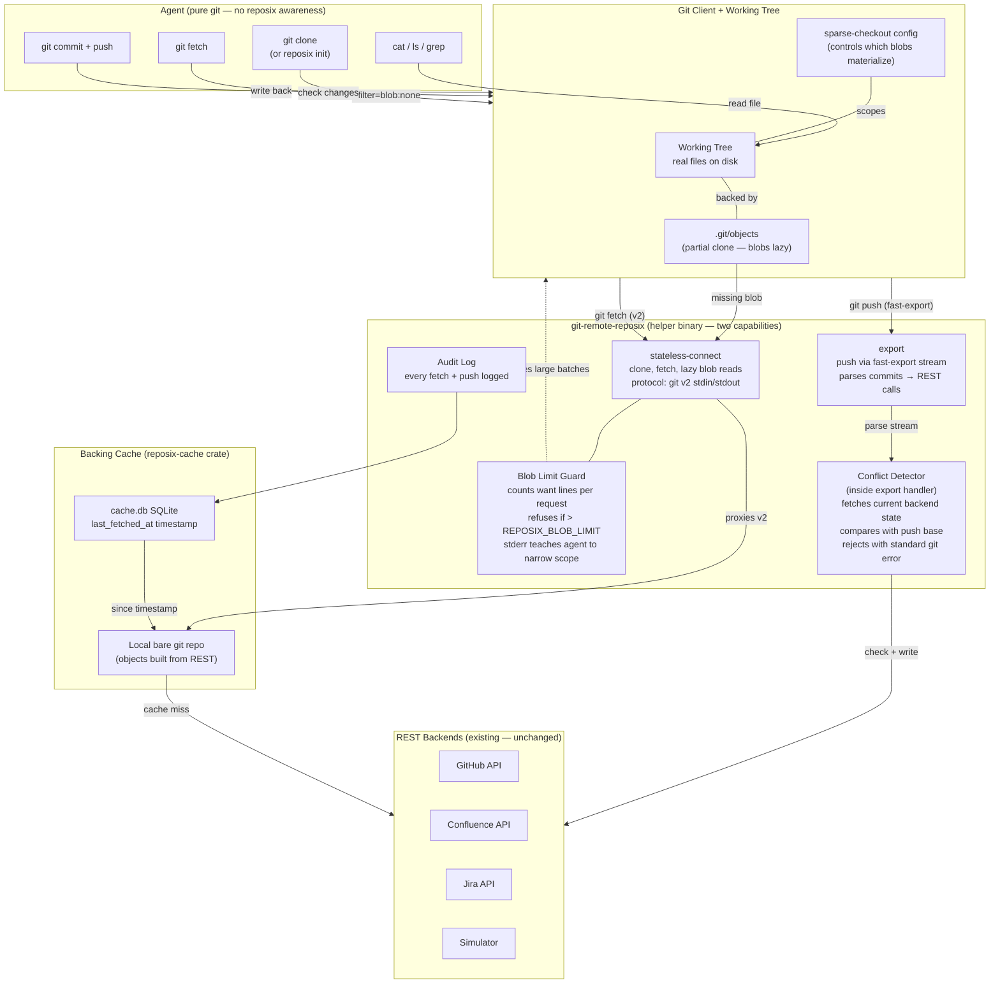

[index](./index.md)

# 5. Architecture: What Changes

## Architecture Diagram

Also available as rendered PNG: `architecture-pivot-diagram.png` in this directory.

## Delete

- **`crates/reposix-fuse/`** -- the entire crate, including all FUSE callbacks, mount/unmount lifecycle, and the `fuse-mount-tests` feature gate.
- **`fuser` dependency** -- removes the `pkg-config` / `libfuse-dev` build requirement.
- **All FUSE-related runtime concerns:** `/dev/fuse` permissions, `fusermount3` requirement, WSL2 kernel module configuration, stale mount cleanup.
- **FUSE integration tests** -- no longer needed; replaced by git-level integration tests.

## Add

- **`stateless-connect` capability in `git-remote-reposix`** -- approximately 200 lines of Rust, tunnelling protocol-v2 traffic to a backing bare-repo cache. Implementation follows the same pattern as the Python POC (`poc/git-remote-poc.py`).
- **`reposix-cache` crate** -- a new crate that materializes REST API responses into a local bare git repo. This is where sync logic lives: tree construction from issue listings, blob creation from issue content, delta sync via `since` queries, and cache eviction.
- **`list_changed_since()` on `BackendConnector` trait** -- enables delta sync by querying the backend for items modified after a given timestamp.
- **Blob limit enforcement** -- the helper counts `want` lines per `command=fetch` request and refuses if the count exceeds `REPOSIX_BLOB_LIMIT`.

## Change

- **CLI flow:** `reposix mount <path>` becomes `reposix init <backend>::<project> <path>`. The new command runs `git init`, configures `extensions.partialClone`, sets `remote.origin.url=reposix::<backend>/<project>`, and runs `git fetch --filter=blob:none origin` to bootstrap.
- **Helper capability advertisement:** adds `stateless-connect` alongside existing `export`. The `import` capability becomes redundant once `stateless-connect` handles all fetch paths; it should be kept for one release cycle, then deprecated.

## Keep

- **`BackendConnector` trait and all backend implementations** (`SimBackend`, `GithubBackend`, `ConfluenceBackend`, etc.) -- consumed by `reposix-cache` instead of by FUSE.
- **`export` capability for push path** -- confirmed working alongside `stateless-connect`; the existing fast-import parsing and REST write logic in `crates/reposix-remote` is preserved.
- **Audit log** -- the helper writes audit rows for every protocol-level fetch and push, same as today.
- **Threat model** -- tainted-by-default policy, allowed-origins egress allowlist, frontmatter field allowlist all remain. The push-through-export flow needs a threat model update (see Risks).
- **Simulator as default/testing backend** -- unchanged.
