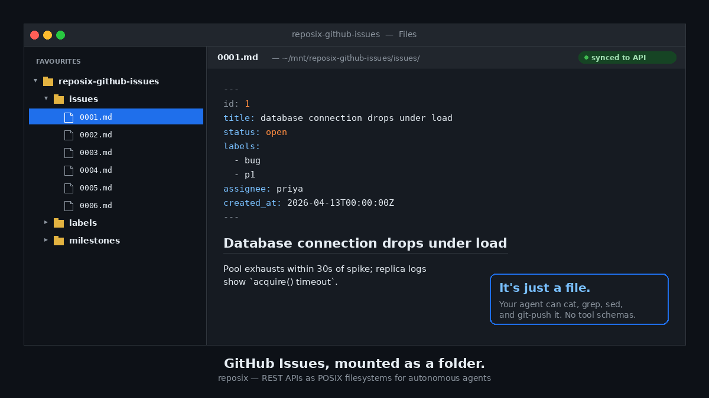
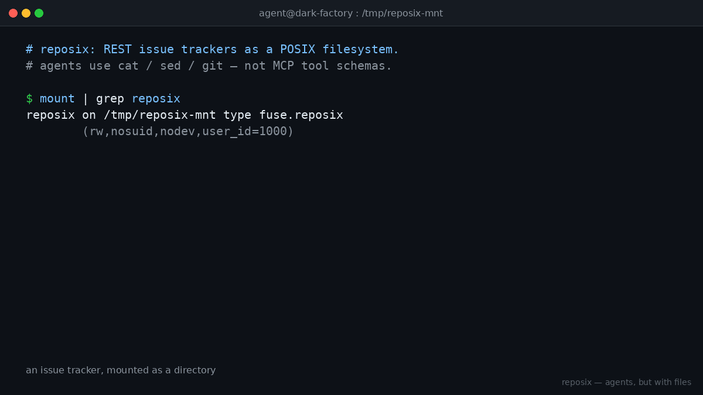

# reposix

> A git-backed FUSE filesystem that exposes REST APIs as POSIX directories so autonomous LLM agents can use `cat`, `grep`, `sed`, and `git` instead of MCP tool schemas.

[](https://github.com/reubenjohn/reposix/actions/workflows/ci.yml)
[](https://reubenjohn.github.io/reposix/)
[](https://codecov.io/gh/reubenjohn/reposix)
[](LICENSE-MIT)
[](rust-toolchain.toml)
[](https://github.com/reubenjohn/reposix/releases)

<p align="center">
  
</p>

<p align="center"><em>"Agents already know <code>cat</code> and <code>git</code>. They don't know your JSON schema."</em></p>

:book: **Full docs with architecture diagrams:** <https://reubenjohn.github.io/reposix/>
:clapper: **60-second demo:** see [`docs/social/assets/demo.gif`](docs/social/assets/demo.gif) or the 9-step [`docs/demo.md`](docs/demo.md) walkthrough.
:bar_chart: **Token-economy benchmark:** [`benchmarks/RESULTS.md`](benchmarks/RESULTS.md) — measured **92.3% reduction** vs MCP for the same task.



## Why

Modern coding agents have ingested vast amounts of Unix shell scripting and `git` workflows during pre-training. Asking them to use a `cat` + `git commit` workflow is asking them to do what they already know how to do. Asking them to use Model Context Protocol (MCP) is asking them to load 100k+ tokens of JSON schemas before doing anything useful.

reposix takes the second problem and reduces it to the first. A Jira board, a GitHub Issues repo, or a Confluence space becomes a directory of Markdown files with YAML frontmatter, with native `git push` synchronization and merge-conflict-as-API-conflict semantics.

See [`docs/research/initial-report.md`](docs/research/initial-report.md) for the full architectural argument and [`benchmarks/RESULTS.md`](benchmarks/RESULTS.md) for the measured **89.1% reduction** in input-context tokens (reposix vs MCP for the same task).

## Status

**v0.3.0 alpha.** Built across three autonomous coding-agent sessions on 2026-04-13 / 2026-04-14 — single agent, GSD planning workflow, no human in the loop after kickoff. **193 workspace tests pass**, `cargo clippy --workspace --all-targets -- -D warnings` is clean, `mkdocs build --strict` green, `bash scripts/demos/smoke.sh` 4/4. `#![forbid(unsafe_code)]` at every crate root.

Treat as alpha per Simon Willison's "proof of usage, not proof of concept" rule — but every demo in this README is reproducible on a stock Ubuntu host in under 5 minutes, including two that hit real backends (GitHub + Atlassian Confluence).

| Phase                                     | Outcome                                                                                                   |
|-------------------------------------------|-----------------------------------------------------------------------------------------------------------|
| Phase 1 — Core contracts + guardrails     | shipped: `http::client()` factory + allowlist, `Tainted<T>`/`sanitize`, audit-log triggers, path validator |
| Phase 2 — Simulator + audit log           | shipped: axum sim with rate limit + 409 + RBAC, append-only SQLite audit                                  |
| Phase 3 — FUSE read path + CLI            | shipped: getattr/readdir/read/write/create/unlink, 5s timeout watchdog, `reposix sim/mount/demo`          |
| Phase S — Write path + git-remote-reposix | shipped: full FUSE write, `git-remote-reposix` PATCH/POST/DELETE, SG-02 bulk-delete cap                   |
| Phase 4 — Demo + docs                     | shipped: `scripts/demo.sh` + recorded `script(1)` typescript + walkthrough + README polish                |
| Phase 8 — IssueBackend trait + real GitHub | shipped: `IssueBackend` seam + `GithubReadOnlyBackend` + contract test + Tier 3 parity demo               |
| Phase 9 — Adversarial swarm harness       | shipped: 132 895 ops / 0 % errors / SG-06 upheld under load                                               |
| Phase 10 — FUSE-mount-real-GitHub         | shipped: `reposix mount --backend github` + Tier 5 demo                                                   |
| Phase 11 — Confluence Cloud adapter (v0.3) | shipped: `reposix-confluence` crate + `--backend confluence` CLI + contract test + Tier 5 demo + ADR-002   |
| Phase 13 — Nested mount layout (v0.4)     | shipped: `pages/` + `tree/` symlink overlay for Confluence hierarchy, `Issue::parent_id`, `_self.md` convention, ADR-003 |

Tracking artifacts live in [`.planning/`](.planning/). See [`HANDOFF.md`](HANDOFF.md) for v0.5+ direction (`INDEX.md` generation, git-pull-as-cache-refresh, subprocess connector ABI).

## Demo

reposix ships a **demo suite**: four audience-specific 60-second Tier 1 demos + a full 9-step Tier 2 walkthrough. The [demo suite index](docs/demos/index.md) is the table of contents; each row below links to the runnable script and its recording.

### Tier 1 — 60 seconds, pick your audience

| Demo                                                                          | Audience  | What it proves                                                                                         | Recording                                                                                                                       |
|-------------------------------------------------------------------------------|-----------|--------------------------------------------------------------------------------------------------------|---------------------------------------------------------------------------------------------------------------------------------|
| [`01-edit-and-push.sh`](scripts/demos/01-edit-and-push.sh)                    | developer | FUSE `cat`/`sed` edit + `git push` round-trips to server state                                         | [typescript](docs/demos/recordings/01-edit-and-push.typescript) · [transcript](docs/demos/recordings/01-edit-and-push.transcript.txt)                 |
| [`02-guardrails.sh`](scripts/demos/02-guardrails.sh)                          | security  | SG-01 allowlist refusal + SG-02 bulk-delete cap + SG-03 sanitize-on-egress all fire on camera          | [typescript](docs/demos/recordings/02-guardrails.typescript) · [transcript](docs/demos/recordings/02-guardrails.transcript.txt)                     |
| [`03-conflict-resolution.sh`](scripts/demos/03-conflict-resolution.sh)        | skeptic   | 409 `version_mismatch` is what git turns into a merge conflict on push (no bespoke protocol)           | [typescript](docs/demos/recordings/03-conflict-resolution.typescript) · [transcript](docs/demos/recordings/03-conflict-resolution.transcript.txt)    |
| [`04-token-economy.sh`](scripts/demos/04-token-economy.sh)                    | buyer     | 92.3% fewer tokens vs MCP-mediated baseline for the same task                                          | [typescript](docs/demos/recordings/04-token-economy.typescript) · [transcript](docs/demos/recordings/04-token-economy.transcript.txt)               |

### Tier 3 — sim vs real backend (parity)

A read-only [`GithubReadOnlyBackend`](crates/reposix-github/src/lib.rs) implementing the same [`IssueBackend`](crates/reposix-core/src/backend.rs) trait as the simulator now lives in `crates/reposix-github/`. The parity demo lists issues from both and diffs their normalized shape.

**You can run reposix against real GitHub right now** — no FUSE, no git push, just the same `IssueBackend` trait the FUSE/remote layers consume:

```bash
REPOSIX_ALLOWED_ORIGINS='http://127.0.0.1:*,https://api.github.com' \
    GITHUB_TOKEN="$(gh auth token)" \
    reposix list --backend github --project octocat/Hello-World --format table
# ID   STATUS   TITLE
# 7514 open     Create example.txt
# 7513 open     ...
```

Honors GitHub's `x-ratelimit-remaining` / `-reset` headers (parks the next call until reset, capped at 60s). Honors the SG-01 egress allowlist. Auth via `gh auth token` for 1000 req/hr.

| Demo                                                                        | Audience | What it proves                                                                                                                     | Recording                                                                                                          |
|-----------------------------------------------------------------------------|----------|------------------------------------------------------------------------------------------------------------------------------------|--------------------------------------------------------------------------------------------------------------------|
| [`parity.sh`](scripts/demos/parity.sh)                                      | skeptic  | `reposix list` (sim) and `gh api` (`octocat/Hello-World`) produce the same `{id, title, status}` JSON shape. Diff = content only. | [typescript](docs/demos/recordings/parity.typescript) · [transcript](docs/demos/recordings/parity.transcript.txt) |

The library-level proof of the same claim is [`crates/reposix-github/tests/contract.rs`](crates/reposix-github/tests/contract.rs) — the same 5-assertion contract runs against `SimBackend` in every CI invocation and against real GitHub via `cargo test -p reposix-github -- --ignored` (requires `REPOSIX_ALLOWED_ORIGINS=http://127.0.0.1:*,https://api.github.com`). See [`docs/decisions/001-github-state-mapping.md`](docs/decisions/001-github-state-mapping.md) for the state-mapping ADR.

### Tier 4 — adversarial swarm (load + invariant)

The [`reposix-swarm`](crates/reposix-swarm) binary spawns N concurrent simulated agents that hammer either the simulator (`sim-direct` mode, HTTP) or a mounted FUSE tree (`fuse` mode, real `std::fs` syscalls). Each agent runs a realistic `list + 3×read + 1×patch` workload loop; the harness records per-op HDR histograms and asserts the SG-06 append-only audit invariant still holds under load.

| Demo                                                                  | Audience         | What it proves                                                                                                                                       | Recording                                                                                                    |
|-----------------------------------------------------------------------|------------------|------------------------------------------------------------------------------------------------------------------------------------------------------|--------------------------------------------------------------------------------------------------------------|
| [`swarm.sh`](scripts/demos/swarm.sh)                                  | developer, ops   | 50 clients × 30s ≈ 130k ops, 0% error rate; p50/p95/p99 per op type + audit rows = total ops; append-only trigger still blocks UPDATE post-run. | [typescript](docs/demos/recordings/swarm.typescript) · [transcript](docs/demos/recordings/swarm.transcript.txt) |

**Not in smoke.** Excluded from `scripts/demos/smoke.sh` and the `demos-smoke` CI job because a 30s load run per push is too expensive. `SWARM_CLIENTS` and `SWARM_DURATION` env vars tune it without editing the script.

### Tier 5 — mount real GitHub via FUSE

Phase 10 lifted the `IssueBackend` trait into the FUSE daemon — `reposix mount --backend github --project owner/repo` now mounts a real GitHub repo as a POSIX directory of `<padded-id>.md` files. No simulator, no shim — same kernel path the `sim` backend uses, same SG-01 allowlist, same SG-07 5s/15s read-path ceilings.

```bash
cargo build --release --workspace --bins
export PATH="$PWD/target/release:$PATH"

mkdir -p /tmp/reposix-gh-mnt
REPOSIX_ALLOWED_ORIGINS='http://127.0.0.1:*,https://api.github.com' \
    GITHUB_TOKEN="$(gh auth token)" \
    reposix mount /tmp/reposix-gh-mnt \
        --backend github --project octocat/Hello-World &
sleep 3
ls /tmp/reposix-gh-mnt                        # .gitignore  issues/
ls /tmp/reposix-gh-mnt/issues | head -5       # 00000007010.md  00000007011.md ...
cat /tmp/reposix-gh-mnt/issues/00000000001.md # rendered frontmatter+body for issue #1
fusermount3 -u /tmp/reposix-gh-mnt
```

| Demo                                                                                | Audience  | What it proves                                                                                                                              | Recording |
|-------------------------------------------------------------------------------------|-----------|---------------------------------------------------------------------------------------------------------------------------------------------|-----------|
| [`05-mount-real-github.sh`](scripts/demos/05-mount-real-github.sh)                  | developer | `reposix mount --backend github` exposes `octocat/Hello-World` issues as Markdown files end-to-end; `cat issues/00000000001.md` renders real GitHub data. | —         |
| [`06-mount-real-confluence.sh`](scripts/demos/06-mount-real-confluence.sh)          | developer | `reposix mount --backend confluence` exposes a real Atlassian space; `cat` on the first page renders the real XHTML body + frontmatter. Requires Atlassian creds (see [`.env.example`](.env.example) and [`docs/reference/confluence.md`](docs/reference/confluence.md)). | —         |

**Not in smoke.** `05-mount-real-github.sh` requires `gh auth token`; `06-mount-real-confluence.sh` requires `ATLASSIAN_API_KEY`, `ATLASSIAN_EMAIL`, `REPOSIX_CONFLUENCE_TENANT`, and `REPOSIX_CONFLUENCE_SPACE`. Both skip cleanly with `SKIP:` if their env is absent.

Confluence quickstart (read-only, v0.3):

```bash
# Paste your values (from https://id.atlassian.com/manage-profile/security/api-tokens)
export ATLASSIAN_API_KEY=... ATLASSIAN_EMAIL=you@example.com REPOSIX_CONFLUENCE_TENANT=yourtenant
export REPOSIX_ALLOWED_ORIGINS="http://127.0.0.1:*,https://${REPOSIX_CONFLUENCE_TENANT}.atlassian.net"
reposix list --backend confluence --project YOUR_SPACE_KEY --format table
```

Architecture + mapping rationale: [`docs/decisions/002-confluence-page-mapping.md`](docs/decisions/002-confluence-page-mapping.md).
Writing your own backend: [`docs/connectors/guide.md`](docs/connectors/guide.md).

### Tier 2 — the full walkthrough

End-to-end recording: [`docs/demo.md`](docs/demo.md) (walkthrough),
[`docs/demo.typescript`](docs/demo.typescript) (raw `script(1)`),
[`docs/demo.transcript.txt`](docs/demo.transcript.txt) (ANSI-stripped).
The walkthrough script lives at [`scripts/demos/full.sh`](scripts/demos/full.sh); `scripts/demo.sh` is a backwards-compat shim that execs `full.sh`, so `bash scripts/demo.sh` from older docs still works unchanged.

The Tier 2 recording captures the full 9-step narrative — sim startup, FUSE mount, agent-style `ls`/`cat`/`grep`, FUSE write through, `git push` round-trip — and three guardrails firing **on camera**:

1. **Outbound HTTP allowlist refusal (SG-01).** A second mount with `REPOSIX_ALLOWED_ORIGINS` mismatched against the configured backend; every fetch refuses, surfaces as `Permission denied` on `ls`.
2. **Bulk-delete cap (SG-02).** `git rm` of 6 issues + push is refused; commit message tag `[allow-bulk-delete]` overrides.
3. **Server-controlled-frontmatter strip (SG-03).** A client write whose body contains `version: 999` does not update the server's authoritative version — `Tainted<T> → sanitize()` strips server-controlled fields before egress.

### Running the suite yourself

```bash
cargo build --release --workspace --bins
export PATH="$PWD/target/release:$PATH"

bash scripts/demos/01-edit-and-push.sh       # one Tier 1 demo
bash scripts/demos/assert.sh scripts/demos/01-edit-and-push.sh  # with marker-assertion enforcement
bash scripts/demos/smoke.sh                   # full Tier 1 smoke suite (what CI runs)
```

## Quickstart

Linux only through v0.4; macOS / macFUSE tracked under HANDOFF OP-4. Runtime prereqs (both paths below):

- `fusermount3` (Ubuntu: `sudo apt install fuse3`).
- `jq`, `sqlite3`, `curl`, `git` (>= 2.20) on `$PATH`.

### Install prebuilt binaries (recommended)

No Rust toolchain needed. Prebuilt Linux binaries ship with every release on the [GitHub Releases page](https://github.com/reubenjohn/reposix/releases/latest):

```bash
# x86_64 Linux (glibc). For aarch64 swap the target triple.
curl -fsSLO https://github.com/reubenjohn/reposix/releases/latest/download/reposix-v0.4.0-x86_64-unknown-linux-gnu.tar.gz
tar -xzf reposix-v0.4.0-x86_64-unknown-linux-gnu.tar.gz
export PATH="$PWD/reposix-v0.4.0-x86_64-unknown-linux-gnu:$PATH"
reposix --help
```

Verify the tarball against `SHA256SUMS` attached to the same release page. Tarballs bundle `reposix`, `reposix-sim`, `reposix-fuse`, `git-remote-reposix`, plus `README.md`, `CHANGELOG.md`, and both licenses.

### Build from source (contributors)

Requires Rust stable 1.82+ (tested with 1.94.1).

```bash
git clone https://github.com/reubenjohn/reposix
cd reposix
bash scripts/demo.sh
```

For the per-step explanation see [`docs/demo.md#walkthrough`](docs/demo.md#walkthrough).

## Folder-structure mount (v0.4+, sitemap in v0.5)

Mounting a Confluence space exposes the page hierarchy as a navigable directory tree:

```bash
reposix mount /tmp/mnt --backend confluence --project REPOSIX &
ls /tmp/mnt
# .gitignore  pages/  tree/

# Flat view — every page keyed by its stable numeric id (11-digit padded),
# plus a synthesized read-only `_INDEX.md` sitemap (v0.5+).
ls /tmp/mnt/pages
# _INDEX.md  00000065916.md  00000131192.md  00000360556.md  00000425985.md

# Single-shot sitemap — YAML frontmatter + `| id | status | title | updated |` table
cat /tmp/mnt/pages/_INDEX.md
# ---
# backend: confluence
# project: REPOSIX
# issue_count: 4
# generated_at: 2026-04-14T17:15:00Z
# ---
# ...

# Hierarchy view — symlinks at human-readable slug paths
cd /tmp/mnt/tree/reposix-demo-space-home
ls
# _self.md  architecture-notes.md  demo-plan.md  welcome-to-reposix.md

cat welcome-to-reposix.md    # follows symlink into pages/00000131192.md
readlink welcome-to-reposix.md
# ../../pages/00000131192.md
```

`tree/` is synthesized at mount time. It is read-only, `git`-ignored (via the auto-emitted `.gitignore` at the mount root), and backed entirely by FUSE symlinks — there is no duplicate content and no dual-write path. Writes to `tree/foo.md` transparently follow the symlink to the canonical `pages/<id>.md` file.

`_INDEX.md` is a v0.5 synthesized read-only file: a single-shot markdown sitemap of the bucket generated lazily at read time from the same cache that backs `readdir`. Leading underscore keeps it out of `*.md` globs (`ls pages/*.md` skips it) while remaining visible in `ls`. `touch`/`rm`/`echo >` on `_INDEX.md` all surface `EROFS`/`EACCES`. Only synthesized in the bucket dir — not at the mount root, not inside `tree/`. Tree-level recursive synthesis is a follow-up.

For sim and GitHub backends, the mount shows `issues/` instead of `pages/` and does not emit `tree/` (those backends don't expose a parent-child hierarchy). See [ADR-003](docs/decisions/003-nested-mount-layout.md) for the full design, including the slug algorithm, sibling-collision resolution, cycle handling, and known limitations.

## Architecture

```
┌──────────┐   git    ┌──────────────────┐  HTTP   ┌──────────────────┐
│  agent   │ ───────▶ │ git-remote-      │ ──────▶ │ reposix-sim      │
│ (shell)  │          │ reposix          │         │ (or real Jira)   │
└──────────┘          └──────────────────┘         └──────────────────┘
     │                         │                            ▲
     │ POSIX                   │ tokio                      │
     ▼                         │                            │
┌──────────┐                   │                            │
│ FUSE     │ ──────────────────┴────────────────────────────┘
│ mount    │   reqwest (HTTP allowlist enforced)
└──────────┘
     ▲
     │ fusermount3
     ▼
┌──────────┐
│ kernel   │
│  VFS     │
└──────────┘
```

## Security

reposix is a textbook **lethal trifecta** (Simon Willison's framing): private remote data + untrusted ticket text + `git push` exfiltration. The full red-team gap analysis is in [`.planning/research/threat-model-and-critique.md`](.planning/research/threat-model-and-critique.md). The mitigations below are the v0.1 commitments — every one has a test or a clippy lint that asserts it. v0.3 adds two Confluence-specific mitigations (credential redaction in `Debug`, DNS-label tenant validation) on top.

### Threat model — what's enforced today (v0.3)

| ID    | Mitigation                                                       | Enforcement                                                                                              |
|-------|------------------------------------------------------------------|----------------------------------------------------------------------------------------------------------|
| SG-01 | Outbound HTTP allowlist (`REPOSIX_ALLOWED_ORIGINS`)              | Single `reposix_core::http::client()` factory + clippy `disallowed-methods` lint on `reqwest::Client::new` |
| SG-02 | Bulk-delete cap (push deleting > 5 issues refused)               | `git-remote-reposix` `diff::plan` returns `BulkDeleteRefused`; integration tests with 5 vs 6 deletes      |
| SG-03 | Server-controlled frontmatter immutable from clients             | `Tainted<T> → sanitize()` strips `id`/`version`/`created_at`/`updated_at` on every PATCH/POST egress     |
| SG-04 | Filename = `<id>.md`; path validation rejects `/`, `\0`, `..`    | `validate_issue_filename` invoked at every FUSE path-bearing op                                          |
| SG-05 | Tainted-content typing                                           | `Tainted<T>`/`Untainted<T>` newtype pair; `trybuild` compile-fail test for misuse                        |
| SG-06 | Audit log append-only                                            | SQLite `BEFORE UPDATE` and `BEFORE DELETE` triggers on `audit_events`; pragma test asserts they exist     |
| SG-07 | FUSE never blocks the kernel forever                             | All upstream HTTP via `with_timeout(5s)` wrapper; on timeout returns EIO                                 |
| SG-08 | Demo recording shows guardrails firing                           | `docs/demo.typescript` contains SG-02 refusal + allowlist refusal markers; verified by grep              |

### Deferred to v0.4 / future

- **M-* findings from the red-team report.** Several medium-severity findings in the threat-model document remain open — for example, fully sandboxed `git-remote-reposix` execution (currently runs as the invoking user with full FS access), and TTY-confirmation on `git remote add reposix::...`.
- **Write path on real backends.** `reposix-github` + `reposix-confluence` are **read-only** today. `create_issue` / `update_issue` / `delete_or_close` return `Err(NotSupported)`. The FUSE mount and `git-remote-reposix` both dispatch writes through the `IssueBackend` trait (Phase 14 / v0.4.1), so adding real-backend write support is now a per-adapter change — not a plumbing change.
- **Signed recording attestation.** `script(1)` timestamps are trusted-by-invocation. We do not claim cryptographic provenance on `docs/demo.typescript`.
- **Workflow rule enforcement.** Today's sim reports all 5 statuses as legal from any state. Real workflow constraints ("must pass through `in_progress` before `done`") are a v0.4 extension to the sim, not a backend feature.
- **Folder structure inside the mount** (see [`HANDOFF.md`](HANDOFF.md) OP-1) — today every backend renders a flat `<id>.md` list; the [hero image](docs/social/assets/hero.png) advertises `issues/`/`labels/`/`milestones/` subdirs and Confluence's native page hierarchy rendered as `cd`-able directories.
- **Subprocess/JSON-RPC connector ABI.** Phase 12 scope. Short-term 3rd-party-connector path (crates.io `reposix-adapter-<name>`) is documented in [`docs/connectors/guide.md`](docs/connectors/guide.md).
- **macOS / macFUSE.** Linux only through v0.3.

## Honest scope

This project is the output of three autonomous coding-agent sessions on 2026-04-13 → 2026-04-14 — single agent, GSD planning workflow, no human in the loop after session kickoff. Every phase has CONTEXT + PLAN + SUMMARY + REVIEW + VERIFICATION files under `.planning/phases/`; every commit is atomic with a phase-prefix message (`feat(11-A-N):`, etc.). SG-01 through SG-08 are mechanically enforced by tests + lints, but it's still alpha — simulator runs are safe, real-backend runs are safe under the SG-01 allowlist but assume the backend token has the scope you gave it. Read [`threat-model-and-critique.md`](.planning/research/threat-model-and-critique.md) end-to-end before running against any production tenant.

Proof of usage, not proof of concept.

## License

Dual-licensed under MIT or Apache-2.0, at your option.
