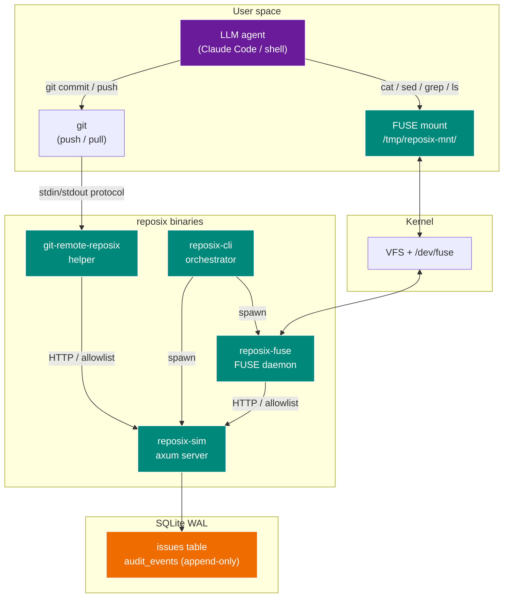
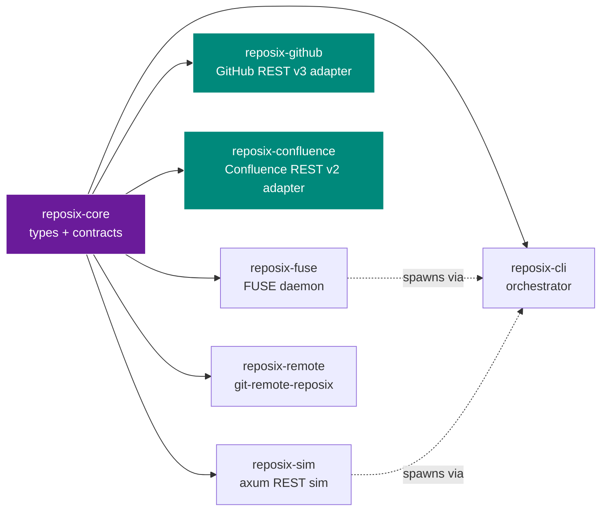
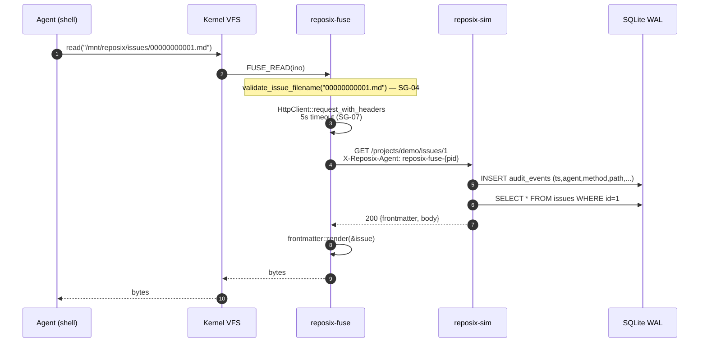
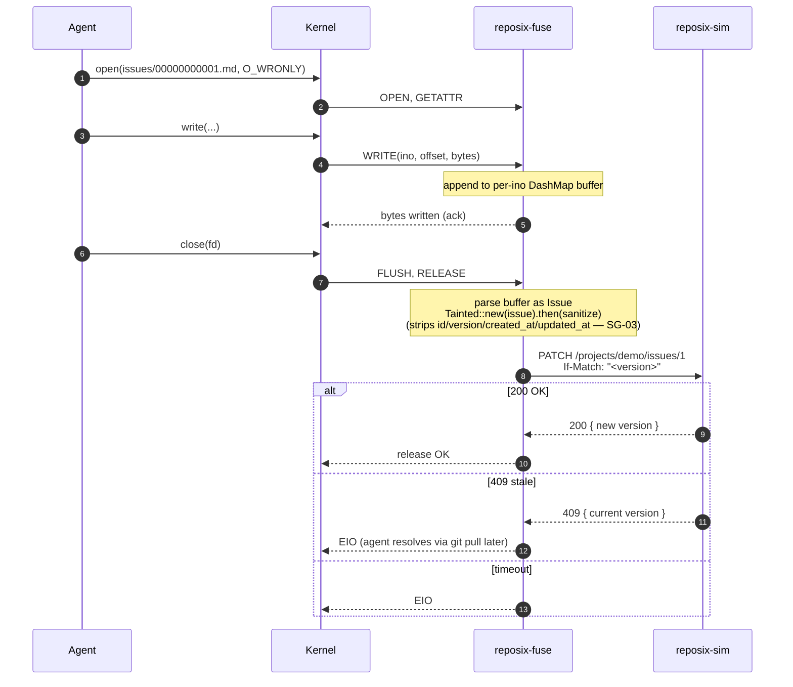
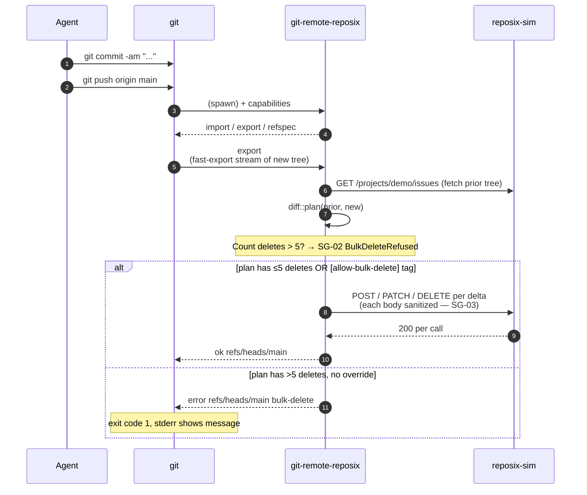
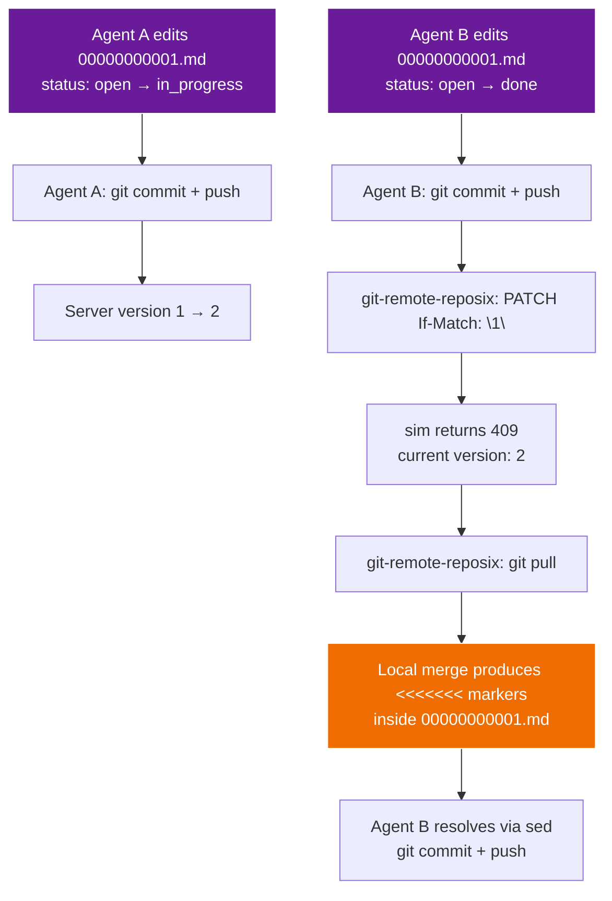
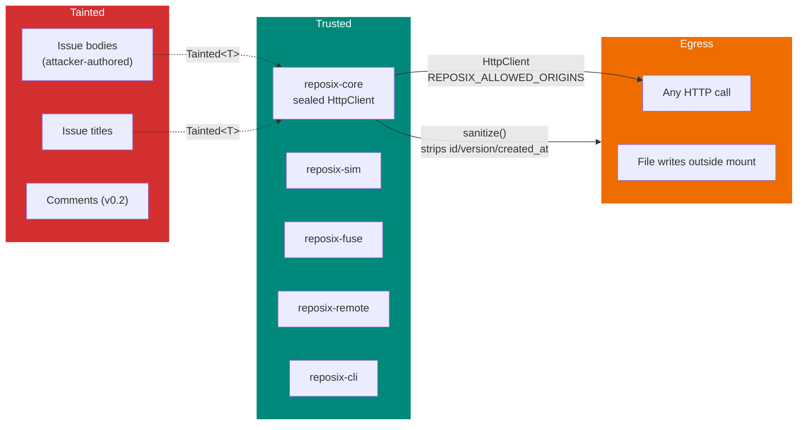

# Architecture

## System view



Every HTTP arrow above is mediated by a single `reposix_core::http::HttpClient` — the only legal way to construct a `reqwest::Client` in this workspace. The clippy lint `disallowed-methods` fires at compile time if any other code tries to bypass it.

{ .no-lightbox width="100%" }

## Crate topology



`reposix-github` and `reposix-confluence` are sibling `IssueBackend`
implementations. Both follow the same pattern — `HttpClient` for SG-01
allowlist enforcement, `Tainted<T>` ingress wrapping for SG-05, a shared
`rate_limit_gate: Arc<Mutex<Option<Instant>>>` for per-token throttling,
manual-redact `Debug` on credential structs. `reposix-confluence` follows
the same SG-01 allowlist / SG-05 tainted-ingress discipline as
`reposix-github`; adding a third backend is mechanical (see
[`docs/connectors/guide.md`](connectors/guide.md)).

`reposix-core` is the seam. Every other crate depends on it; it depends on nothing internal. Ships: `Issue`, `IssueId`, `IssueStatus`, `ProjectSlug`, `Project`, `RemoteSpec`, `Tainted<T>`, `Untainted<T>`, `HttpClient`, `validate_issue_filename`, `frontmatter::{render, parse}`, the audit-log schema fixture, the `sanitize` function.

## Read path: cat /mnt/reposix/issues/00000000001.md



Key points:

- Filename validation happens at the FUSE boundary. `../../etc/passwd.md` is rejected with `EINVAL` before any HTTP call.
- The 5-second timeout means a dead backend cannot hang the kernel indefinitely; `ls` returns within 5s with `EIO`.
- The audit insert is an outermost axum middleware layer — every request is recorded, including rate-limited ones.
- `frontmatter::render` is the same function the `git-remote-reposix` helper uses for fast-import blobs, guaranteeing deterministic SHAs across read/push.

## Write path: sed -i 's/status: open/status: done/' /mnt/reposix/issues/00000000001.md



## git push: the central value prop



## Optimistic concurrency as git merge

This is the most load-bearing design choice in reposix — and it falls out of the architecture for free.



The agent resolving the conflict never has to parse a JSON `409` error. It never has to hold two versions of the issue in context and synthesize a merge. It uses `sed` on a text file with unambiguous markers — a flow it has seen in every merge-conflict-resolution corpus it was trained on.

## The async bridge

FUSE callbacks are synchronous by kernel contract. `git-remote-reposix` speaks a synchronous stdin/stdout protocol. But all our HTTP is async (tokio + reqwest). The bridge is deliberately tiny:

```rust
pub struct ReposixFs {
    rt: Arc<tokio::runtime::Runtime>,
    http: Arc<HttpClient>,
    // ...
}

impl fuser::Filesystem for ReposixFs {
    fn read(&mut self, _req: &Request, ino: u64, /* ... */) {
        let bytes = self.rt.block_on(async {
            self.http.request_with_headers(
                Method::GET, &url, &[("X-Reposix-Agent", &agent_id)],
            ).await
        });
        // ... respond to kernel
    }
}
```

The FUSE thread is not a tokio worker, so `block_on` from inside the callback is deadlock-safe. The same pattern applies in `git-remote-reposix` for its dispatch loop.

## Security perimeter



See the [security page](security.md) for the full guardrails table, threat model, and what's deferred to v0.2.
