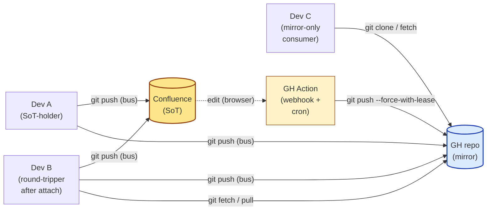

# DVCS topology — three roles

reposix v0.13.0 turns "VCS over REST" into "DVCS over REST." One backend stays the source of truth (SoT) — Confluence, GitHub Issues, or JIRA. A plain-git repository on GitHub becomes a universal-read mirror: anyone can `git clone` the markdown with vanilla git, no reposix install required. Writes still go through a reposix-equipped path that fans out to both halves.

This page is the cold-reader's mental model: **three roles**, **two refs you can `git log`**, and **when to choose which pattern** for your team.

## Three roles in a v0.13.0 deployment

| Role | What you install | What you read from | What you write to |
|---|---|---|---|
| **SoT-holder** (Dev A) | reposix CLI; attached via `reposix init` | The SoT (cache-backed; live REST) | SoT + GH mirror (atomic via the bus remote) |
| **Mirror-only consumer** (Dev B before installing) | nothing — vanilla git only | The GH mirror (a plain git repo) | Cannot write back through reposix |
| **Round-tripper** (Dev B after `reposix attach`) | reposix CLI; attached after-the-fact | GH mirror for fast clones; SoT for ground truth | SoT + GH mirror (atomic via the bus remote) |

The mirror-only consumer is the new entrant. Before v0.13.0, "see the team's tracker" meant "install reposix." Now it can mean "`git clone`," which is what every developer already knows how to do.

## One picture



The bus remote (yellow arrow on each writer) is the **only** writer to the SoT. The GH Action is the **only** writer to the mirror that did not already come through a bus push. Everything else — the mirror-only consumer's `git clone`, the round-tripper's `git fetch origin` — is plain git, no protocol extensions.

## Two refs — and where they actually live

The mirror is eventually consistent with the SoT. The webhook fires within ~30 seconds of a Confluence edit; the GH Action runs; the mirror catches up. To make that staleness window observable, every successful sync (a bus push, or the webhook) writes two refs:

```text
refs/mirrors/<sot-host>-head           # SHA of the SoT's main at last sync
refs/mirrors/<sot-host>-synced-at      # annotated tag with timestamp message
```

For a Confluence SoT at `reuben-john.atlassian.net`, the host slug is `confluence`. (The slug always names the backend kind, not your tenant. The four canonical slugs are `sim`, `github`, `confluence`, `jira`.)

> **Where these refs live (verified P91 91-06, correcting an earlier overclaim in this doc):** `refs/mirrors/...` are written into the **local reposix cache's own bare repo** — one per machine whose `reposix` install ran the push. They are **not** pushed to the plain-git GH mirror. A real bus push was traced end to end for this rewrite: after the push, the mirror's own ref list shows only `refs/heads/main` — no `refs/mirrors/*` ever arrives there, because the bus's mirror leg is a plain `git push <mirror> main` subprocess (DVCS-BUS-WRITE-02) that only ever touches `main`. And a bus-attached round-tripper's own `git fetch` of the reposix remote doesn't pick them up either (DVCS-BUS-FETCH-01; confirmed: fetching the bus remote populated its `refs/remotes/.../main` tracking ref and nothing under `refs/mirrors/`).
>
> The one shape where a real `git fetch` *would* bring these refs into a working tree is a **single-backend** (non-bus, Pattern B) `reposix::` remote — the helper's git-native fetch tunnel talks directly to the cache's bare repo, which advertises every ref it holds, `refs/mirrors/*` included. See [Git layer](../how-it-works/git-layer.md) for that mechanism. That path is architecture-derived, not independently re-verified here — this repo's dev box runs an older git than the runtime requirement (D91-02), so it can't drive the git-native fetch tunnel at all.
>
> **Practical upshot:** "Dev C" (mirror-only, vanilla git, no reposix) can **never** read these refs — there is no path from the mirror to them. Today's only two working consumers are (1) the bus push's own reject-hint, which reads the ref internally and renders the age inline (below), and (2) manual inspection of the cache's bare repo directly, on the machine that owns it: `git --git-dir=<cache-path> log refs/mirrors/<sot-host>-synced-at -1 --format='%ai %s'` (find `<cache-path>` from `reposix gc`'s printed cache root).

> **Important:** `refs/mirrors/<sot-host>-synced-at` is the timestamp the mirror last caught up to `<sot-host>` — it is NOT a "current SoT state" marker. Between a Confluence edit and the next webhook fire (typically 30 seconds), the SoT has moved and the mirror has not. Reading the ref tells you "as of this timestamp, the mirror was current"; nothing more.

What this enables, concretely — Dev B (round-tripper) gets a bus-remote rejection that cites the mirror lag, read straight out of the cache's own ref (no fetch required, since the helper already has the cache open):

```bash
$ git push
error: confluence rejected the push (issue 0001 modified at 2026-04-30T17:30:00Z, your version 7, backend version 8)
hint: your origin (GH mirror) was last synced from confluence at 2026-04-30T17:25:00Z (5 minutes ago)
hint: run `reposix sync --reconcile` to refresh your cache against the SoT, then `git pull --rebase`
```

The reject message reads its own cache's ref state and translates the staleness window into a human sentence. The recovery is the same `git pull --rebase` you already know.

## When to choose which pattern

You have three deployment shapes to pick from. Pick the leftmost that satisfies your constraints — install cost increases left-to-right.

### Pattern A — Vanilla mirror only (mirror-only consumer)

**Who:** anyone on the team who only needs to **read** the issue tracker — onboarding engineers, designers, support.

**What:**

```bash
git clone git@github.com:org/<space>-mirror.git /tmp/issues
cd /tmp/issues
cat issues/0001.md && grep -ril TODO .
```

**Trade-off:** zero install cost, zero learning curve. They cannot write back; if they want to file an issue, they go to the SoT's web UI. The mirror lags by up to ~30 seconds (cron tick) plus webhook latency.

**Choose this when:** the role is read-mostly, write occasionally via the SoT's native UI is fine.

### Pattern B — `reposix init` against the SoT directly (SoT-holder)

**Who:** the developer or owner installing reposix on their primary machine — the one driving daily writes against the tracker.

**What:**

```bash
reposix init confluence::SPACE /tmp/repo
cd /tmp/repo
git checkout origin/main
$EDITOR issues/0001.md
git commit -am 'fix typo' && git push
```

**Trade-off:** real-time SoT view (no mirror lag); writes go straight to Confluence. No GH mirror at all unless you set one up separately.

**Choose this when:** you are the only writer, or your team has not yet stood up the GH mirror + webhook sync.

### Pattern C — Vanilla clone, then `reposix attach` (round-tripper)

**Who:** Dev B who started by cloning the GH mirror with vanilla git, then decided they want to push back too.

**What:**

```bash
# Already have a vanilla clone:
cd /tmp/issues
$EDITOR issues/0001.md && git commit -am 'fix typo'

# Install reposix AND the git remote helper (two separate binaries):
cargo binstall reposix-cli reposix-remote
reposix attach confluence::SPACE
git push                      # bus remote handles SoT + mirror atomically
```

The `reposix-cli` package installs the `reposix` CLI; the `reposix-remote` package installs the `git-remote-reposix` helper that git shells out to for `reposix::` URLs. Installing only the CLI leaves `git push` failing with `unable to find remote helper for 'reposix'` — `reposix attach` prints a warning naming the missing helper if it is not on PATH.

`reposix attach` also sets `remote.pushDefault` to the reposix remote, so the bare `git push` above routes through the SoT bus rather than silently pushing to the vanilla mirror on `origin`. Fetch is untouched: `git fetch` / `git pull` keep reading from the mirror. (A `remote.pushDefault` you set yourself is left alone — attach warns instead of clobbering it.)

**Trade-off:** keeps your existing clone; reuses the GH mirror you already fetched from for fast subsequent pulls. The cache is built fresh against the SoT during attach (one REST walk; subsequent pushes use `list_changed_since` for cheap conflict detection).

**Choose this when:** you started as a mirror-only consumer and your role grew. This is the v0.13.0 thesis path — onboard cheaply, upgrade when you need to.

## Why SoT-first for writes (asymmetry, on purpose)

The bus remote writes the SoT first, then the mirror. The asymmetry matters when the mirror push fails (network blip, race with the webhook):

- **SoT-first failure mode:** SoT write succeeds, mirror push fails. The SoT is now ahead; the mirror lags. The next bus push from anyone catches it up. The webhook also catches it up. No data loss; the worst case is a brief observable lag.
- **Mirror-first failure mode (rejected design):** mirror has a SHA the SoT will never accept. Recovery would mean force-pushing the mirror to overwrite history other devs already fetched.

You will see this in the bus reject messages: when the mirror push fails after the SoT write succeeded, the helper prints a warning to stderr but returns `ok` to git. The contract from your shell's perspective is "the SoT write landed"; the mirror catch-up is a separate event tracked via the `refs/mirrors/...` annotations.

**Both writes are egress-gated.** The SoT write (REST) and the mirror push (`git ls-remote` + `git push`) each send issue content off the machine, so both are checked against `REPOSIX_ALLOWED_ORIGINS` before any network contact — the mirror push is not a privileged side channel. A bus push to a mirror whose host is not on the allowlist is refused with an `egress-denied` message (local `file://` mirrors are exempt — no egress). Because the allowlist grammar is `http`/`https` and the mirror gate matches on **host**, authorise an `ssh` mirror (`git@github.com:…`) with an `https://<host>` entry. See [Troubleshooting → mirror-egress rejection](../guides/troubleshooting.md#bus-remote-mirror-egress-rejection-egress-denied).

## Cache coherence: L1 / L2 / L3 (ADR-010)

The bus remote's conflict detection and the fetch/sync path both lean on the local
cache as a trust boundary; three layers, two shipped and one deferred:

- **L1 — trust the cache as prior.** The bus push precheck and delta sync both treat
  the cache's `oid_map` / `last_fetched_at` cursor as ground truth for "what changed."
  Fast (no extra network round-trip), but a drifted cache — a failed sync, a
  same-second write racing the cursor — makes it silently wrong. Recovery: `reposix
  sync --reconcile` (a full `list_records` walk that rebuilds the cache from the SoT).
  Also gates the mirror-head refresh: `refresh_for_mirror_head` runs on every push
  that changes the SoT (`files_touched > 0`); a push that changes nothing is a
  semantic no-op — skipped because there is nothing new to refresh, not a coherence
  shortcut (RBF-LR-04).
- **L3 — transactional cache writes (shipped, ADR-010 Option B).** `Cache::sync`'s
  delta path upserts `oid_map` for the *full* `list_records` set inside the same
  atomic transaction that writes the tree — not just the changed IDs the delta query
  reports — so the HEAD tree can never reference an OID `read_blob` cannot resolve.
  This is the fix for the reproduced two-writer `not our ref` failure (D-P92-03): the
  tree↔`oid_map` invariant now holds by construction, independent of the backend's
  second-resolution `updated_at` precision.
- **L2 — re-fetch on cache miss (deferred to v0.14.0, ADR-010 Option A).** A future
  belt-and-suspenders layer: on an `oid_map` miss, `read_blob` would re-scan the
  backend and materialize the winning blob on demand instead of failing the want.
  Deferred because it moves outbound HTTP onto the read/fetch path (latency-envelope
  and OP-1/OP-2 taint-surface cost) and L3 already restores the invariant at its
  source, making L2 a redundant safety net rather than the primary fix.

Full trade-off analysis, reversibility assessment, and the rejected/deferred
alternatives: [ADR-010](../decisions/010-l2-l3-cache-coherence.md).

## Out of scope (intentionally)

- **Bidirectional bus.** A `git push` to the GH mirror with vanilla git creates commits the SoT will never see. The next webhook sync will force-with-lease over them. To write back to the SoT, you must go through a reposix-equipped bus push. This constraint is deliberate — the mirror is a read surface, not a write surface.
- **Multi-SoT.** v0.13.0 is "one issues backend (SoT) + one plain-git mirror." A working tree can be attached to exactly one SoT. The origin-of-truth-across-multiple-issues-backends question lives in v0.14.0.
- **Long-running sync process.** The webhook + cron schedule is the v0.13.0 sync mechanism. There is no background reposix service; everything is event-driven or cron-driven.
- **Atomic two-phase commit across backends.** The bus remote is "SoT-first, mirror-best-effort with lag tracking," not a true 2PC. The asymmetry above is the price of not needing a coordinator.
- **Duplicate-free recovery from an interrupted create on a real backend.** A create against an id-assigning real backend (GitHub Issues / JIRA / Confluence) that is cut off mid-push can leave one hand-deletable duplicate on retry — a documented, owner-signed v0.13.0 known limitation, recoverable by hand-deleting the duplicate ([troubleshooting](../guides/troubleshooting.md#duplicate-record-after-an-interrupted-create-real-backend-v0130-known-limitation), [ADR-010 §3](../decisions/010-l2-l3-cache-coherence.md)). The clean fix — modelling a create as a durable slug→id translation — is the v0.14.0 reconciliation-redesign pivot.

## See also

- [Mental model in 60 seconds](mental-model-in-60-seconds.md) — the three keys for a single-backend reposix install. Read first if you are new to reposix.
- [DVCS mirror setup](../guides/dvcs-mirror-setup.md) — the owner's walk-through for installing the webhook + GH Action that keeps the mirror in sync with the SoT.
- [Troubleshooting — DVCS push/pull issues](../guides/troubleshooting.md#dvcs-pushpull-issues) — `fetch first` rejection, attach reconciliation warnings, webhook race conditions.
- [How it works — git layer](../how-it-works/git-layer.md) — push round-trip, conflict detection, and the layered details a Layer-3 reader wants.
