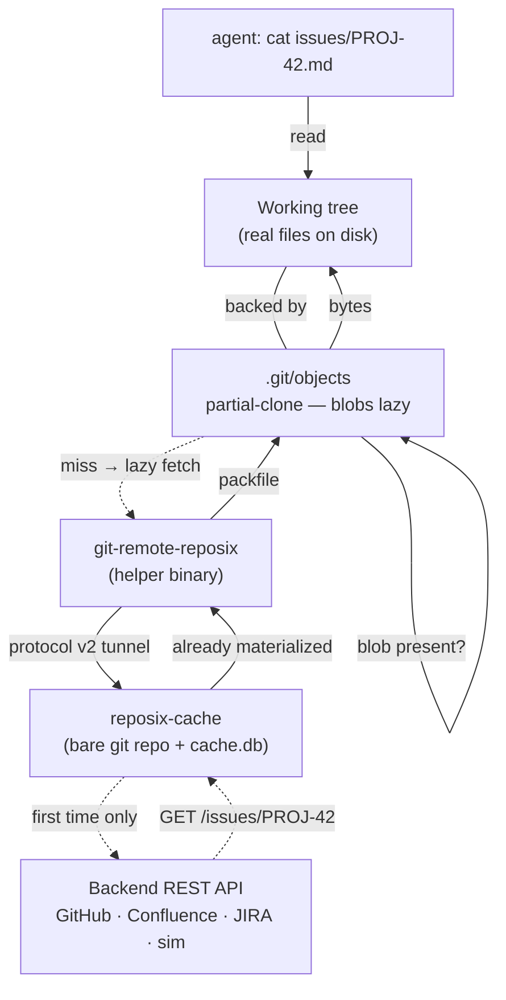

# Filesystem layer

The first key from [Mental model in 60 seconds](../concepts/mental-model-in-60-seconds.md) is *clone IS a git working tree*. This page explains why that statement is literally true: there is no virtual filesystem, no daemon between you and the bytes — just a real `.git/` directory backed by a local cache that pulls blobs from the backend on demand.

## How a `cat` becomes a REST call (or doesn't)

The first `cat` of a given issue triggers one REST call. Every `cat` after that is a local read — `8 ms` against the simulator, [measured](../benchmarks/v0.9.0-latency.md). The tree (filenames, directory structure, blob OIDs) is fetched once at `init` and is essentially free thereafter; only blob *contents* are lazy.

## Why partial clone, not a virtual filesystem

The v0.1 architecture mounted a virtual filesystem so `ls` and `cat` would fan out to live REST calls. That made every read pay a network round-trip — `cat issues/2444.md` blocked on HTTP, and `ls` over 10 000 Confluence pages meant 10 000 calls just to render a directory. The v0.9.0 design (see [`architecture-pivot-summary.md`](https://github.com/reubenjohn/reposix/tree/main/.planning/research/v0.9-fuse-to-git-native)) **superseded** that virtual filesystem with git's own partial-clone mechanism. The `crates/reposix-fuse/` crate was deleted in the same milestone; the `fuser` dependency, the `/dev/fuse` permission song-and-dance, and the WSL2 kernel-module quirks all went with it.

Partial clone is built into git ≥ 2.27 and stable in practice since 2019. The `--filter=blob:none` flag asks the remote for the tree without blobs; the helper then lazy-fetches blobs on demand the same way `git-remote-http` would. To git, our remote is just another remote — the agent never has to learn that it's talking to a REST API.

The other thing this buys: the working tree is **real**. `git status`, `git diff`, `git stash`, `git restore` all work the way they do on any other repo. Hooks fire. `.gitignore` applies. Editors track changes. Nothing about the working tree is synthetic.

## What lives where

The layer has two pieces:

- **`crates/reposix-cache/`** — a real on-disk bare git repo (built with [`gix`](https://github.com/Byron/gitoxide)) plus `cache.db` (SQLite, WAL mode). The bare repo holds the tree and any materialized blobs; `cache.db` holds the audit log and the `last_fetched_at` timestamp used for delta sync.
- **The working tree** — created by `reposix init`, which runs `git init`, sets `extensions.partialClone=origin`, points `remote.origin.url` at the helper, and runs `git fetch --filter=blob:none`. After that command, the working tree is yours; reposix does not touch it again unless you `git fetch` or `git push`.

Wire-level details (cache schema, audit columns, helper invocation flags) live in [the simulator reference](../reference/simulator.md) and [testing targets](../reference/testing-targets.md). This page intentionally stays at user-experience altitude.

## Failure modes

- **Network down on first read.** The blob is missing locally and the helper cannot reach the backend; git surfaces the helper's stderr to you and the `cat` fails. Subsequent reads of already-materialized blobs continue to work — the cache is a real local git store. (`v0.1` had no offline story at all; every read was live.)
- **Blob limit hit.** A bulk operation like `git grep` over a never-checked-out tree can ask for thousands of blobs in one shot. The helper refuses past `REPOSIX_BLOB_LIMIT` (default 200) and emits a stderr message that names `git sparse-checkout` as the recovery move. The detail of how this is wired lives in the [git layer](git-layer.md#blob-limit-guardrail).
- **OID drift.** A backend write that bypasses reposix (someone using the REST API directly) changes an issue between your `git fetch` and your read. The cache will lazy-fetch the new content the next time the helper sees a `want` for that OID; the audit log shows a fresh `materialize` row. If you've already committed against the stale base and try to push, the push-time conflict detector rejects you with the standard git "fetch first" error — that flow is the subject of the [git layer](git-layer.md).

## Next

The blobs got into the working tree somehow; the edits get back to the backend somehow. Both halves of that round-trip are git protocol, and they live in [the git layer →](git-layer.md).

Every sync also writes a private tag (`refs/reposix/sync/<ts>`) in the cache's bare repo, so you can `git checkout` an earlier observation. See [time travel →](time-travel.md).
