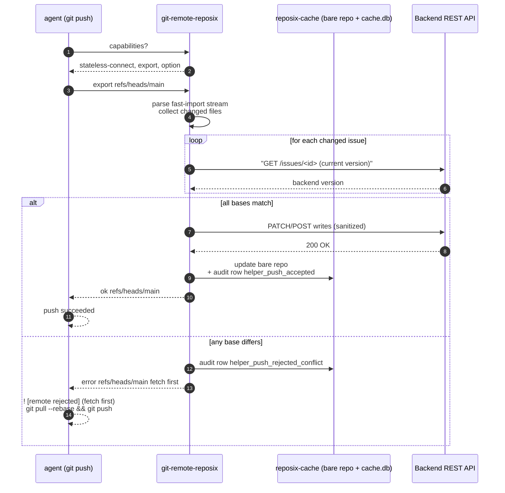

# Git layer

The third key from [Mental model in 60 seconds](../concepts/mental-model-in-60-seconds.md) is *`git push` IS the sync verb*. This page shows how — what the helper advertises to git, what happens when you push, and why a stale-base push gets rejected with the same error message you'd see on any other remote.

## The push round-trip (happy path and conflict)



The conflict-reject path is the dark-factory teaching mechanism: an agent that has never read a reposix doc still knows what *fetch first* means, because every git remote on Earth speaks that error.

## Capabilities advertised

The helper advertises three [capabilities](../reference/glossary.md#capability-advertisement) (a [git remote-helper protocol](https://git-scm.com/docs/gitremote-helpers#_command_capabilities) handshake) on stdin/stdout the moment git invokes it:

- **[`stateless-connect`](../reference/glossary.md#stateless-connect)** ([helper-protocol capability](https://git-scm.com/docs/gitremote-helpers#_invocation) that lets git tunnel its native wire protocol through the helper) — handles all read traffic (`git clone`, `git fetch`, lazy blob fetches). Git tunnels [protocol-v2](../reference/glossary.md#protocol-v2) (the [current git wire protocol](https://git-scm.com/docs/protocol-v2)) through the helper to the local [bare repo](../reference/glossary.md#bare-repo) (a [git repo without a working tree](https://git-scm.com/docs/git-init#Documentation/git-init.txt---bare)) in `reposix-cache`. This is the path that lets [partial clone](../reference/glossary.md#partial-clone) work.
- **`export`** — handles push. Git pipes a [fast-import](../reference/glossary.md#fast-import) ([git's plumbing format](https://git-scm.com/docs/git-fast-import) for streaming commits, trees, and blobs) stream into the helper, which parses commits and turns them into REST writes.
- **`option`** — lets git pass `verbosity` and similar flags through. Mostly cosmetic.

The [refspec](../reference/glossary.md#refspec) (the `<src>:<dst>` mapping that tells [git which refs go where](https://git-scm.com/docs/git-fetch#Documentation/git-fetch.txt-ltrefspecgt)) namespace is `refs/heads/*:refs/reposix/*`. That non-default mapping matters: collapsing it to `refs/heads/*:refs/heads/*` makes [fast-export](../reference/glossary.md#fast-export) ([git's diff-as-stream emitter](https://git-scm.com/docs/git-fast-export)) emit an empty delta because the private OID equals the local HEAD. The bug is silent (the push appears to succeed but no commits are exported), so the namespace is load-bearing — see the [v0.9.0 architecture-pivot summary §3](https://github.com/reubenjohn/reposix/tree/main/.planning/research/v0.9-fuse-to-git-native) for the gory detail.

## Backend dispatch (URL scheme)

Before the helper can fetch anything, it has to decide *which backend the URL is talking about*. `git-remote-reposix` reads `argv[2]` (the value of `remote.origin.url`) and dispatches:

| URL form | Backend |
|---|---|
| `reposix::http://127.0.0.1:<port>/projects/<slug>` | sim (loopback) |
| `reposix::https://api.github.com/projects/<owner>/<repo>` | GitHub Issues |
| `reposix::https://<tenant>.atlassian.net/confluence/projects/<space>` | Confluence |
| `reposix::https://<tenant>.atlassian.net/jira/projects/<key>` | JIRA |

The two Atlassian backends share an origin, so the helper looks for a `/confluence/` or `/jira/` path-segment marker to disambiguate. `reposix init` emits the right form for you; `reposix doctor` flags marker-less Atlassian URLs as a warning.

Each backend reads its credentials from environment variables documented in [Testing targets](../reference/testing-targets.md) — `GITHUB_TOKEN` for GitHub, the `ATLASSIAN_*` triple for Confluence, the `JIRA_*` triple for JIRA. Missing creds surface as a startup error from the helper that lists every absent variable on its own line and links to the doc, so an agent reading stderr knows exactly what to set.

The dispatch logic lives in `crates/reposix-remote/src/backend_dispatch.rs`. See [ADR-008](../decisions/008-helper-backend-dispatch.md) for the rationale.

## Push-time conflict detection

The helper never trusts that the agent's commit base is current. Inside the `export` handler, after parsing each changed file, it does a fresh `GET` against the backend and compares the version to whatever the agent's commit was based on. If they differ, the helper:

1. Drains the rest of the incoming stream (so the connection closes cleanly).
2. Writes a `helper_push_rejected_conflict` row to the audit log.
3. Emits `error refs/heads/main fetch first` on stdout.

Git renders that as `! [remote rejected] main -> main (fetch first)` plus the standard "perhaps a `git pull` would help" hint. The agent runs `git pull --rebase`, the helper does a delta-sync of the changed issue back into the working tree, the agent re-applies its edit on top, and `git push` works.

This is the dark-factory teaching mechanism. The agent learned the fix without reading reposix's docs — it learned it because it already knew how to recover from a rejected push to any remote. **Untrusted input does not need a trusted client; it needs a trusted server that rejects bad input clearly.**

## Blob limit guardrail

The helper counts `want <oid>` lines on each `command=fetch` request. If the count exceeds `REPOSIX_BLOB_LIMIT` (default 200, env-configurable) it refuses the fetch and writes a `blob_limit_exceeded` row to the audit log. The stderr message names the remediation by hand:

```text
error: refusing to fetch 487 blobs (limit: 200).
       Narrow your scope with `git sparse-checkout set <pathspec>` and retry.
```

This is the same teaching mechanism as the conflict-rejection: an agent that runs `git grep TODO` against a 10 000-issue tree without first narrowing its scope hits the limit, reads the error, runs `git sparse-checkout set issues/PROJ-24*`, and retries. No prompt engineering, no system-prompt injection, no reposix-specific knowledge needed.

The limit exists because the alternative is unbounded REST traffic. A misbehaving agent can rack up thousands of API calls trying to materialize a working tree it doesn't actually need. The guardrail keeps that bill — and the rate-limit headers — under control.

## Recovery shape

Both rejections lead to the same shape of recovery:

| Rejection | Agent observes | Agent runs |
|---|---|---|
| stale base on push | `! [remote rejected] main -> main (fetch first)` | `git pull --rebase && git push` |
| blob limit hit on fetch | stderr: `refusing to fetch N blobs ... narrow your scope with git sparse-checkout` | `git sparse-checkout set <pathspec> && git checkout origin/main` |

Both are recoverable, both are auditable (one row each in `cache.db`), and both teach the agent the right move on the spot.

## Next

The conflict-rejection and blob limit are not just UX — they are mitigations. The threat model that frames them, plus the tainted-by-default policy and the audit log, is in [the trust model →](trust-model.md).

See also: [filesystem layer ←](filesystem-layer.md) for how the bytes got into the working tree before the push started, and [time travel](time-travel.md) for how every sync becomes a git ref you can `checkout`.
