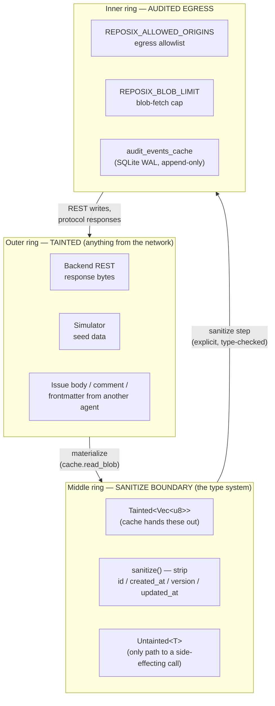

# Trust model

reposix is, by construction, a textbook **lethal trifecta** machine — Simon Willison's name for the three legs an exfiltration attack against an LLM agent needs at the same time. From [`agentic-engineering-reference.md`](../research/agentic-engineering-reference.md), the legs are:

1. **Private data** — the agent sees issue bodies, custom fields, attachments, internal comments. Anything an authenticated REST call can return.
2. **Untrusted input** — every issue body, comment, title, and label is attacker-influenced text. So is anything seeded into the simulator.
3. **Exfiltration** — `git push` is a side-effecting verb that can target arbitrary remotes; the helper makes outbound HTTP calls to backends.

You cannot build reposix without all three legs being present. So instead of pretending one of them isn't there, the design **cuts the path between them** at every boundary. The three keys from [Mental model in 60 seconds](../concepts/mental-model-in-60-seconds.md) ground in this page: the cache layer is where taint enters; the helper is where egress and audit happen; the frontmatter allowlist is where untrusted input meets server-controlled fields.

## Concentric rings — taint in, audited bytes out

Three rings, three cuts. A byte from the network does not reach a side-effecting call without crossing a boundary that the type system or the runtime can audit.

## Mitigations table

| Trifecta leg | Cut | Where it lives |
|---|---|---|
| Private data | Egress allowlist `REPOSIX_ALLOWED_ORIGINS` — every HTTP client built through `reposix_core::http::client()`, no direct `reqwest::Client::new()` (clippy `disallowed_methods` enforces). Default: `http://127.0.0.1:*`. | `crates/reposix-core/src/http.rs`, runtime check in `crates/reposix-cache` |
| Private data | Blob limit `REPOSIX_BLOB_LIMIT` (default 200) — caps unbounded `git fetch` runs that would page in an entire backend. | helper, see [git layer §blob limit](git-layer.md#blob-limit-guardrail) |
| Untrusted input | Frontmatter field allowlist — `id`, `created_at`, `version`, `updated_at` stripped from inbound writes before the REST call. An attacker-authored body with `version: 999999` cannot poison the server version. | helper push handler, audited as `helper_push_sanitized_field` |
| Untrusted input | `Tainted<T>` ↔ `Untainted<T>` newtype pair — the cache returns `Tainted<Vec<u8>>`; `sanitize()` is the only safe conversion. A trybuild compile-fail test asserts you cannot send a `Tainted<T>` to an egress sink without `sanitize`. | `crates/reposix-core/src/tainted.rs` |
| Exfiltration | Push-time conflict detection — rejects stale-base pushes with `error refs/heads/main fetch first`. Side effect: prevents a stale agent from blindly overwriting a backend write that landed between its `clone` and its `push`. | helper, see [git layer §push-time conflict detection](git-layer.md#push-time-conflict-detection) |
| Exfiltration | Append-only audit log — `BEFORE UPDATE/DELETE RAISE` triggers on `audit_events_cache` so an attacker who reaches sqlite3 cannot tamper with history without the alarm row showing up. | `crates/reposix-cache/src/cache_schema.sql` |

## Audit log

Every network-touching action writes one row to `audit_events_cache` in `cache.db` (SQLite WAL). The table is append-only at the SQL level: `BEFORE UPDATE` and `BEFORE DELETE` triggers raise `'audit_events_cache is append-only'`. The ops vocabulary is fixed:

| `op` | Written when |
|---|---|
| `materialize` | Cache lazy-fetched a blob from the backend |
| `egress_denied` | Outbound call refused by `REPOSIX_ALLOWED_ORIGINS` |
| `delta_sync` | Helper ran `list_changed_since(last_fetched_at)` |
| `helper_connect`, `helper_advertise`, `helper_fetch`, `helper_fetch_error` | Helper protocol events on the read side |
| `helper_push_started`, `helper_push_accepted`, `helper_push_rejected_conflict`, `helper_push_sanitized_field` | Helper protocol events on the write side |
| `blob_limit_exceeded` | `command=fetch` carried more `want` lines than `REPOSIX_BLOB_LIMIT` |

`git log` is the agent's intent; `audit_events_cache` is the system's outcome. Together they answer "what was attempted, what was allowed, and what hit the network" without any side-channel logging.

## What's NOT mitigated

Honesty about the threat model is a feature, not a footnote.

- **Shell access bypasses every cut.** An attacker on the dev host can `curl` the backend directly with the same token. reposix is a substrate for safer agent loops — it is not a sandbox. The egress allowlist guards the helper and the cache; it does not guard the rest of the host.
- **The simulator is itself attacker-influenced.** Seed data is authored by an agent (or by a fixture written by an agent), so simulator runs are *also* tainted. The lethal-trifecta mitigations apply against the simulator just as hard as against a real backend.
- **Token leakage via crash logs.** A panicking helper that includes auth headers in its `RUST_BACKTRACE` output can leak credentials. The codebase scrubs known credential headers before logging, but a third-party crate panicking with a header in scope is out of reposix's hands.
- **Confused-deputy across backends.** A user with credentials for two backends and one allowlist entry can be tricked by a tainted issue body into directing writes at the wrong backend. The allowlist constrains *origin*; it does not constrain *intent*. Multi-backend egress is high-friction by design — the agent must run a separate `reposix init` per backend.
- **Cache compromise.** An attacker with write access to `cache.db` can replay or hide audit rows from older WAL segments. Append-only triggers prevent in-place tampering on the live segment but cannot defend against the file being swapped wholesale.

## Further reading

- [Filesystem layer ←](filesystem-layer.md) — where tainted bytes enter the system.
- [Git layer ←](git-layer.md) — where the conflict and blob-limit cuts are wired.
- [`docs/security.md`](../security.md) — historical, longer-form security notes; carved into this page during v0.10.0 nav restructure.
- [`docs/research/agentic-engineering-reference.md`](../research/agentic-engineering-reference.md) — the lethal-trifecta framing.
