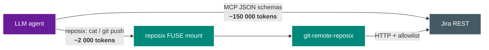

# reposix

> **Agents already know `cat` and `git`. They don't know your JSON schema.**

{ .no-lightbox width="100%" }

reposix is a git-backed FUSE filesystem that exposes REST-based issue trackers (Jira, GitHub Issues, Confluence) as a POSIX directory tree. An autonomous LLM agent can `ls`, `cat`, `grep`, edit, and `git push` tickets without ever loading a single Model Context Protocol (MCP) tool schema.

{ .no-lightbox width="100%" }

!!! success "v0.7 — six autonomous overnight sessions, 2026-04-13 → 2026-04-16"
    Every line of code in this repository was written by a coding agent across six overnight sessions. v0.1 (simulator + FUSE + guardrails), v0.2 (real-GitHub adapter), v0.3 (real-Confluence adapter, live against `reuben-john.atlassian.net`), v0.4 (`pages/` + `tree/` nested mount layout), v0.5 (`_INDEX.md` sitemaps), v0.6 (Confluence write path + labels + refresh), and v0.7 (hardening + benchmarks + comments/attachments/whiteboards + docs reorg). An adversarial red-team subagent critiques the design; planners verify each phase. Treat as alpha — but every demo in this site is reproducible on a stock Ubuntu host in under 5 minutes.

## The one-sentence thesis



Same outcome, ~75× less context burned. The ratio is not imaginary — see the [token-economy benchmark](why.md#token-economy-benchmark).

## Five-line quickstart

```bash
git clone https://github.com/reubenjohn/reposix
cd reposix
cargo build --release --workspace --bins
export PATH="$PWD/target/release:$PATH"
bash scripts/demo.sh
```

Runs the full nine-step demo against an in-process simulator. No credentials. No network. Exits zero in under 2 minutes.

## What's in the box (v0.7)

<div class="grid cards" markdown>

-   :material-file-document: **[Five-crate workspace](reference/crates.md)**

    `-core`, `-sim`, `-fuse`, `-remote`, `-cli`. 317+ tests. All crates `#![forbid(unsafe_code)]`. `cargo clippy --workspace -- -D warnings` is clean.

-   :material-shield-lock: **[Eight security guardrails](security.md)**

    SG-01 allowlist · SG-02 bulk-delete cap · SG-03 frontmatter strip · SG-04 path validator · SG-05 tainted typing · SG-06 append-only audit · SG-07 5s EIO timeout · SG-08 demo shows guardrails firing.

-   :material-folder-multiple: **[Working POSIX mount](reference/cli.md#reposix-mount)**

    `reposix mount /tmp/mnt --backend sim` — issues/pages as `<id>.md` with YAML frontmatter. `ls`, `cat`, `grep -r` all work. Backends: simulator, GitHub Issues, Confluence Cloud.

-   :material-source-branch: **[git-remote-reposix helper](reference/git-remote.md)**

    `git push reposix::http://.../projects/demo` translates diffs to `PATCH`/`POST`/`DELETE`. SG-02 fires on pushes deleting >5 issues; overridable via `[allow-bulk-delete]` commit tag.

</div>

## The "dark factory" pattern

This project is an experiment in the pattern from Simon Willison's April 2026 interview[^1]: **nobody writes code, nobody reads code**. The replacement for code review is:

1. **A simulator, not mocks.** `crates/reposix-sim` is a full-fidelity fake issue tracker — rate limits, 409 conflicts, append-only audit, all modeled. A swarm of agents can hammer it for free.
2. **Adversarial red-team subagents.** A parallel agent poked holes in the design at T+0 and its findings ([threat model](security.md#threat-model)) became first-class requirements.
3. **Goal-backward verification.** Every phase has Bash-assertion success criteria. The final [`VERIFICATION.md`](https://github.com/reubenjohn/reposix/blob/main/.planning/VERIFICATION.md) walks each of the 17 original requirements → evidence → test name.
4. **Empirical closing of the loop.** Before declaring the demo done, the agent literally ran `bash scripts/demo.sh` end-to-end, verified server state updates via `curl`, and confirmed the allowlist refusal and SG-02 cap fire on the recorded transcript.

[^1]: The "dark factory" framing — [`docs/research/agentic-engineering-reference.md`](https://github.com/reubenjohn/reposix/blob/main/docs/research/agentic-engineering-reference.md) §1 in the repo.

## Where to go next

<div class="grid cards" markdown>

-   :material-lightbulb-on: **[Why reposix exists](why.md)** — the token economics, the POSIX-pretraining argument, and the benchmark.
-   :material-graph: **[Architecture](architecture.md)** — component diagrams, data flow, the async bridge from FUSE to HTTP.
-   :material-play-circle: **[Demo walkthrough](demo.md)** — step-by-step explanation of what the recording shows.
-   :material-shield-lock: **[Security](security.md)** — lethal trifecta analysis, the full guardrails table, what's deferred to v0.8.

</div>
