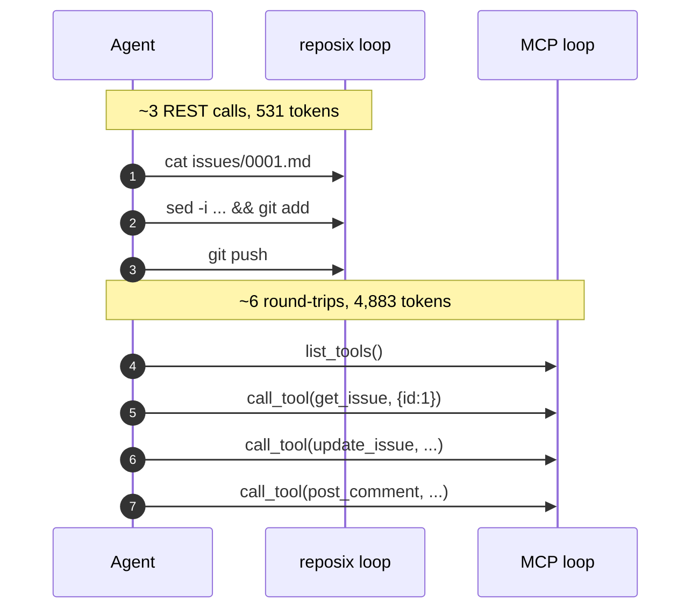

# reposix

> **Agents already know `cat` and `git`. They don't know your JSON schema.**

reposix exposes REST-based issue trackers (Jira, GitHub Issues, Confluence) as a **real git working tree**. An autonomous LLM agent can `git clone`, `cat`, `grep`, edit, and `git push` tickets without learning a single Model Context Protocol (MCP) tool schema or REST SDK surface. It runs alongside REST — the other 20% of operations (complex JQL, bulk imports, admin) keep using the API directly. reposix handles the 80% where an agent just needs to read, edit, and push.

<div class="grid cards" markdown>

-   **`89.1%`** fewer tokens vs MCP for the same 3-issue read+edit+push workflow ([benchmarks/RESULTS.md](https://github.com/reubenjohn/reposix/blob/main/benchmarks/RESULTS.md))
-   **`8 ms`** cached read · **`24 ms`** cold init ([latency](benchmarks/v0.9.0-latency.md))
-   **`5-line install`** — `curl`, `brew`, `cargo binstall`, or `irm` ([first-run.md](tutorials/first-run.md))

</div>

## reposix loop vs MCP loop



Same workflow, two loops. The reposix loop reuses `cat`/`sed`/`git` — vocabulary the agent already has — and pushes one commit. The MCP loop discovers tools, then issues one call per field mutation. The token gap is measured: see [`benchmarks/RESULTS.md`](https://github.com/reubenjohn/reposix/blob/main/benchmarks/RESULTS.md).

## 30-second install

=== "curl (Linux/macOS)"
    ```bash
    curl --proto '=https' --tlsv1.2 -LsSf \
        https://github.com/reubenjohn/reposix/releases/latest/download/reposix-installer.sh | sh
    ```

=== "PowerShell (Windows)"
    ```powershell
    powershell -ExecutionPolicy Bypass -c "irm https://github.com/reubenjohn/reposix/releases/latest/download/reposix-installer.ps1 | iex"
    ```

=== "Homebrew"
    ```bash
    brew install reubenjohn/reposix/reposix
    ```

=== "cargo binstall"
    ```bash
    cargo binstall reposix-cli reposix-remote
    ```

Full step-by-step in [first-run](tutorials/first-run.md).

## After — one commit

```bash
cd /tmp/reposix-demo
sed -i 's/^status: .*/status: in_progress/' issues/0001.md
echo $'\n## Comment\nReproduced — investigating root cause.' >> issues/0001.md
git commit -am "0001: in progress" && git push
```

The audit trail is `git log`. No SDK to vendor; no schemas to load.

[Mental model in 60 seconds →](concepts/mental-model-in-60-seconds.md){ .md-button .md-button--primary }
[How it complements MCP and SDKs →](concepts/reposix-vs-mcp-and-sdks.md){ .md-button }

---

## Tested against

reposix's `8 ms` cache read is measured against the in-process simulator, but the architecture is exercised end-to-end against three real backends sanctioned by the project owner for aggressive testing:

- **Confluence — [TokenWorld space](reference/testing-targets.md#confluence-tokenworld-space)** (Atlassian Cloud).
- **GitHub — [`reubenjohn/reposix` issues](reference/testing-targets.md#github-reubenjohnreposix-issues)** (this project's own tracker).
- **JIRA — [project `TEST`](reference/testing-targets.md#jira-project-test-overridable)** (overridable via `JIRA_TEST_PROJECT`).

Latency for each backend is captured in [`docs/benchmarks/v0.9.0-latency.md`](benchmarks/v0.9.0-latency.md). Sim cold init is `24 ms` (soft threshold `500 ms`); list-issues `9 ms`; capabilities probe `5 ms`. Real-backend cells fill in once CI secret packs are wired (Phase 36).

## What each backend can do

The four built-in backends differ in capabilities. `reposix doctor` prints
your configured backend's row at runtime (see [exit codes](reference/exit-codes.md)
for harness integration); the static matrix is also here for at-a-glance
reading:

| Backend     | Read | Create | Update | Comments         | Delete | Versioning |
|-------------|------|--------|--------|------------------|--------|------------|
| sim         | yes  | yes    | yes    | in-body          | yes    | strong     |
| github      | yes  | yes    | yes    | in-body          | yes    | ETag       |
| confluence  | yes  | yes    | yes    | separate API     | yes    | strong     |
| jira        | yes  | no     | no     | no               | no     | timestamp  |


JIRA is currently read-only — write paths are tracked in
[`v0.11.1` POLISH2-08+](https://github.com/reubenjohn/reposix/blob/main/.planning/REQUIREMENTS.md).
For the canonical struct + per-backend constant, see
`crates/reposix-core/src/backend.rs` (`BackendCapabilities`).

## Six-line quickstart

```bash
git clone https://github.com/reubenjohn/reposix && cd reposix
cargo build --release --workspace --bins
export PATH="$PWD/target/release:$PATH"
reposix sim &                                             # start the simulator on :7878
reposix init sim::demo /tmp/reposix-demo
cd /tmp/reposix-demo && git checkout -B main refs/reposix/origin/main && cat issues/0001.md
```

After `init`, agent UX is pure git: `cat`, `grep -r`, edit, `git commit`, `git push`. The bootstrap takes ≤ `24 ms` against the simulator on a stock laptop.

## Where to go next

<div class="grid cards" markdown>

-   💡 **[Mental model in 60 seconds](concepts/mental-model-in-60-seconds.md)** — three keys to the design (clone = snapshot · frontmatter = schema · `git push` = sync verb).
-   ⚖️ **[reposix vs MCP and SDKs](concepts/reposix-vs-mcp-and-sdks.md)** — positioning, with measured numbers per row.
-   🔗 **How it works** — [the filesystem layer](how-it-works/filesystem-layer.md), [the git layer](how-it-works/git-layer.md), and [the trust model](how-it-works/trust-model.md). One diagram each.
-   📊 **[Latency envelope](benchmarks/v0.9.0-latency.md)** — the v0.9.0 measured numbers.

</div>

## What it looks like underneath

reposix has three pieces — a local bare git repository built from REST responses (with file content fetched lazily), a `git` remote that handles both reads and pushes by translating to API calls, and `reposix init` (a one-shot bootstrap). Two guardrails are load-bearing for autonomous agents: **push-time conflict detection** rejects stale-base pushes with the standard git "fetch first" error so an agent recovers via `git pull --rebase`; the **fetch size limit** caps `git fetch` and emits a stderr message that names `git sparse-checkout` as the recovery move. An agent unfamiliar with reposix observes the error, runs `sparse-checkout`, and recovers with no human prompt engineering.

The detail of how each piece works lives in [How it works](how-it-works/filesystem-layer.md). The reference material — frontmatter schema, simulator HTTP surface, testing targets — is in [Reference](reference/simulator.md).

---

*Honest scope: built across autonomous coding-agent sessions; v0.9.0 architecture pivoted from a virtual filesystem to git-native partial clone (2026-04-24). Treat as alpha — but every demo on this site is reproducible on a stock Ubuntu host in under five minutes. The v0.7 token-economy benchmark measured an **89.1%** input-context-token reduction vs a synthesized MCP-tool-catalog baseline (modeled on the public Atlassian Forge surface — see [`benchmarks/RESULTS.md`](https://github.com/reubenjohn/reposix/blob/main/benchmarks/RESULTS.md) for the methodology and caveats).*
