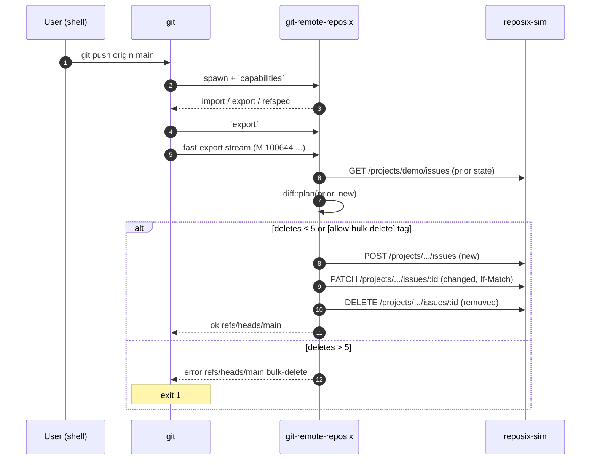

# git remote helper

`git-remote-reposix` is a [git remote helper](https://git-scm.com/docs/gitremote-helpers) that teaches `git` to push and pull issues as if they were a branch of Markdown files.

## Invocation

Git automatically invokes `git-remote-reposix` when a remote URL starts with `reposix::`:

```bash
git remote add origin reposix::http://127.0.0.1:7878/projects/demo
git pull origin main     # → `import` capability: sim → git
git push origin main     # → `export` capability: git → sim
```

## Capabilities

```
stateless-connect
export
refspec refs/heads/*:refs/reposix/*
```

`stateless-connect` is the v0.9.0 read path — the helper tunnels a protocol-v2 fetch with `--filter=blob:none` to the cache's bare repo, so `git fetch` materializes only tree metadata (blobs are fetched lazily on first read). `export` is the push path: git emits a fast-export stream, the helper parses it, runs push-time conflict detection against the backend, and applies REST writes on success. The `refspec` maps the remote's `main` into a private namespace so the user's real work-tree branch is unaffected by fetches.

## Flow: `git push`



## Flow: `git pull`

Pull is served by the `import` capability. The helper emits a [fast-import](https://git-scm.com/docs/git-fast-import) stream:

```
feature done
commit refs/reposix/main
mark :1
author reposix <noreply@reposix> 1712966400 +0000
committer reposix <noreply@reposix> 1712966400 +0000
data 28
reposix snapshot @ 1712966400
M 100644 inline 0001.md
data 425
---
id: 1
title: ...
...
---
body ...
M 100644 inline 0002.md
...
done
```

The bytes of each blob come from `reposix_core::issue::frontmatter::render(&issue)` — the same function the cache materializer uses when serving `read_blob(oid)`. This guarantees deterministic SHAs across round-trips.

## Bulk-delete cap (SG-02)

Any push whose tree-diff removes more than 5 files is rejected:

```
$ git rm 0001.md 0002.md 0003.md 0004.md 0005.md 0006.md
$ git commit -am 'cleanup'
$ git push origin main
error: refusing to push (would delete 6 issues; cap is 5; commit message tag '[allow-bulk-delete]' overrides)
To reposix::http://127.0.0.1:7878/projects/demo
 ! [remote rejected] main -> main (bulk-delete)
error: failed to push some refs to 'reposix::http://127.0.0.1:7878/projects/demo'
```

Override:

```
$ git commit --amend -m '[allow-bulk-delete] cleanup'
$ git push origin main
```

The check lives in `crates/reposix-remote/src/diff.rs::plan` — client-side. The simulator itself has no such cap; defense in depth.

## Server-field stripping (SG-03)

Every outbound PATCH/POST body first goes through:

```rust
let egress = sanitize(
    Tainted::new(issue),
    ServerMetadata { id, version, created_at, updated_at },
);
```

`sanitize` replaces those four server-controlled fields with the server's known values and returns `Untainted<Issue>`. An attacker-authored issue body containing `version: 999999` or `id: 0` has no effect on the server's authoritative state.

## Authentication (v0.2)

v0.1 does not authenticate outbound requests. Per research [`git-remote-helper.md`](https://github.com/reubenjohn/reposix/blob/main/.planning/research/git-remote-helper.md) §7, v0.2 will resolve credentials in priority order:

1. Per-alias env var (`REPOSIX_TOKEN_<ALIAS>`)
2. Global env (`REPOSIX_TOKEN`)
3. `git config remote.<alias>.reposixToken`
4. `git config reposix.token`

Per-alias namespacing avoids credential-in-URL smells and lets the same simulator be added as multiple remotes with different tokens.

## Known limitations (v0.2 backlog)

- **CRLF handling.** `ProtoReader` pipes blob bytes through `Protocol::read_line` which is String-based — `\r` gets silently stripped and non-UTF-8 bytes fail mid-protocol. Works for ASCII+LF corpora (which is what the demo uses). Fix: switch to raw `Vec<u8>` framing.
- **Marks-based incremental sync.** v0.1 recomputes the world on every pull. Acceptable for ≤ 100 issues. Marks-file support is a v0.2 perf deliverable.
- **Conflict-aware merging.** v0.1 rejects pushes that would lose remote changes (409 surfaces as push failure). Full automatic merge via `<<<<<<< HEAD` markers in the working tree is a v0.2 deliverable.
