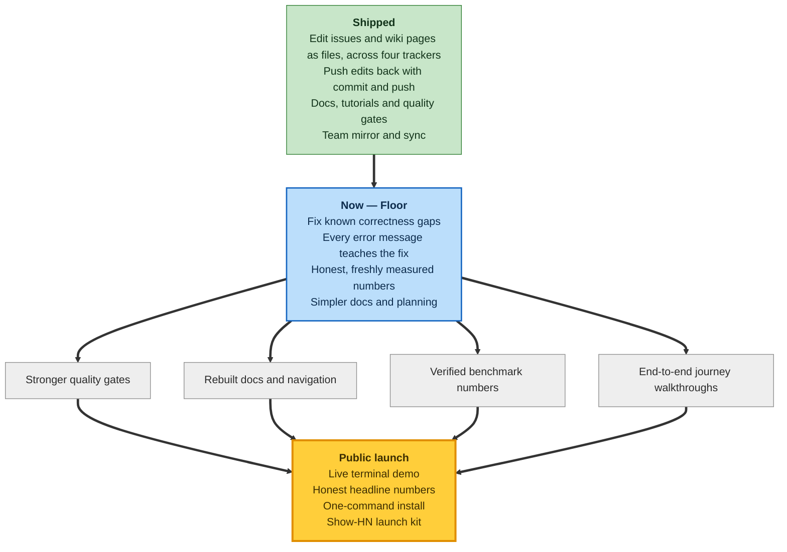

# Roadmap

A bird's-eye view of where reposix is heading — grouped by **capability, not by release
number or date**, so the map stays true without weekly edits.

> **Source of truth.** This page mirrors the private planning ledger at
> [`.planning/PROJECT.md`](https://github.com/reubenjohn/reposix/blob/main/.planning/PROJECT.md)<!-- SYNC: paired with .planning/PROJECT.md § Current Milestone. Edit either side → update the other. TWO distinct cadences: the "Progress right now" section below (three sequenced blocks — Landed recently / In flight now / Up next, in order — phase numbers allowed as sequence markers, dates ONLY on the Landed side) refreshes at EVERY phase close; the mermaid arcs (shipped / active / future) re-color only at milestone close. -->,
> driven by the GSD planning workflow. It is a public snapshot — the capability map and
> its arcs lag the ledger by design and re-color at milestone close, so the map never
> promises a date it has to chase. Only the "Progress right now" section below moves faster,
> ticking forward at each phase close.

## Progress right now

_Updated 2026-07-19 · Milestone: Floor_

### Landed recently

- **P120** (2026-07-17) — CLI and helper error messages now teach the fix instead of
  leaving you guessing; three credential leaks in diagnostic output were closed.
- **P121** (2026-07-17) — Every error now carries an explainable code: run `reposix
  explain <code>` for a plain-English write-up, rustc-style.
- **P122** (2026-07-18) — The git remote helper and `init` command got hardened against
  edge cases: safer ref handling, louder failures instead of silent fallbacks, and a
  refusal to nest a new repo inside a shared tree by mistake.
- **P123** (2026-07-18) — The quality-gate runner itself got hardened: safer concurrent
  runs, a guard against silently downgrading a passing result, and a stronger self-check
  that the CI-green signal can be trusted.
- **P124** (2026-07-18) — The containerized test harness now proves its pass/fail claims
  for real instead of copying expected results, and survives being killed mid-run.
- **P125** (2026-07-18) — closed GREEN: the pre-release real-backend check and the
  milestone-close litmus now self-heal a stale mirror before they run, the recovery hints
  shown on a mirror-drift error name the right remote to rebase against, and a documented
  refresh step keeps the check from false-negativing on its own prior push.

### In flight now

- _Nothing in flight right now — P125 just closed GREEN (see above); **P126** is next up
  (see below) and has not started yet._

### Up next, in order

1. **P126** — Docs-alignment tooling polish: the tool that keeps the docs honest gets
   more reliable and easier to understand.
2. **P127** — Surprises absorption: every loose end found while building this milestone
   gets closed out.
3. **P128** — Good-to-haves polish + milestone close: remaining polish lands, the
   milestone retrospective is written, and the v0.15.0 tag script is prepared for the
   owner to run.
4. **v0.17** — a meta-milestone that builds the five quality-gate shapes that would have
   caught this milestone's own findings earlier.
5. **v0.19** — a truth-purge and information-architecture rebuild across the docs site.
6. **v0.21** — a benchmark-honesty pass: headline numbers re-measured and re-verified.
7. **v0.23** — end-to-end journey slices: real workflows, start to finish.
8. **v0.25** — a launch kit: live demo, install path, and public launch.

Small stub milestones land between these as needed, draining new surprises and
good-to-haves as they surface.

## How to read this

The map has three states plus the end state we are steering toward. Each box lists its
arcs; the arrows flow from what is done, through what we are doing now, into the launch.

- **Green — Shipped.** Capabilities you can use today: edit a tracker's issues and a wiki's
  pages as plain files across four backends, push your edits back with a commit, and rely on
  the docs, tutorials, quality gates, and team mirroring already in place.
- **Blue — Now (the "Floor" milestone).** The launch-readiness floor we are building:
  closing known correctness gaps, hardening every error message so it teaches the fix,
  re-measuring the numbers honestly, and simplifying the docs and planning.
- **Grey — Ahead.** The arcs still in front of us. They fan out from the Floor —
  stronger quality gates, rebuilt docs and navigation, verified benchmark numbers, and
  end-to-end journey walkthroughs — and converge on the launch.
- **Gold — Public launch.** The end state: a live terminal demo, honest headline numbers,
  a one-command install, and a Show-HN launch kit.

Because the map is drawn by capability, it names no phase numbers and no dates. For live
phase status and the current milestone in detail, follow the source-of-truth link above.

**Two refresh cadences.** The **"Progress right now" section** near the top ticks forward
at **every phase close** — a phase moves from *In flight now* into *Landed recently* (with
its close date and outcome line attached), and the *Up next, in order* list shifts forward
by one. The **mermaid arcs** (green shipped, blue active, grey ahead, gold launch) re-color
only at **milestone close**, which is why the diagram stays stable while the three blocks
above keep pace with day-to-day progress.
