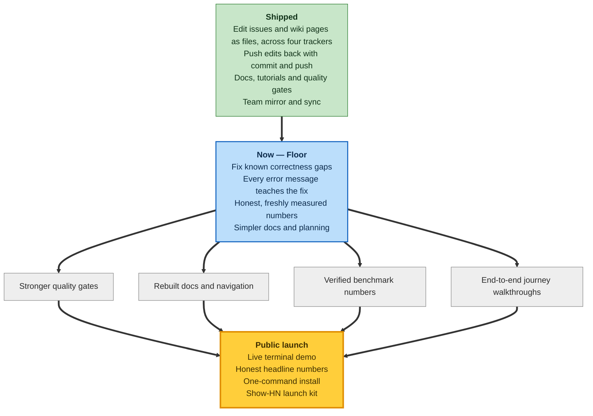

# Roadmap

A bird's-eye view of where reposix is heading — grouped by **capability, not by release
number or date**, so the map stays true without weekly edits.

> **Source of truth.** This page mirrors the private planning ledger at
> [`.planning/PROJECT.md`](https://github.com/reubenjohn/reposix/blob/main/.planning/PROJECT.md)<!-- SYNC: paired with .planning/PROJECT.md § Current Milestone. Edit either side → update the other; re-color the arcs (shipped / active / future) at milestone close. -->,
> driven by the GSD planning workflow. It is a public snapshot — it lags the ledger by
> design and is refreshed at milestone close, so it never promises a date it has to chase.

## How to read this

The map has three states plus the end state we are steering toward. Each box lists its
arcs; the arrows flow from what is done, through what we are doing now, into the launch.

- **Green — Shipped.** Capabilities you can use today: edit a tracker's issues and a wiki's
  pages as plain files across four backends, push your edits back with a commit, and rely on
  the docs, tutorials, quality gates, and team mirroring already in place.
- **Blue — Now (the "Floor" milestone).** The launch-readiness floor we are building:
  closing known correctness gaps, hardening every error message so it teaches the fix,
  re-measuring the numbers honestly, and simplifying the docs and planning.
- **Grey — Ahead.** The arcs still in front of us. They fan out from the Floor —
  stronger quality gates, rebuilt docs and navigation, verified benchmark numbers, and
  end-to-end journey walkthroughs — and converge on the launch.
- **Gold — Public launch.** The end state: a live terminal demo, honest headline numbers,
  a one-command install, and a Show-HN launch kit.

Because the map is drawn by capability, it names no phase numbers and no dates. For live
phase status and the current milestone in detail, follow the source-of-truth link above.
