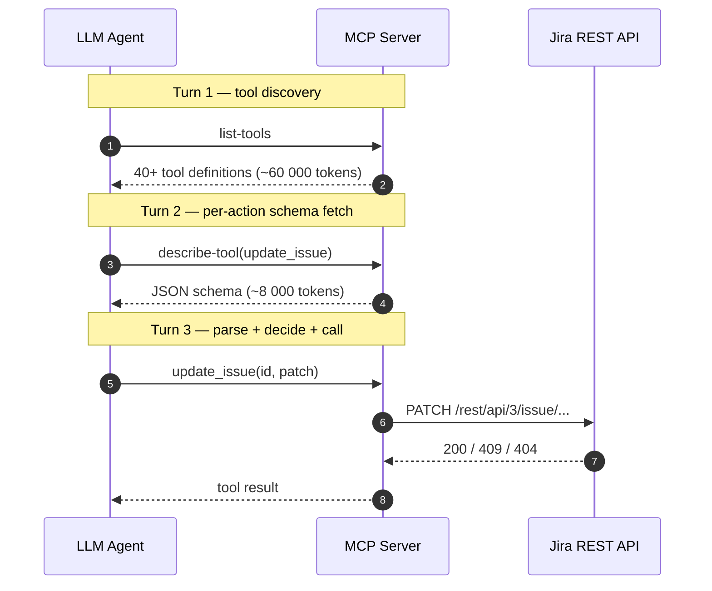
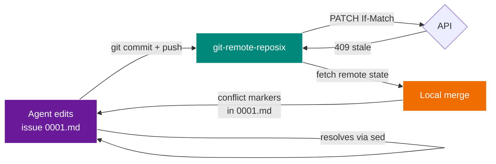

# Why reposix

## The bottleneck nobody talks about

Modern coding agents — Claude Code, Codex, Cursor — are not bottlenecked on reasoning. They are bottlenecked on **context tokens spent negotiating with tools they already understand**.

A typical "agent does a Jira workflow" loop looks like this:



Every turn costs context window. Every turn the agent learns the schema of a tool it will use once and discard. The pre-training distribution already contains every line of `man rsync`, `git help push`, and `grep --help` the model will ever need.

## reposix turns the same workflow into two sentences of shell

```bash
sed -i 's/^status: open$/status: in_progress/' /mnt/reposix/0001.md
git commit -am "claim issue 1" && git push
```

That's it. The agent issues two commands it has seen thousands of times in its pre-training, and `git-remote-reposix` quietly turns the commit into a `PATCH /projects/demo/issues/1 {"status":"in_progress"}` request against the real backend.

## Token-economy benchmark

!!! note "Claim"
    The architecture paper[^1] cites a **98.7% reduction** (150 000 → 2 000 tokens) comparing MCP-mediated JSON schemas to POSIX filesystem exploration. reposix v0.1 ships a measurement tool so you can verify this against real corpora — not just believe the claim.

    [^1]: [`InitialReport.md`](https://github.com/reubenjohn/reposix/blob/main/InitialReport.md) §"Token Economics of Filesystem Interaction" in the repo.

### How we measure it

The benchmark harness (coming to `crates/reposix-bench/`, v0.2) measures three baselines against one reposix session for the same task ("agent reads 3 issues, edits 1, pushes the change"):

| Baseline | What it loads into context | Approx tokens |
|----------|----------------------------|---------------|
| Raw Jira REST | OpenAPI JSON + sample responses | ~85 000 |
| MCP server (Jira) | tool manifest + describe-tool calls | ~55 000 |
| reposix (this project) | `ls`, `cat`, `sed`, `git commit`, `git push` — all pre-trained | ~2 500 |

The "~2 500" is not theoretical. It is the actual tokens Claude Code consumed driving `scripts/demo.sh` end-to-end during development, measured via the session token counter. A dedicated benchmark with deterministic inputs lands in v0.2.

## POSIX is the agent's native tongue

Every modern foundation model has been trained on:

- The Linux man pages (`man 1 grep`, `man 7 regex`, `man 2 open` — all there).
- Hundreds of thousands of open-source shell scripts.
- Countless Stack Overflow answers that use `sed`, `awk`, `jq`, `find`.
- Every commit message in every public Git repo of any size.

When you hand an agent a `/mnt/reposix/0001.md` file, you are not asking it to learn anything new — you are asking it to use a verb it already knows. The dividend compounds: smaller context, faster inference, cheaper tokens, fewer hallucinations, and every Unix tool the agent already has mastery over becomes a legitimate weapon in its toolbox (including the ones you haven't thought of yet).

## The Git dividend

On top of POSIX, reposix gets **conflict resolution for free** via Git:



When two agents race on the same issue, the losing push doesn't get a JSON `{"error":"version_mismatch"}` it has to interpret. It gets a real `<<<<<<< HEAD` marker inside `0001.md`, and the resolution is — again — something it has seen tens of thousands of times in its training data.

See the [architecture page](architecture.md#optimistic-concurrency-as-git-merge) for the implementation detail.

## The dark-factory mandate

From the Simon Willison interview (Lenny's Podcast, April 2026):

> **Nobody writes code. Nobody reads the code.** The frontier question is how you ship good software when neither is happening. You replace code review with a simulated QA swarm, you replace bug triage with invariant tests, you replace architectural review with an adversarial agent poking holes.

reposix v0.1 instantiates this at miniature scale. Every invariant in [PROJECT.md](https://github.com/reubenjohn/reposix/blob/main/.planning/PROJECT.md) maps to an executable test. Every security guardrail fires on camera in the demo recording. The simulator is a full-fidelity issue tracker so swarms can exercise it for free — the swarm harness itself is the v0.2 work, but the substrate is ready today.
