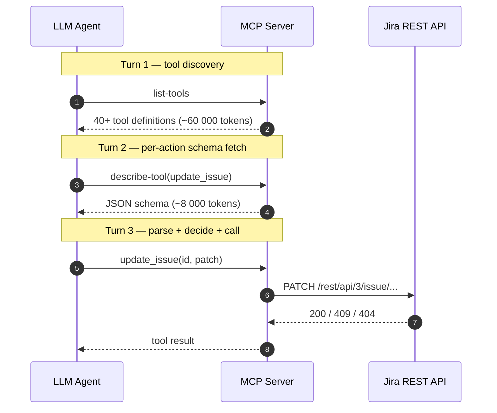
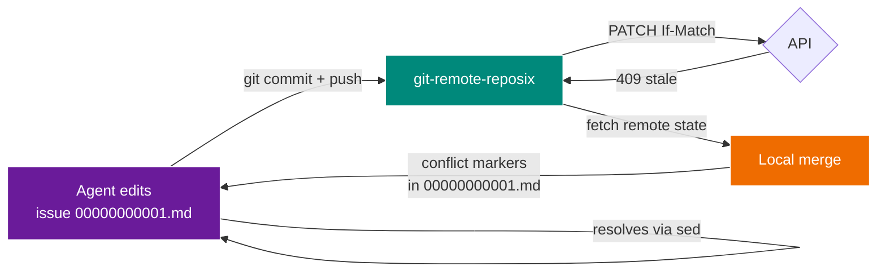

# Why reposix

## The bottleneck nobody talks about

Modern coding agents — Claude Code, Codex, Cursor — are not bottlenecked on reasoning. They are bottlenecked on **context tokens spent negotiating with tools they already understand**.

A typical "agent does a Jira workflow" loop looks like this:



Every turn costs context window. Every turn the agent learns the schema of a tool it will use once and discard. The pre-training distribution already contains every line of `man rsync`, `git help push`, and `grep --help` the model will ever need.

## reposix turns the same workflow into two sentences of shell

```bash
sed -i 's/^status: open$/status: in_progress/' /mnt/reposix/issues/00000000001.md
git commit -am "claim issue 1" && git push
```

That's it. The agent issues two commands it has seen thousands of times in its pre-training, and `git-remote-reposix` quietly turns the commit into a `PATCH /projects/demo/issues/1 {"status":"in_progress"}` request against the real backend.

## Token-economy benchmark

!!! success "Measured, not claimed"
    The architecture paper[^1] projected a ~98% reduction. We measured it against a representative fixture corpus using Anthropic's `count_tokens` API (no more `len/4` heuristic). Result: **89.1% reduction** — reposix ingests **~9.2× less context** than an MCP-mediated baseline for the same task. Full breakdown in [`benchmarks/RESULTS.md`](https://github.com/reubenjohn/reposix/blob/main/benchmarks/RESULTS.md).

    [^1]: [`InitialReport.md`](https://github.com/reubenjohn/reposix/blob/main/InitialReport.md) §"Token Economics of Filesystem Interaction" in the repo.

### How we measure it

Two fixtures in `benchmarks/fixtures/`:

- `mcp_jira_catalog.json` — a representative 35-tool Jira MCP manifest modeled on the public Atlassian Forge surface and the schemas produced by `mcp-atlassian`.
- `reposix_session.txt` — the ANSI-stripped excerpt of a real shell session performing the same task (read 3 issues, edit 1, push).

`scripts/bench_token_economy.py` computes character counts and real token counts (via Anthropic's `client.messages.count_tokens()` API; results cached in `benchmarks/fixtures/*.tokens.json` for offline reproducibility) and emits a Markdown table.

| Scenario | Real tokens (`count_tokens`) |
|----------|-----------------:|
| MCP-mediated (tool catalog + schemas) | ~4,883 |
| **reposix** (shell session transcript) | **~531** |

{ .no-lightbox width="100%" }

Reproduce:

```bash
python3 scripts/bench_token_economy.py
```

The paper's 98.7% number assumes a larger MCP corpus (40+ tools with fully-expanded schemas). Prior to Phase 22 we published 91.6% based on a `len/4` heuristic; with real tokenization via Anthropic's `count_tokens` API the number is 89.1%. We keep both on file in `benchmarks/RESULTS.md` git history. Both conclusions match: **between one and two orders of magnitude less context burned**.

### This now works against real GitHub, not just the simulator

As of v0.2.0-alpha (post-noon 2026-04-13), `reposix list --backend github --project owner/repo` reads any public GitHub repo's issues end-to-end. Same `IssueBackend` trait, same normalized output:

```bash
REPOSIX_ALLOWED_ORIGINS='http://127.0.0.1:*,https://api.github.com' \
    GITHUB_TOKEN="$(gh auth token)" \
    reposix list --backend github --project octocat/Hello-World --format table
```

Pagination, rate-limit backoff (honors `x-ratelimit-reset`), and the SG-01 egress allowlist all hold. The `tests/contract.rs` parameterized test asserts the same five behavioral invariants on both `SimBackend` and `GithubReadOnlyBackend` — a CI-enforced "the simulator is not lying" guarantee.

## What the measurement does NOT capture

- The agent's own reasoning tokens — identical across scenarios, so they cancel out.
- Re-fetches if context is compacted mid-session — reposix is less affected here since its "context" is persistent on disk.
- Actual dollar cost — that's a model-price question, not an architecture question.
- Fixture representativeness — our GitHub and Confluence fixtures are synthetic (see `benchmarks/fixtures/README.md`); real production payloads can be larger, which would push the reduction higher.

## POSIX is the agent's native tongue

Every modern foundation model has been trained on:

- The Linux man pages (`man 1 grep`, `man 7 regex`, `man 2 open` — all there).
- Hundreds of thousands of open-source shell scripts.
- Countless Stack Overflow answers that use `sed`, `awk`, `jq`, `find`.
- Every commit message in every public Git repo of any size.

When you hand an agent a `/mnt/reposix/issues/00000000001.md` file, you are not asking it to learn anything new — you are asking it to use a verb it already knows. The dividend compounds: smaller context, faster inference, cheaper tokens, fewer hallucinations, and every Unix tool the agent already has mastery over becomes a legitimate weapon in its toolbox (including the ones you haven't thought of yet).

## The Git dividend

On top of POSIX, reposix gets **conflict resolution for free** via Git:



When two agents race on the same issue, the losing push doesn't get a JSON `{"error":"version_mismatch"}` it has to interpret. It gets a real `<<<<<<< HEAD` marker inside `00000000001.md`, and the resolution is — again — something it has seen tens of thousands of times in its training data.

See the [architecture page](architecture.md#optimistic-concurrency-as-git-merge) for the implementation detail.

## The dark-factory mandate

From the Simon Willison interview (Lenny's Podcast, April 2026):

> **Nobody writes code. Nobody reads the code.** The frontier question is how you ship good software when neither is happening. You replace code review with a simulated QA swarm, you replace bug triage with invariant tests, you replace architectural review with an adversarial agent poking holes.

reposix instantiates this at miniature scale. Every invariant in [PROJECT.md](https://github.com/reubenjohn/reposix/blob/main/.planning/PROJECT.md) maps to an executable test. Every security guardrail fires on camera in the demo recording. The simulator is a full-fidelity issue tracker so swarms can exercise it for free — the swarm harness shipped in Phase 9, the real GitHub backend in v0.2, real Confluence in v0.3, and the `pages/` + `tree/` nested mount layout in v0.4. The substrate keeps the same shape.
